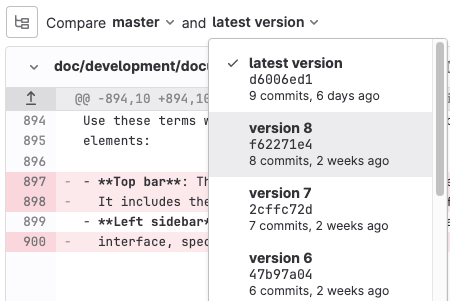

DETAILS:
**Tier:** Free, Premium, Ultimate
**Offering:** GitLab.com, GitLab Self-Managed, GitLab Dedicated

A commit records and sends the source code changes to the [repository](../repository/_index.md).
For more information, see [Recording Changes to the Repository](https://git-scm.com/book/en/v2/Git-Basics-Recording-Changes-to-the-Repository).

## Commit changes using the command line

When you use the command line, use [`git commit`](../../../topics/git/commands.md#git-commit).
You can add multiple commits before pushing your changes.

- **Commit message:**

  A commit message identifies what is changed and why. Use descriptive messages to clarify the changes.
  In GitLab, you can add keywords to the commit message to perform one of the following actions:

  - **Trigger a GitLab CI/CD pipeline:**

    If the project is configured with [GitLab CI/CD](../../../ci/_index.md),
    you trigger a pipeline per push, not per commit.

  - **Skip pipelines:**

    Add the [`ci skip`](../../../ci/pipelines/_index.md#skip-a-pipeline) keyword to
    your commit message to make GitLab CI/CD skip the pipeline.

  - **Cross-link issues and merge requests:**

    Use [cross-linking](../issues/crosslinking_issues.md#from-commit-messages)
    to keep track of related parts of your workflow.
    If you mention an issue or a merge request in a commit message, they are displayed
    on their respective thread.

- **Cherry-pick a commit:**

  In GitLab, you can [cherry-pick a commit](cherry_pick_changes.md#cherry-pick-a-single-commit)
  from the UI.

- **Revert a commit:**

  [Revert a commit](revert_changes.md#revert-a-commit)
  from the UI to a selected branch.

- **Sign a commit:**

  Add extra security by [signing your commits](../repository/signed_commits/_index.md).

For additional information, see [Stage, commit, and push changes](../../../topics/git/commit.md).

## Merge request commits

Each merge request has a history of the commits made to the source branch
after the merge request was created.

These commits are displayed on the merge request's **Commits** tab.
From this tab, you can review commit messages and copy a commit's SHA when you need to
[cherry-pick changes](cherry_pick_changes.md).

### View commits in a merge request

To see the commits included in a merge request:

1. On the left sidebar, select **Search or go to** and find your project.
1. Select **Code > Merge requests**, then select your merge request.
1. To show a list of the commits in the merge request, newest first, select **Commits** .
   To read more about the commit, select **Toggle commit description** (**{ellipsis_h}**)
   on any commit.
1. To view the changes in the commit, select the title of the commit link.
1. To view other commits in the merge request, either:

   - Select **Prev** or **Next**.
   - Use keyboard shortcuts: <kbd>X</kbd> (previous commit) and <kbd>C</kbd> (next commit).

If your merge request builds upon a previous merge request, you might
need to [include more commits for context](#show-commits-from-previous-merge-requests).

### Show commits from previous merge requests

When you review a merge request, you might need information from previous commits
to help understand the commits you're reviewing. You might need more context
if another merge request:

- Changed files your current merge request doesn't modify, so those files aren't shown
  in your current merge request's diff.
- Changed files that you're modifying in your current merge request, and you need
  to see the progression of work.

To add previously merged commits to a merge request for more context:

1. On the left sidebar, select **Search or go to** and find your project.
1. Select **Code > Merge requests**, then select your merge request.
1. Select **Commits**.
1. Scroll to the end of the list of commits, and select **Add previously merged commits**.
1. Select the commits that you want to add.
1. Select **Save changes**.

Previously merged commits are referred to as **Context Commits** in
the [API](../../../api/merge_request_context_commits.md).

### Add a comment to a commit

WARNING:
Threads created this way are lost if the commit ID changes after a
force push.

To add discussion to a specific commit:

1. On the left sidebar, select **Search or go to** and find your project.
1. Select **Code > Commits**.
1. Below the commits, in the **Comment** field, enter a comment.
1. Save your comment as either a standalone comment, or a thread:
   - To add a comment, select **Comment**.
   - To start a thread, select the down arrow (**{chevron-down}**), then select **Start thread**.

### View diffs between commits

To view the changes between previously merged commits:

1. On the left sidebar, select **Search or go to** and find your project.
1. Select **Code > Merge requests**, then select your merge request.
1. Select **Changes**.
1. By **Compare** (**{file-tree}**), select the commits to compare:

   

If you selected to add previously merged commits for context, those commits are
also shown in the list.

### Find the merge request that introduced a change

When you view the commit details page, GitLab links to one or more merge requests
that contain that commit.

This behavior only applies to commits that are in the most recent version of a merge
request. If the commits were in a merge request and were rebased out of that merge
request, the commits are not linked.
