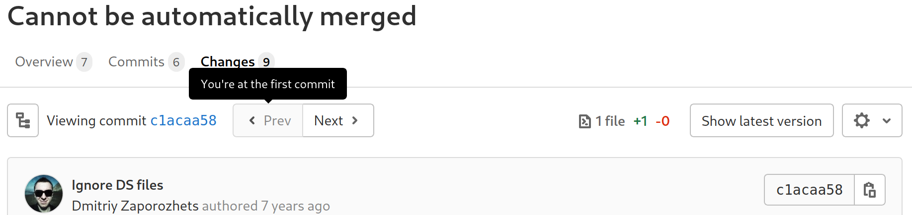
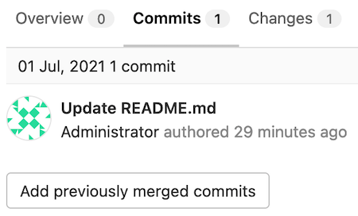
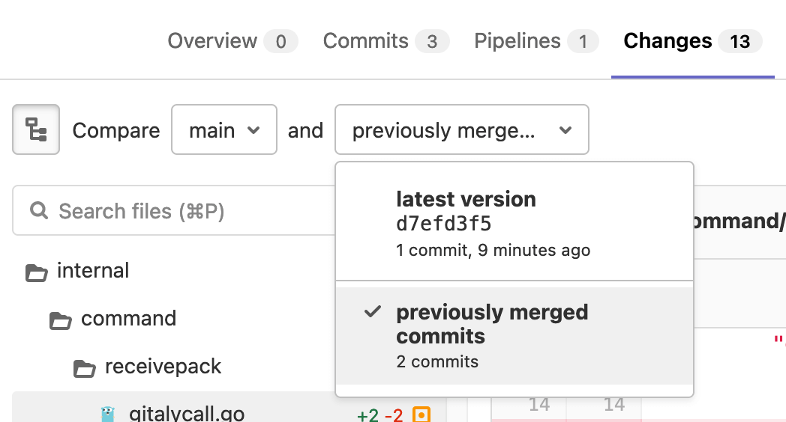

# Commits tab in merge requests **(FREE)**

The **Commits** tab in a merge request displays a sequential list of commits
to the Git branch your merge request is based on. From this page, you can review
full commit messages and copy a commit's SHA when you need to
[cherry-pick changes](cherry_pick_changes.md).

## Merge requests commit navigation

> [Introduced](https://gitlab.com/gitlab-org/gitlab/-/issues/18140) in GitLab 13.0.

To seamlessly navigate among commits in a merge request:

1. Select the **Commits** tab.
1. Select a commit to open it in the single-commit view.
1. Navigate through the commits by either:

   - Selecting **Prev** and **Next** buttons below the tab buttons.
   - Using the <kbd>X</kbd> and <kbd>C</kbd> keyboard shortcuts.



## View merge request commits in context

> - [Introduced](https://gitlab.com/gitlab-org/gitlab/-/issues/29274) in GitLab 13.12.
> - [Deployed behind a feature flag](../../feature_flags.md), enabled by default.
> - Disabled on GitLab.com.
> - Not recommended for production use.
> - To use in GitLab self-managed instances, ask a GitLab administrator to [enable it](#enable-or-disable-viewing-merge-request-commits-in-context). **(FREE SELF)**

WARNING:
This feature is in [beta](https://about.gitlab.com/handbook/product/gitlab-the-product/#beta)
and is [incomplete](https://gitlab.com/groups/gitlab-org/-/epics/1192).
Previously merged commits can be added, but they can't be removed due to
[this bug](https://gitlab.com/gitlab-org/gitlab/-/issues/325538).

This in-development feature might not be available for your use. There can be
[risks when enabling features still in development](../../feature_flags.md#risks-when-enabling-features-still-in-development).
Refer to this feature's version history for more details.

When reviewing a merge request, it helps to have more context about the changes
made. That includes unchanged lines in unchanged files, and previous commits
that have already merged that the change is built on.

To add previously merged commits to a merge request for more context:

1. Go to your merge request.
1. Select the **Commits** tab.
1. Scroll to the end of the list of commits, and select **Add previously merged commits**:

   

1. Select the commits that you want to add.
1. Select **Save changes**.

To view the changes done on those previously merged commits:

1. On your merge request, select the **Changes** tab.
1. Scroll to **(file-tree)** **Compare** and select **previously merged commits**:

   

### Enable or disable viewing merge request commits in context **(FREE SELF)**

Viewing merge request commits in context is under development and not ready for production use. It is
deployed behind a feature flag that is **disabled by default**.
[GitLab administrators with access to the GitLab Rails console](../../../administration/feature_flags.md)
can enable it.

To enable it:

```ruby
Feature.enable(:context_commits)
```

To disable it:

```ruby
Feature.disable(:context_commits)
```
