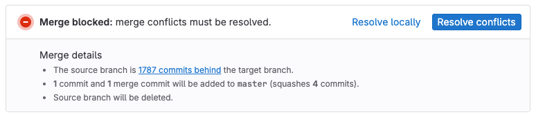
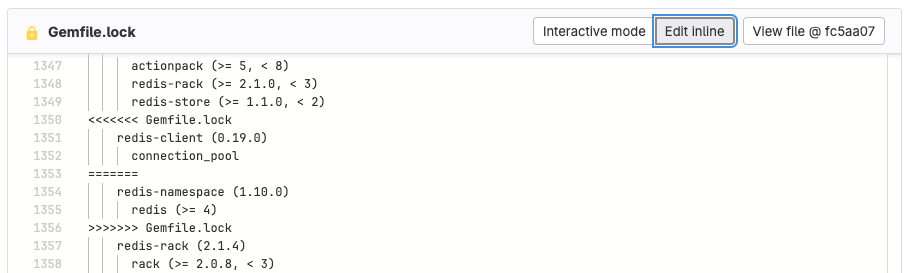

DETAILS:
**Tier:** Free, Premium, Ultimate
**Offering:** GitLab.com, GitLab Self-Managed, GitLab Dedicated

Merge conflicts occur when two branches in a merge request, the source and target,
have different changes to the same lines of code. In most cases, GitLab can merge changes together,
but when conflicts arise, you must decide which changes to keep.

To resolve a merge request with conflicts, you must either:

- Create a merge commit.
- Resolve the conflict through a rebase.

GitLab resolves conflicts by creating a merge commit in the source branch without merging it
into the target branch. You can then review and test the merge commit to verify it contains
no unintended changes and doesn't break your build.

## Understand conflict blocks

When Git detects a conflict that requires a decision on your part, it marks the
beginning and end of the conflict block with conflict markers:

- `<<<<<<< HEAD` marks the beginning of the conflict block.
- Your changes are shown.
- `=======` marks the end of your changes.
- The latest changes in the target branch are shown.
- `>>>>>>>` marks the end of the conflict.

To resolve a conflict, delete:

1. The version of the conflicted lines you don't want to keep.
1. The three conflict markers: the beginning, the end, and the `=======` line between
   the two versions.

## Conflicts you can resolve in the user interface

You can resolve merge conflicts in the GitLab UI if the conflicting file:

- Is a non binary text file.
- Is less than 200 KB in size with conflict markers added.
- Uses UTF-8 compatible encoding.
- Doesn't contain conflict markers.
- Exists under the same path in both branches.

If a file doesn't meet these criteria, you must resolve the conflict manually.

## Conflict resolution methods

GitLab shows [conflicts available for resolution](#conflicts-you-can-resolve-in-the-user-interface)
in the user interface, and you can also resolve conflicts using the following methods:

- **Interactive mode**: Best for conflicts where you only need to select which version of a line to keep.
- **Inline editor**: Suitable for complex conflicts requiring manual edits to blend changes.
- **Command line**: Provides complete control over complex conflicts. For more information, see [Resolve conflicts from the command line](../../../topics/git/git_rebase.md#resolve-conflicts-from-the-command-line).

### Interactive mode

Interactive mode merges the target branch into the source branch with your chosen changes.

To resolve merge conflicts with interactive mode:

1. On the left sidebar, select **Search or go to** and find your project.
1. Select **Code > Merge requests** and find the merge request.
1. Select **Overview**, and scroll to the merge request reports section.
1. Find the merge conflicts message, and select **Resolve conflicts**.
   GitLab shows a list of files with merge conflicts. The lines that conflict are
   highlighted.

1. For each conflict, select **Use ours** or **Use theirs** to mark the version
   of the conflicted lines you want to keep. This decision is known as
   "resolving the conflict."
1. When you've resolved all the conflicts, enter a **Commit message**.
1. Select **Commit to source branch**.

### Inline editor

Some merge conflicts are more complex, and you must manually edit lines to
resolve them.

The merge conflict resolution editor helps you resolve these conflicts in GitLab:

1. On the left sidebar, select **Search or go to** and find your project.
1. Select **Code > Merge requests** and find the merge request.
1. Select **Overview**, and scroll to the merge request reports section.
1. Find the merge conflicts message, and select **Resolve conflicts**.
   GitLab shows a list of files with merge conflicts.
1. Find the file to edit manually, and scroll to the conflict block.
1. In the header for that file, select **Edit inline** to open the editor. In this
   example, the conflict block begins at line 1350 and ends at line 1356:

   

1. After you resolve the conflict, enter a **Commit message**.
1. Select **Commit to source branch**.

## Rebase

If your merge request is stuck with a `Checking ability to merge automatically`
message, you can:

- Use the `/rebase` [quick action](../quick_actions.md#issues-merge-requests-and-epics) in the GitLab UI.
- [Rebase with Git](../../../topics/git/git_rebase.md#rebase).

To troubleshoot CI/CD pipeline issues, see [Debugging CI/CD pipelines](../../../ci/debugging.md).

### Rebase with a quick action

You can rebase a merge request from the GitLab UI with the `/rebase` [quick action](../quick_actions.md).

Prerequisites:

- No merge conflicts exist.
- You must have at least the [Developer role](../../permissions.md) for the source project.
- If the merge request is in a fork, the fork must allow commits
  [from members of the upstream project](allow_collaboration.md).

To rebase with the quick action:

1. Go to your merge request.
1. Type `/rebase` in a comment.
1. Select **Comment**.

GitLab schedules and executes a rebase of the branch against the default branch.

## Related topics

- [Rebase and resolve conflicts](../../../topics/git/git_rebase.md)
- [Introduction to Git rebase and force-push](../../../topics/git/git_rebase.md)
- [Git applications for visualizing the Git workflow](https://git-scm.com/downloads/guis)
- [Automatic conflict resolution with `git rerere`](https://git-scm.com/book/en/v2/Git-Tools-Rerere)
