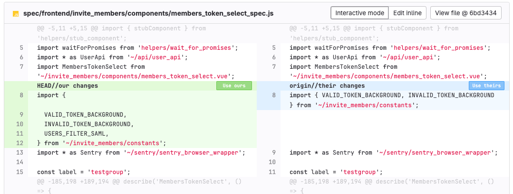

# Merge conflicts

DETAILS:
**Tier:** Free, Premium, Ultimate
**Offering:** GitLab.com, Self-managed, GitLab Dedicated

Merge conflicts happen when the two branches in a merge request (the source and target) each have different
changes, and you must decide which change to accept. In a merge request, Git compares
the two versions of the files line by line. In most cases, GitLab can merge changes
together. However, if two branches both change the same lines, GitLab blocks the merge,
and you must choose which change you want to keep:


A merge request with conflicts cannot merge until you either:

- Create a merge commit.
- Resolve the conflict through a rebase.

GitLab resolves conflicts by creating a merge commit in the source branch, but
does not merge it into the target branch. You can then review and test the
merge commit. Verify it contains no unintended changes and doesn't break your build.

## Understand the conflict block

When Git detects a conflict that requires a decision on your part, it marks the
beginning and end of the conflict block with conflict markers:

- `<<<<<<< HEAD` marks the beginning of the conflict block.
- Your changes are shown.
- `=======` marks the end of your changes.
- The latest changes in the target branch are shown.
- `>>>>>>>` marks the end of the conflict.

When you resolve a conflict, you delete:

1. The version of the conflicted lines you don't want to keep.
1. The three conflict markers: the beginning, the end, and the `=======` line between
   the two versions.

## Conflicts you can resolve in the user interface

If your merge conflict meets all of the following conditions, you can resolve the
merge conflict in the GitLab user interface:

- The file is text, not binary.
- The file is in a UTF-8 compatible encoding.
- The file does not already contain conflict markers.
- The file, with conflict markers added, is less than 200 KB in size.
- The file exists under the same path in both branches.

If any file in your merge request contains conflicts, but can't meet all of these
criteria, you must resolve the conflict manually.

## Conflicts GitLab can't detect

GitLab does not detect conflicts when both branches rename a file to different names.
For example, these changes don't create a conflict:

1. Branch `one` renames `example.txt` to `example1.txt`
1. Branch `two` renames `example.txt` to `example_old.txt`.

When these branches merge, both `example1.txt` and `example_old` are present.

## Methods of resolving conflicts

GitLab shows [conflicts available for resolution](#conflicts-you-can-resolve-in-the-user-interface)
in the user interface, and you can also resolve conflicts locally through the command line:

- **Interactive mode**: UI method best for
  conflicts that only require you to select which version of a line to keep, without edits.
- **Inline editor**: UI method best for more complex conflicts that require you to
  edit lines and manually blend changes together.
- **Command line**: provides complete control over the most complex conflicts.

### In interactive mode

To resolve less-complex conflicts from the GitLab user interface:

1. On the left sidebar, select **Search or go to** and find your project.
1. Select **Code > Merge requests** and find the merge request.
1. Select **Overview**, and scroll to the merge request reports section.
1. Find the merge conflicts message, and select **Resolve conflicts**.
   GitLab shows a list of files with merge conflicts. The lines that conflict are
   highlighted:

   

1. For each conflict, select **Use ours** or **Use theirs** to mark the version
   of the conflicted lines you want to keep. This decision is known as
   "resolving the conflict."
1. When you've resolved all of the conflicts, enter a **Commit message**.
1. Select **Commit to source branch**.

Resolving conflicts merges the target branch of the merge request into the
source branch, using the version of the text you chose. If the source branch is
`feature` and the target branch is `main`, these actions are similar to running
`git switch feature; git merge main` locally.

### In the inline editor

Some merge conflicts are more complex, and you must manually modify lines to
resolve their conflicts. The merge conflict resolution editor helps you resolve
these complex conflicts in the GitLab interface:

1. On the left sidebar, select **Search or go to** and find your project.
1. Select **Code > Merge requests** and find the merge request.
1. Select **Overview**, and scroll to the merge request reports section.
1. Find the merge conflicts message, and select **Resolve conflicts**.
   GitLab shows a list of files with merge conflicts.
1. Find the file to edit manually, and scroll to the conflict block.
1. In the header for that file, select **Edit inline** to open the editor. In this
   example, the conflict block begins at line 1350 and ends at line 1356:

   

1. After you resolve the conflict, enter a **Commit message**.
1. Select **Commit to source branch**.

### From the command line

While most conflicts can be resolved through the GitLab user interface, some are too complex.
Complex conflicts are best fixed locally, from the command line, to give you the
most control over each change.

Prerequisites:

- You must have permission to force push to branches.

1. Open the terminal and check out your feature branch. For example, `my-feature-branch`:

   ```shell
   git switch my-feature-branch
   ```

1. [Rebase your branch](../../../topics/git/git_rebase.md#rebase-by-using-git) against the
   target branch (here, `main`) so Git prompts you with the conflicts:

   ```shell
   git fetch
   git rebase origin/main
   ```

1. Open the conflicting file in your preferred code editor.
1. Find the conflict block.
1. Edit the file:
   1. Choose which version (before or after `=======`) you want to keep.
   1. Delete the version you don't want to keep.
   1. Delete the conflict markers.
1. Save the file.
1. Repeat the process for each file that contains conflicts.
1. Stage your changes in Git:

   ```shell
   git add .
   ```

1. Commit your changes:

   ```shell
   git commit -m "Fix merge conflicts"
   ```

1. Continue the rebase:

   ```shell
   git rebase --continue
   ```

   WARNING:
   Up to this point, you can run `git rebase --abort` to stop the process.
   Git aborts the rebase and rolls back the branch to the state you had before
   running `git rebase`.
   After you run `git rebase --continue`, you cannot abort the rebase.

1. [Force-push](../../../topics/git/git_rebase.md#force-pushing) the changes to your
   remote branch.

## Related topics

- [Introduction to Git rebase and force-push](../../../topics/git/git_rebase.md)
- [Git applications for visualizing the Git workflow](https://git-scm.com/downloads/guis)
- [Automatic conflict resolution with `git rerere`](https://git-scm.com/book/en/v2/Git-Tools-Rerere)
