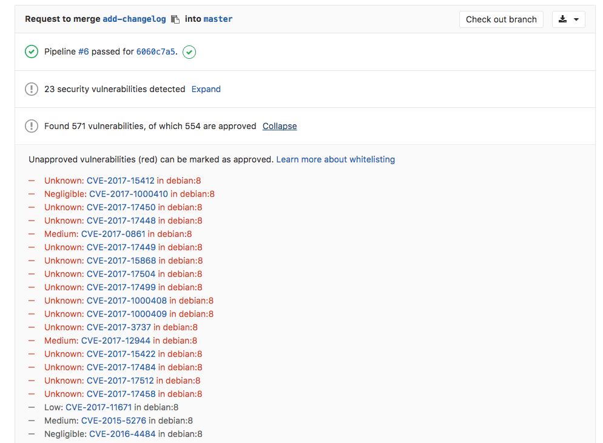

# Container Scanning **[ULTIMATE]**

> [Introduced][ee-3672] in [GitLab Ultimate][ee] 10.4.

## Overview

If you are using [GitLab CI/CD][ci], you can analyze your Docker images for known
vulnerabilities using [Clair](https://github.com/coreos/clair),
a Vulnerability Static Analysis tool for containers.

Going a step further, GitLab can show the vulnerability list right in the merge
request widget area.

## Use cases

If you distribute your application with Docker, then there's a great chance
that your image is based on other Docker images that may in turn contain some
known vulnerabilities that could be exploited.

Having an extra job in your pipeline that checks for those vulnerabilities,
and the fact that they are displayed inside a merge request, makes it very easy
to perform audits for your Docker-based apps.

## How it works

In order for the report to show in the merge request, you need to specify a
`container_scanning` job (exact name) that will analyze the code and upload the
resulting `gl-container-scanning-report.json` file as an artifact (exact filename).
GitLab will then check this file and show the information inside the merge request.

For more information on how the `container_scanning` job should look like, check the
example on [analyzing a Docker image for vulnerabilities][cc-docs].

CAUTION: **Caution:**
Container Scanning was previously using `sast:container` for job name and
`gl-sast-container-report.json` for the artifact name. While these old names
are still maintained they have been deprecated with GitLab 11.0 and may be removed
in next major release, GitLab 12.0. You are advised to update your current `.gitlab-ci.yml`
configuration to reflect that change.

[ee-3672]: https://gitlab.com/gitlab-org/gitlab-ee/merge_requests/3672
[ee]: https://about.gitlab.com/pricing/
[ci]: ../../../ci/README.md
[cc-docs]: ../../../ci/examples/container_scanning.md
