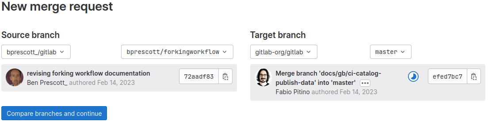

DETAILS:
**Tier:** Free, Premium, Ultimate
**Offering:** GitLab.com, GitLab Self-Managed, GitLab Dedicated

GitLab provides many different ways to create a merge request, including by [using Git commands](../../../topics/git/merge.md).

NOTE:
GitLab enforces [branch naming rules](../repository/branches/_index.md#name-your-branch)
to prevent problems, and provides
[branch naming patterns](../repository/branches/_index.md#prefix-branch-names-with-issue-numbers)
to streamline merge request creation.

## From the merge request list

You can create a merge request from the list of merge requests.

1. On the left sidebar, select **Search or go to** and find your GitLab project.
1. Select **Code > Merge requests**.
1. In the upper-right corner, select **New merge request**.
1. Select a source and target branch, then select **Compare branches and continue**.
1. Complete the fields on the **New merge request** page, then select **Create merge request**.

Each branch can be associated with only one open merge request. If a merge request
already exists for this branch, a link to the existing merge request is shown.

## From an issue

If your development workflow requires an issue for every merge
request, you can create a branch directly from the issue to speed the process up.
The new branch, and later its merge request, are marked as related to this issue.
After merging the merge request, the issue is closed automatically, unless
[automatic issue closing is disabled](../issues/managing_issues.md#disable-automatic-issue-closing):

::Tabs

:::TabTitle Merge request and branch

To create a branch and a merge request at the same time:

1. On the left sidebar, select **Search or go to** and find your project.
1. Select **Plan > Issues** and find your issue.
1. Go to the bottom of the issue description.
1. Select **Create merge request > Create merge request and branch**.
1. On the dialog, review the suggested branch name. It's based on your project's
   [branch name template](../repository/branches/_index.md).
1. Optional. If the branch name is already taken, or you need a different branch name, rename it.
1. Select a source branch or tag.
1. Select **Create merge request**.

:::TabTitle Branch only

To create only a branch directly from an issue:

1. On the left sidebar, select **Search or go to** and find your project.
1. Select **Plan > Issues** and find your issue.
1. Go to the bottom of the issue description.
1. Select **Create merge request > Create branch**.
1. In the dialog, review the suggested branch name. It's based on your project's
   [branch name template](../repository/branches/_index.md) Rename it if the
   branch name is already taken, or you need a different branch name.
1. Select a source branch or tag.
1. Select **Create branch**.

::EndTabs

If your Git repository is empty, GitLab:

- Creates a default branch.
- Commits a blank `README.md` file to it.
- Creates and redirects you to a new branch based on the issue title.
- If your project is [configured with a deployment service](../integrations/_index.md) like Kubernetes,
  GitLab prompts you to set up [auto deploy](../../../topics/autodevops/stages.md#auto-deploy)
  by helping you create a `.gitlab-ci.yml` file.

If the name of the branch you create is
[prefixed with the issue number](../repository/branches/_index.md#prefix-branch-names-with-issue-numbers),
GitLab cross-links the issue and merge request, and adds the
[issue closing pattern](../issues/managing_issues.md#closing-issues-automatically)
to the description of the merge request. In most cases, this looks like `Closes #ID`,
where `ID` is the ID of the issue. If your project is configured with a
[closing pattern](../issues/managing_issues.md#default-closing-pattern), the issue closes
when the merge request merges.

## From a task

> - [Introduced](https://gitlab.com/gitlab-org/gitlab/-/issues/477785) in GitLab 17.8.

If your team breaks issues into [tasks](../../tasks.md), you can create a branch directly from the task to speed the process up.
The new branch, and later its merge request, are marked as related to this task.
After merging the merge request, the task is closed automatically, unless
[automatic issue closing is disabled](../issues/managing_issues.md#disable-automatic-issue-closing):

Prerequisites:

- You must have at least a Developer role for the project containing the task.

::Tabs

:::TabTitle Merge request and branch

To create a branch and a merge request at the same time:

1. On the left sidebar, select **Search or go to** and find your project.
1. Select **Plan > Issues**.
1. In the issue list, find your task.
1. Go to the bottom of the task description.
1. Select **Create merge request**.
1. On the dialog, review the suggested branch name.
   It's based on your project's [branch name template](../repository/branches/_index.md).
1. Optional. If the branch name is already taken, or you need a different branch name, rename it.
1. Select a source branch or tag.
1. Select **Create merge request**.

:::TabTitle Branch only

To create only a branch directly from a task:

1. On the left sidebar, select **Search or go to** and find your project.
1. Select **Plan > Issues**.
1. In the issue list, find your task.
1. Go to the bottom of the task description.
1. Select **Create merge request > Create branch**.
1. On the dialog, review the suggested branch name.
   It's based on your project's [branch name template](../repository/branches/_index.md).
1. Optional. If the branch name is already taken, or you need a different branch name, rename it.
1. Select a source branch or tag.
1. Select **Create branch**.

::EndTabs

If your Git repository is empty, GitLab:

- Creates a default branch.
- Commits a blank `README.md` file to it.
- Creates and redirects you to a new branch based on the issue title.
- If your project is [configured with a deployment service](../integrations/_index.md) like Kubernetes,
  GitLab prompts you to set up [auto deploy](../../../topics/autodevops/stages.md#auto-deploy)
  by helping you create a `.gitlab-ci.yml` file.

If the name of the branch you create is
[prefixed with the task number](../repository/branches/_index.md#prefix-branch-names-with-issue-numbers),
GitLab cross-links the issue and merge request, and adds the
[closing pattern](../issues/managing_issues.md#closing-issues-automatically)
to the description of the merge request. In most cases, this looks like `Closes #ID`,
where `ID` is the ID of the task. If your project is configured with a
[closing pattern](../issues/managing_issues.md#default-closing-pattern), the task closes
when the merge request merges.

## From the Web Editor

You can create a merge request when you do the following from the Web Editor:

- [Create a file](../repository/web_editor.md#create-a-file).
- [Edit a file](../repository/web_editor.md#edit-a-file).
- [Upload a file](../repository/web_editor.md#upload-a-file).
- [Delete a file](../repository/web_editor.md#delete-a-file).
- [Create a directory](../repository/web_editor.md#create-a-directory).

## When you create a branch

You can create a merge request when you create a branch.

1. On the left sidebar, select **Search or go to** and find your project.
1. Select **Code > Branches**.
1. Type a branch name and select **New branch**.
1. Above the file list, select **Create merge request**.
   A merge request is created. The default branch is the target.
1. Fill out the fields and select **Create merge request**.

## When you work in a fork

You can create a merge request from your fork to contribute back to the main project.

1. On the left sidebar, select **Search or go to** and find your fork.
1. Select **Code > Merge requests**, and select **New merge request**.
1. For **Source branch**, select the branch in your fork that contains your changes.
1. For **Target branch**:

   1. Select the upstream repository, and not your fork.
      If you contribute changes upstream frequently, consider setting a
      [default target](#set-the-default-target-project) for your fork.
   1. Select a branch from the upstream repository:

      

   NOTE:
   If your fork's visibility is more restricted than the parent repository, the target branch defaults
   to your fork's default branch. This prevents potential exposure of private information in your fork.

1. Select **Compare branches and continue**.
1. Select **Create merge request**. The merge request is created in the target repository,
   not your fork.
1. Add your desired labels, milestones, reviewers, and assignees.
1. Select **Submit merge request**.

If the merge request targets another repository, it uses:

- The target project's approval rules.
- Your fork's CI/CD configuration, resources, and project CI/CD variables.

To run CI/CD pipelines in the upstream project,
[you must be a member of that project](../../../ci/pipelines/merge_request_pipelines.md#use-with-forked-projects).
If you run a merge request pipeline
[in the parent project](../../../ci/pipelines/merge_request_pipelines.md#run-pipelines-in-the-parent-project)
for a merge request from a fork, all variables become available to the pipeline.

After your work merges, [unlink your fork](../repository/forking_workflow.md#unlink-a-fork)
from its upstream repository if you don't intend to make more contributions.

### Set the default target project

By default, merge requests originating from a fork target the upstream repository, not your fork.
You can configure your forked repository to be the default target, rather than the upstream repository.

Prerequisites:

- You're working in a fork.
- You must have at least the Developer role, or be allowed to create merge requests in the project.
- The upstream repository allows merge requests to be created.
- The [visibility settings](../../public_access.md#change-project-visibility) for
  the fork must match, or be less strict than, the upstream repository. For example:
  this setting isn't shown if your fork is private, but the upstream is public.

To do this:

1. On the left sidebar, select **Search or go to** and find your project.
1. Select **Settings > Merge requests**.
1. In the **Target project** section, select the option you want to use for
   your default target project.
1. Select **Save changes**.

## By sending an email

You can create a merge request by sending an email message to GitLab.
The merge request target branch is the repository's default branch.

Prerequisites:

- The merge request must target the current repository, not an upstream repository.
- A GitLab administrator must configure [incoming email](../../../administration/incoming_email.md).
  This setting is enabled on GitLab.com.
- A GitLab administrator must configure [Reply by email](../../../administration/reply_by_email.md).
  This setting is enabled on GitLab.com.
- You must have at least the Developer role, or be allowed to create merge requests in the project.

To create a merge request by sending an email:

1. On the left sidebar, select **Search or go to** and find your project.
1. Select **Code > Merge requests**.
1. If the project contains any merge requests, select **Email a new merge request to this project**.
1. In the dialog, copy the email address shown. Keep this address private. Anyone who
   has it can create issues or merge requests as if they were you.
1. Open an email and compose a message with the following information:

   - The **To** line is the email address you copied.
   - The **Subject** is the source branch name.
   - The body of the email is the merge request description.

1. To add commits, attach `.patch` files to the message.
1. Send the email.

A merge request is created.

### Add attachments when creating a merge request by email

Add commits to a merge request by adding patches as attachments to the email.

- The combined size of the patches must be 2 MB or less.
- To be considered a patch, the attachment's filename must end in `.patch`.
- Patches are processed in order by name.
- If the source branch from the subject does not exist, it is
  created from the repository's `HEAD`, or the default target branch.
  To change the target branch manually, use the
  [`/target_branch` quick action](../quick_actions.md).
- If the source branch already exists, patches are applied on top of it.

## Troubleshooting

### No option to create a merge request on an issue

The option to **Create merge request** doesn't display on an issue if:

- A branch with the same name already exists.
- A merge request already exists for this branch.
- Your project has an active fork relationship.
- Your project is private and the issue is confidential.

To make this button appear, one possible workaround is to
[remove your project's fork relationship](../repository/forking_workflow.md#unlink-a-fork).
After removal, you can't restore the fork relationship. Your project can no longer
send or receive merge requests to the source project, or other forks of it.

### Email message could not be processed

When sending an email to create a merge request, and you attempt to target an
upstream repository, GitLab responds with this error:

```plaintext
Unfortunately, your email message to GitLab could not be processed.

You are not allowed to perform this action. If you believe this is in error, contact a staff member.
```
