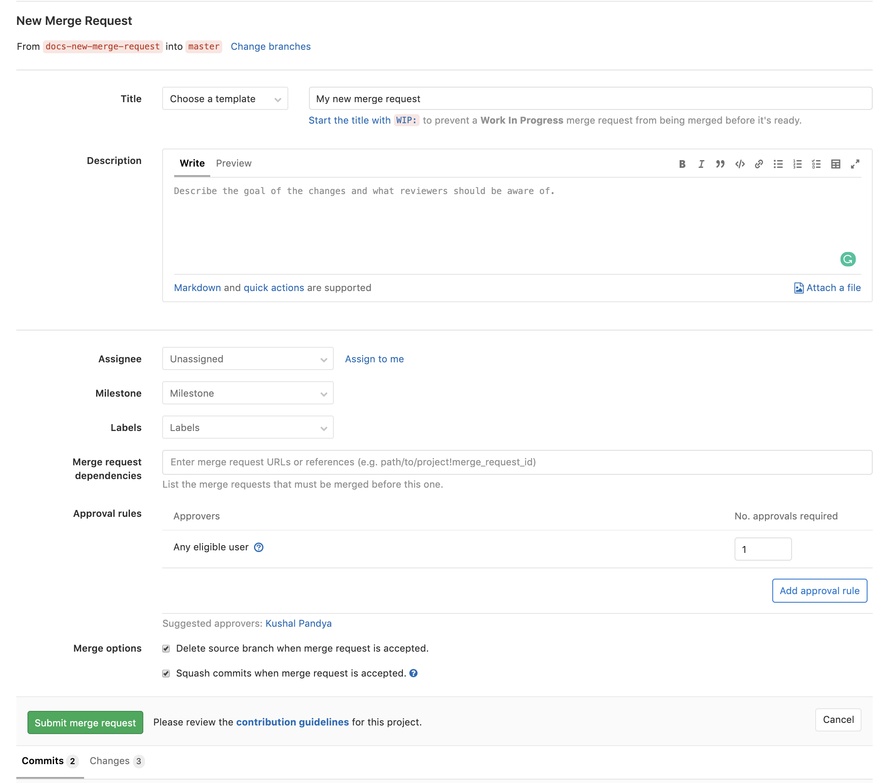

# How to create a merge request

Before creating a merge request, read through an
[introduction to Merge Requests](getting_started.md)
to familiarize yourself with the concept, the terminology,
and to learn what you can do with them.

Every merge request starts by creating a branch. You can either
do it locally through the command line, via a Git CLI application,
or through the GitLab UI.

This document describes the several ways to create a merge request.

When you start a new merge request, regarless of the method,
you'll be taken to the [**New Merge Request** page](#new-merge-request-page)
to fill it with information about the merge request.

If you push a new branch to GitLab, also regardless of the method,
you can click the [**Create Merge Request**](#create-merge-request-button)
button and start a merge request from there.

## New Merge Request page

On the **New Merge Request** page, start by filling in the title
and description for the merge request. If there are are already
commits on the branch, the title will be pre-filled with the first
line of the first commit message, and the description will be
pre-filled with any additional lines in the commit message.
The title is the only field that is mandatory in all cases.

From there, you can fill it with information (title, description,
assignee(s), milestone, labels, approvers) and click **Create Merge Request**.

From that initial screen, you can also see all the commits,
pipelines, and file changes pushed to your branch before submitting
the merge request.



TIP: **Tip:**
You can push one or more times to your branch in GitLab before
creating the merge request.

## Create Merge Request button

Once you have pushed a new branch to GitLab, visit your repository
in GitLab and to see a call-to-action at the top of your screen
from which you can click the button **Create Merge Request**.


You can also see the **Create merge request** button in the top-right of the:

- **Project** page.
- **Repository > Files** page.
- **Merge Requests** page.

In this case, GitLab will use the most recent branch you pushed
changes to as the source branch, and the default branch in the current
project as the target.

## New merge request by adding, editing, and uploading a file

When you choose to edit, add, or upload a file through the GitLab UI,
at the end of the file you'll see the option to add the **Commit message**,
to select the **Target branch** of that commit, and the checkbox to
**Start new a merge request with these changes**.

Similarly, if you change files through the Web IDE, when you navigate to **Commit** on the left-hand sidebar, you'll see these same options.

Once you have added, edited, or uploaded the file:

1. Describe your changes in the commit message.
1. Select an existing branch to add your commit into, or, if you'd like to create a new branch, type the new branch name (without spaces, capital letters, or special chars).
1. Keep the checkbox checked to start a new merge request straightaway, or, uncheck it to add more changes to that branch before starting the merge request.
1. Click **Commit changes**.

If you chose to start a merge request, you'll be taken to the
[**New Merge Request** page](#new-merge-request-page), from
which you can fill it in with information and submit the merge request.

The merge request will target the default branch of the repository.
If you want to change it, you can do it later by editing the merge request.

## New merge request from a new branch created through the UI

To quickly start working on files through the GitLab UI,
navigate to your project's **Repository > Branches** and click
**New branch**. A new branch will be created and you can start
editing files.

Once committed and pushed, you can click on the [**Create Merge Request**](#create-merge-request-button)
button to open the [**New Merge Request** page](#new-merge-request-page).
A new merge request will be started using the current branch as the source,
and the default branch in the current project as the target.

## New merge request from you local environment

Assuming you have your repository cloned into your computer and you'd
like to start working on changes to files, start by creating and
checking out a new branch:

```bash
git checkout -b my-new-branch
```

Work on your file changes, stage, and commit them:

```bash
git add .
git commit -m "My commit message"
```

Once you're done, [push your branch to GitLab](../../../gitlab-basics/start-using-git.md#send-changes-to-gitlabcom):

```bash
git push origin my-new-branch
```

In the output, GitLab will prompt you with a direct link for creating
a merge request:

```bash
...
remote: To create a merge request for docs-new-merge-request, visit:
remote:   https://gitlab-instance.com/my-group/my-project/merge_requests/new?merge_request%5Bsource_branch%5D=my-new-branch
```

Copy that link and paste it in your browser, and the [**New Merge Request page**](#new-merge-request-page)
will be displayed.

There is also a number of [flags you can add to commands when pushing through the command line](../push_options.md) to reduce the need for editing merge requests manually through the UI.

If you didn't push your branch to GitLab through the command line
(for example, you used a Git CLI application to push your changes),
you can create a merge request through the GitLab UI by clicking
the [**Create Merge Request**](#create-merge-request-button) button.

## New merge request from an issue

You can also [create a new merge request directly from an issue](../repository/web_editor.md#create-a-new-branch-from-an-issue).

## New merge request from the Merge Requests page

You can start creating a new merge request by clicking the
**New merge request** button on the **Merge Requests** page in a project.
Then choose the source project and branch that contain your changes,
and the target project and branch where you want to merge the changes into.
Click on **Compare branches and continue** to go to the
[**New Merge Request** page](#new-merge-request-page) and fill in the details.

## New merge request by email **(CORE ONLY)**

_This feature needs [incoming email](../../../administration/incoming_email.md)
to be configured by a GitLab administrator to be available._ It isn't
available in GitLab.com.

You can create a new merge request by sending an email to a user-specific email
address. The address can be obtained on the merge requests page by clicking on
a **Email a new merge request to this project** button. The subject will be
used as the source branch name for the new merge request and the target branch
will be the default branch for the project. The message body (if not empty)
will be used as the merge request description. You need
["Reply by email"](../../../administration/reply_by_email.md) enabled to use
this feature. If it's not enabled to your instance, you may ask your GitLab
administrator to do so.

This is a private email address, generated just for you. **Keep it to yourself**
as anyone who gets ahold of it can create issues or merge requests as if they were you.
You can add this address to your contact list for easy access.


_In GitLab 11.7, we updated the format of the generated email address.
However the older format is still supported, allowing existing aliases
or contacts to continue working._

### Adding patches when creating a merge request via e-mail

> [Introduced](https://gitlab.com/gitlab-org/gitlab-foss/merge_requests/22723) in GitLab 11.5.

You can add commits to the merge request being created by adding
patches as attachments to the email. All attachments with a filename
ending in `.patch` will be considered patches and they will be processed
ordered by name.

The combined size of the patches can be 2MB.

If the source branch from the subject does not exist, it will be
created from the repository's HEAD or the specified target branch to
apply the patches. The target branch can be specified using the
[`/target_branch` quick action](../quick_actions.md). If the source
branch already exists, the patches will be applied on top of it.

## Reviewing and managing Merge Requests

Once you have submitted a merge request, it can be [reviewed and managed](reviewing_and_managing_merge_requests.md) through GitLab.
