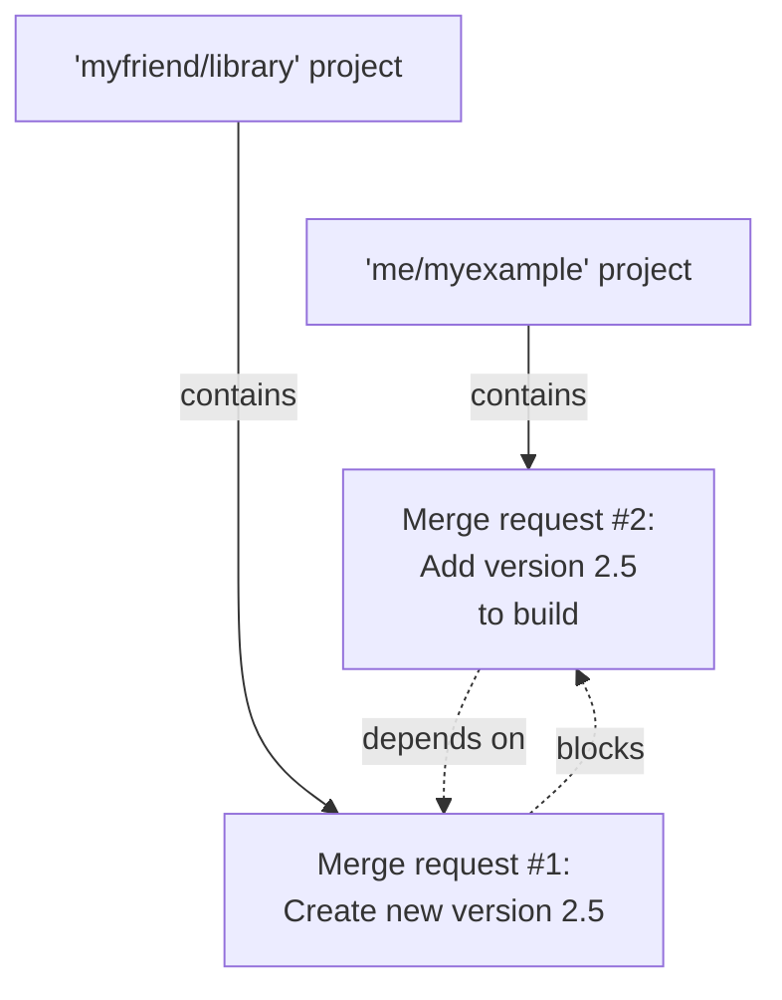

# Merge request dependencies

DETAILS:
**Tier:** Premium, Ultimate
**Offering:** GitLab.com, Self-managed, GitLab Dedicated

> - Support for complex merge dependencies [introduced](https://gitlab.com/gitlab-org/gitlab/-/issues/11393) in GitLab 16.6 [with a flag](../../../administration/feature_flags.md) named `remove_mr_blocking_constraints`. Disabled by default.
> - Support for complex merge dependencies [generally available](https://gitlab.com/gitlab-org/gitlab/-/merge_requests/136775) in GitLab 16.7. Feature flag `remove_mr_blocking_constraints` removed.

A single feature can span several merge requests, spread out across multiple projects,
and the order in which the work merges can be significant. Use merge request dependencies
when it's important to merge work in a specific order. Some examples:

- Ensure changes to a required library are merged before changes to a project that
  imports the library.
- Prevent a documentation-only merge request from merging before the feature work
  is itself merged.
- Require a merge request updating a permissions matrix to merge, before merging work
  from someone who hasn't yet been granted permissions.

If your project `me/myexample` imports a library from `myfriend/library`,
you might want to update your project to use a new feature in `myfriend/library`.
However, if you merge changes to your project before the external library adds the
new feature, you would break the default branch in your project. A merge request
dependency prevents your work from merging too soon:

You could mark your `me/myexample` merge request as a [draft](drafts.md)
and explain why in the comments. However, this approach is manual and does not scale, especially
if your merge request relies on several others in multiple projects. Instead,
use the draft (or ready) state to track the readiness of an individual
merge request, and a merge request dependency to enforce merge order.

NOTE:
Merge request dependencies are a **PREMIUM** feature, but this restriction is
enforced only for the dependent merge request. A merge request in a **PREMIUM**
project can depend on a merge request in a **FREE** project, but a merge request
in a **FREE** project cannot be marked as dependent.

## Nested dependencies

Indirect, nested dependencies are supported in GitLab 16.7 and later.
A single merge request can be blocked by up to 10 merge requests, and,
in turn, can block up to 10 merge requests. In this example, `myfriend/library!10`
depends on `herfriend/another-lib!1`, which in turn depends on `mycorp/example!100`:

Nested dependencies do not display in the GitLab UI, but UI support has
been proposed in [epic 5308](https://gitlab.com/groups/gitlab-org/-/epics/5308).

NOTE:
A merge request can't be made dependent on itself (self-referential), but
it's possible to create circular dependencies.

## View dependencies for a merge request

If a merge request is dependent on another, the merge request reports section shows
information about the dependency:

To view dependency information on a merge request:

1. On the left sidebar, select **Search or go to** and find your project.
1. Select **Code > Merge requests** and identify your merge request.
1. Scroll to the merge request reports area. Dependent merge requests display information
   about the total number of dependencies set, such as
   **(status-warning)** **Depends on 1 merge request being merged**.
1. Select **Expand** to view the title, milestone, assignee, and pipeline status
   of each dependency.

Until your merge request's dependencies all merge, your merge request
cannot be merged. The message
**Merge blocked: you can only merge after the above items are resolved** displays.

### Closed merge requests

Closed merge requests still prevent their dependents from being merged, because
a merge request can close regardless of whether or not the planned work actually merged.

If a merge request closes and the dependency is no longer relevant,
remove it as a dependency to unblock the dependent merge request.

## Create a new dependent merge request

When you create a new merge request, you can prevent it from merging until after
other specific work merges, even if the merge request is in a different project.

Prerequisites:

- You must have at least the Developer role or be allowed to create merge requests in the project.
- The dependent merge request must be in a project in the Premium or Ultimate tier.

To create a new merge request and mark it as dependent on another:

1. [Create a new merge request](creating_merge_requests.md).
1. In **Merge request dependencies**, paste either the reference or the full URL
   to the merge requests that should merge before this work merges. References
   are in the form of `path/to/project!merge_request_id`.
1. Select **Create merge request**.

## Edit a merge request to add a dependency

You can edit an existing merge request and mark it as dependent on another.

Prerequisites:

- You must have at least the Developer role or be allowed to edit merge requests in the project.

To do this:

1. On the left sidebar, select **Search or go to** and find your project.
1. Select **Code > Merge requests** and identify your merge request.
1. Select **Edit**.
1. In **Merge request dependencies**, paste either the reference or the full URL
   to the merge requests that should merge before this work merges. References
   are in the form of `path/to/project!merge_request_id`.

## Remove a dependency from a merge request

You can edit a dependent merge request and remove a dependency.

Prerequisites:

- You must have a role in the project that allows you to edit merge requests.

1. On the left sidebar, select **Search or go to** and find your project.
1. Select **Code > Merge requests** and identify your merge request.
1. Select **Edit**.
1. Scroll to **Merge request dependencies** and select **Remove** next to the reference
   for each dependency you want to remove.

   NOTE:
   Dependencies for merge requests you don't have access to are displayed as
   **1 inaccessible merge request**, and can be removed the same way.
1. Select **Save changes**.

## Troubleshooting

### API support for managing merge request dependencies

No API support exists for managing dependencies. For more information, read
[issue #12551](https://gitlab.com/gitlab-org/gitlab/-/issues/12551).

### Preserving dependencies on project import or export

Dependencies are not preserved when projects are imported or exported. For more
information, read [issue #12549](https://gitlab.com/gitlab-org/gitlab/-/issues/12549).
