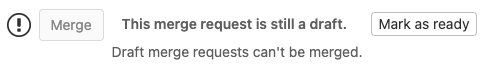

# Draft merge requests **(FREE)**

If a merge request isn't ready to merge, potentially because of continued development
or open threads, you can prevent it from being accepted before you
[mark it as ready](#mark-merge-requests-as-ready). Flag it as a draft to disable
the **Merge** button until you remove the **Draft** flag:

## Mark merge requests as drafts

> - [Introduced](https://gitlab.com/gitlab-org/gitlab/-/issues/32692) in GitLab 13.2, Work-In-Progress (WIP) merge requests were renamed to **Draft**. Support for using **WIP** is scheduled for removal in GitLab 14.0.
> - **Mark as draft** and **Mark as ready** buttons [introduced](https://gitlab.com/gitlab-org/gitlab/-/issues/227421) in GitLab 13.5.

There are several ways to flag a merge request as a draft:

- **Viewing a merge request**: In the top right corner of the merge request, click **Mark as draft**.
- **Creating or editing a merge request**: Add `[Draft]`, `Draft:` or `(Draft)` to
  the beginning of the merge request's title, or click **Start the title with Draft:**
  below the **Title** field.
- **Commenting in an existing merge request**: Add the `/draft`
  [quick action](../quick_actions.md#issues-merge-requests-and-epics)
  in a comment. This quick action is a toggle, and can be repeated to change the status
  again. This quick action discards any other text in the comment.
- **Creating a commit**: Add `draft:`, `Draft:`, `fixup!`, or `Fixup!` to the
  beginning of a commit message targeting the merge request's source branch. This
  is not a toggle, and adding this text again in a later commit doesn't mark the
  merge request as ready.

WARNING:
Adding `WIP:` to the start of the merge request's title still marks a merge request
as a draft. This feature is scheduled for removal in GitLab 14.0. Use `Draft:` instead.

## Mark merge requests as ready

When a merge request is ready to be merged, you can remove the `Draft` flag in several ways:

- **Viewing a merge request**: In the top right corner of the merge request, click **Mark as ready**.
  Users with [Developer or greater permissions](../../permissions.md)
  can also scroll to the bottom of the merge request description and click **Mark as ready**:

  

- **Editing an existing merge request**: Remove `[Draft]`, `Draft:` or `(Draft)`
  from the beginning of the title, or click **Remove the Draft: prefix from the title**
  below the **Title** field.
- **Commenting in an existing merge request**: Add the `/draft`
  [quick action](../quick_actions.md#issues-merge-requests-and-epics)
  in a comment in the merge request. This quick action is a toggle, and can be repeated
  to change the status back. This quick action discards any other text in the comment.

In [GitLab 13.10 and later](https://gitlab.com/gitlab-org/gitlab/-/issues/15332),
when you mark a merge request as ready, notifications are triggered to
[merge request participants and watchers](../../profile/notifications.md#notifications-on-issues-merge-requests-and-epics).

## Include or exclude drafts when searching

When viewing or searching in your project's merge requests list, you can include or exclude
draft merge requests:

1. Go to your project and select **Merge requests**.
1. In the navigation bar, click **Open**, **Merged**, **Closed**, or **All** to
   filter by merge request status.
1. Click the search box to display a list of filters and select **Draft**, or
   enter the word `draft`.
1. Select `=`.
1. Select **Yes** to include drafts, or **No** to exclude, and press **Return**
   to update the list of merge requests:

   

## Pipelines for drafts

When the [pipelines for merged results](../../../ci/pipelines/pipelines_for_merged_results.md)
feature is enabled, draft merge requests run
[merge request pipelines](../../../ci/pipelines/merge_request_pipelines.md) only.

To run pipelines for merged results, you must
[mark the merge request as ready](#mark-merge-requests-as-ready).

<!-- ## Troubleshooting

Include any troubleshooting steps that you can foresee. If you know beforehand what issues
one might have when setting this up, or when something is changed, or on upgrading, it's
important to describe those, too. Think of things that may go wrong and include them here.
This is important to minimize requests for support, and to avoid doc comments with
questions that you know someone might ask.

Each scenario can be a third-level heading, e.g. `### Getting error message X`.
If you have none to add when creating a doc, leave this section in place
but commented out to help encourage others to add to it in the future. -->
