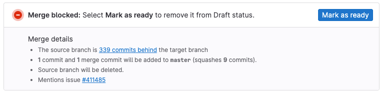
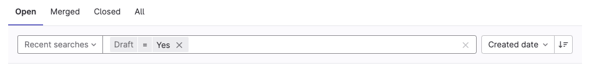

DETAILS:
**Tier:** Free, Premium, Ultimate
**Offering:** GitLab.com, GitLab Self-Managed, GitLab Dedicated

If a merge request isn't ready to merge, you can block it from merging until you
[mark it as ready](#mark-merge-requests-as-ready). Merge requests marked as **Draft**
cannot merge until you remove the **Draft** flag, even if they meet all other merge criteria:

## Mark merge requests as drafts

> - `/draft` quick action as a toggle [deprecated](https://gitlab.com/gitlab-org/gitlab/-/merge_requests/92654) in GitLab 15.4.
> - [Changed](https://gitlab.com/gitlab-org/gitlab/-/merge_requests/108073) the draft status to use a checkbox in GitLab 15.8.

You can flag a merge request as a draft in several ways:

- **Viewing a merge request**: In the upper-right corner of the merge request,
  select **Merge request actions** (**{ellipsis_v}**), then **Mark as draft**.
- **Creating or editing a merge request**: Add `[Draft]`, `Draft:` or `(Draft)` to
  the beginning of the merge request's title, or select **Mark as draft**
  below the **Title** field.
- **Commenting in an existing merge request**: Add the `/draft`
  [quick action](../quick_actions.md#issues-merge-requests-and-epics)
  in a comment. To mark a merge request as ready, use `/ready`.
- **Creating a commit**: Add `draft:`, `Draft:`, `fixup!`, or `Fixup!` to the
  beginning of a commit message targeting the merge request's source branch. This
  method is not a toggle. Adding this text again in a later commit doesn't mark the
  merge request as ready.

## Mark merge requests as ready

When a merge request is ready to merge, you can remove the `Draft` flag in several ways:

- **Viewing a merge request**: In the upper-right corner of the merge request, select **Mark as ready**.
  Users with at least the Developer role
  can also scroll to the bottom of the merge request description and select **Mark as ready**.
- **Editing an existing merge request**: Remove `[Draft]`, `Draft:` or `(Draft)`
  from the beginning of the title, or clear **Mark as draft**
  below the **Title** field.
- **Commenting in an existing merge request**: Add the `/ready`
  [quick action](../quick_actions.md#issues-merge-requests-and-epics)
  in a comment in the merge request.

When you mark a merge request as ready, GitLab notifies
[merge request participants and watchers](../../profile/notifications.md#notifications-on-issues-merge-requests-and-epics).

## Include or exclude drafts when searching

When you view or search in your project's merge requests list, to include or exclude
draft merge requests:

1. On the left sidebar, select **Search or go to** and find your project.
1. Select **Code > Merge requests**.
1. To filter by merge request status, select **Open**, **Merged**, **Closed**,
   or **All** in the navigation bar.
1. Select the search box to display a list of filters and select **Draft**, or
   enter the word `draft`.
1. Select `=`.
1. Select **Yes** to include drafts, or **No** to exclude, and press **Return**
   to update the list of merge requests:

   

## Pipelines for drafts

Draft merge requests run the same pipelines as merge requests marked as ready.

In GitLab 15.0 and earlier, you must [mark the merge request as ready](#mark-merge-requests-as-ready)
if you want to run [merged results pipelines](../../../ci/pipelines/merged_results_pipelines.md).

To skip a pipeline for a draft merge request, see [Skip pipelines for draft merge requests](../../../ci/yaml/workflow.md#skip-pipelines-for-draft-merge-requests).

<!-- ## Troubleshooting

Include any troubleshooting steps that you can foresee. If you know beforehand what issues
one might have when setting this up, or when something is changed, or on upgrading, it's
important to describe those, too. Think of things that might go wrong and include them here.
This is important to minimize requests for support, and to avoid doc comments with
questions that you know someone might ask.

Each scenario can be a third-level heading, for example `### Getting error message X`.
If you have none to add when creating a doc, leave this section in place
but commented out to help encourage others to add to it in the future. -->
