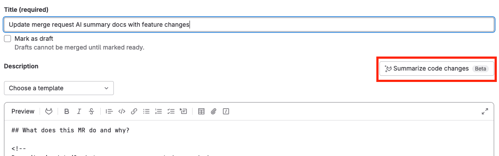

# GitLab Duo in merge requests

DETAILS:
**Tier:** Ultimate
**Offering:** GitLab.com

GitLab Duo is designed to provide contextually relevant information during the lifecycle of a merge request.

## Generate a description by summarizing code changes

DETAILS:
**Tier:** For a limited time, Ultimate. In the future, Ultimate with [GitLab Duo Enterprise](../../../subscriptions/subscription-add-ons.md).
**Offering:** GitLab.com
**Status:** Beta

> - [Introduced](https://gitlab.com/groups/gitlab-org/-/epics/10401) in GitLab 16.2 as an [experiment](../../../policy/experiment-beta-support.md#experiment).
> - [Changed](https://gitlab.com/gitlab-org/gitlab/-/issues/429882) to beta in GitLab 16.10.

Use GitLab Duo Merge request summary to create a merge request description when you
create or edit a merge request.

1. [Create a new merge request](creating_merge_requests.md).
1. In the **Description** field, put your cursor where you want to insert the description.
1. Above the description, select **Summarize code changes**.

   

The description is inserted where your cursor was.

Provide feedback on this feature in [issue 443236](https://gitlab.com/gitlab-org/gitlab/-/issues/443236).

**Data usage**: The diff of changes between the source branch's head and the target branch is sent to the large language model.

## Summarize a code review

DETAILS:
**Tier:** For a limited time, Ultimate. In the future, Ultimate with [GitLab Duo Enterprise](../../../subscriptions/subscription-add-ons.md).
**Offering:** GitLab.com
**Status:** Experiment

> - [Introduced](https://gitlab.com/groups/gitlab-org/-/epics/10466) in GitLab 16.0 as an [experiment](../../../policy/experiment-beta-support.md#experiment).

When you've completed your review of a merge request and are ready to [submit your review](reviews/index.md#submit-a-review), generate a GitLab Duo Code review summary:

1. On the left sidebar, select **Search or go to** and find your project.
1. Select **Code > Merge requests** and find the merge request you want to review.
1. When you are ready to submit your review, select **Finish review**.
1. Select **Summarize my pending comments**.

The summary is displayed in the comment box. You can edit and refine the summary prior to submitting your review.

Provide feedback on this experimental feature in [issue 408991](https://gitlab.com/gitlab-org/gitlab/-/issues/408991).

**Data usage**: When you use this feature, the following data is sent to the large language model referenced above:

- Draft comment's text

## Generate a merge commit message

DETAILS:
**Tier:** For a limited time, Ultimate. In the future, Ultimate with [GitLab Duo Enterprise](../../../subscriptions/subscription-add-ons.md).
**Offering:** GitLab.com, Self-managed, GitLab Dedicated

> - [Introduced](https://gitlab.com/groups/gitlab-org/-/epics/10453) in GitLab 16.2 as an [experiment](../../../policy/experiment-beta-support.md#experiment) [with a flag](../../../administration/feature_flags.md) named `generate_commit_message_flag`. Disabled by default.
> - Feature flag `generate_commit_message_flag` [enabled by default](https://gitlab.com/gitlab-org/gitlab/-/merge_requests/158339) in GitLab 17.2.

FLAG:
The availability of this feature is controlled by a feature flag.
For more information, see the history.

When preparing to merge your merge request you might wish to edit the proposed merge commit message.

To generate a commit message with GitLab Duo:

1. On the left sidebar, select **Search or go to** and find your project.
1. Select **Code > Merge requests** and find your merge request.
1. Select the **Edit commit message** checkbox on the merge widget.
1. Select **Generate commit message**.
1. Review the commit message provide and choose **Insert** to add it to the commit.

Provide feedback on this experimental feature in [issue 408994](https://gitlab.com/gitlab-org/gitlab/-/issues/408994).

**Data usage**: When you use this feature, the following data is sent to the large language model referenced above:

- Contents of the file
- The filename

## Related topics

- [Control GitLab Duo availability](../../ai_features_enable.md)
- [All GitLab Duo features](../../ai_features.md)
