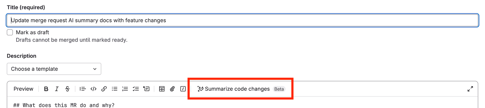

DETAILS:
**Tier:** Ultimate with GitLab Duo Enterprise - [Start a trial](https://about.gitlab.com/solutions/gitlab-duo-pro/sales/?type=free-trial)
**Offering:** GitLab.com

GitLab Duo is designed to provide contextually relevant information during the lifecycle of a merge request.

## Generate a description by summarizing code changes

DETAILS:
**Status:** Beta
**LLM:** Vertex AI Codey [`text-bison`](https://console.cloud.google.com/vertex-ai/publishers/google/model-garden/text-bison)

> - [Introduced](https://gitlab.com/groups/gitlab-org/-/epics/10401) in GitLab 16.2 as an [experiment](../../../policy/development_stages_support.md#experiment).
> - [Changed](https://gitlab.com/gitlab-org/gitlab/-/issues/429882) to beta in GitLab 16.10.
> - Changed to require GitLab Duo add-on in GitLab 17.6 and later.

When you create or edit a merge request, use GitLab Duo Merge Request Summary
to create a merge request description.

1. [Create a new merge request](creating_merge_requests.md).
1. In the **Description** field, put your cursor where you want to insert the description.
1. On the toolbar above the text area, select **Summarize code changes** (**{tanuki-ai}**).

   

The description is inserted where your cursor was.

Provide feedback on this feature in [issue 443236](https://gitlab.com/gitlab-org/gitlab/-/issues/443236).

**Data usage**: The diff of changes between the source branch's head and the target branch is sent to the large language model.

## Have GitLab Duo review your code

DETAILS:
**Status:** Experiment
**LLM:** Anthropic [Claude 3.5 Sonnet](https://console.cloud.google.com/vertex-ai/publishers/anthropic/model-garden/claude-3-5-sonnet)

> - [Introduced](https://gitlab.com/groups/gitlab-org/-/epics/14825) in GitLab 17.5 as an [experiment](../../../policy/development_stages_support.md#experiment).
> - Feature flag `ai_review_merge_request` [disabled by default](https://gitlab.com/gitlab-org/gitlab/-/issues/456106).

FLAG:
The availability of this feature is controlled by a feature flag.
For more information, see the history.

WARNING:
This feature is considered [experimental](../../../policy/development_stages_support.md) and is not intended for customer usage outside of initial design partners. We expect major changes to this feature.

DISCLAIMER:
This page contains information related to upcoming products, features, and functionality.
It is important to note that the information presented is for informational purposes only.
Please do not rely on this information for purchasing or planning purposes.
The development, release, and timing of any products, features, or functionality may be subject to change or delay and remain at the
sole discretion of GitLab Inc.

When your merge request is ready to be reviewed, use GitLab Duo Code Review to perform an initial review.

1. On the left sidebar, select **Search or go to** and find your project.
1. Select **Code > Merge requests** and find your merge request.
1. In a comment box enter the quick action `/assign_reviewer @GitLabDuo` or assign GitLab Duo as reviewer.

**Data usage**: When you use this feature, the following data is sent to the large language model:

- Contents of the file
- The filename

## Summarize a code review

DETAILS:
**Status:** Experiment
**LLM:** Vertex AI Codey [`text-bison`](https://console.cloud.google.com/vertex-ai/publishers/google/model-garden/text-bison)

> - [Introduced](https://gitlab.com/groups/gitlab-org/-/epics/10466) in GitLab 16.0 as an [experiment](../../../policy/development_stages_support.md#experiment).

When you've completed your review of a merge request and are ready to [submit your review](reviews/_index.md#submit-a-review), use GitLab Duo Code Review Summary to generate a summary of your comments.

1. On the left sidebar, select **Search or go to** and find your project.
1. Select **Code > Merge requests** and find the merge request you want to review.
1. When you are ready to submit your review, select **Finish review**.
1. Select **Add Summary**.

The summary is displayed in the comment box. You can edit and refine the summary prior to submitting your review.

Provide feedback on this experimental feature in [issue 408991](https://gitlab.com/gitlab-org/gitlab/-/issues/408991).

**Data usage**: When you use this feature, the following data is sent to the large language model referenced above:

- Draft comment's text

## Generate a merge commit message

DETAILS:
**Offering:** GitLab.com, GitLab Self-Managed, GitLab Dedicated
**LLM:** Anthropic [Claude 3.5 Sonnet](https://console.cloud.google.com/vertex-ai/publishers/anthropic/model-garden/claude-3-5-sonnet)

> - [Introduced](https://gitlab.com/groups/gitlab-org/-/epics/10453) in GitLab 16.2 as an [experiment](../../../policy/development_stages_support.md#experiment) [with a flag](../../../administration/feature_flags.md) named `generate_commit_message_flag`. Disabled by default.
> - Feature flag `generate_commit_message_flag` [enabled by default](https://gitlab.com/gitlab-org/gitlab/-/merge_requests/158339) in GitLab 17.2.
> - Feature flag `generate_commit_message_flag` [removed](https://gitlab.com/gitlab-org/gitlab/-/merge_requests/173262) in GitLab 17.7.

When preparing to merge your merge request, edit the proposed merge commit message
by using GitLab Duo Merge Commit Message Generation.

1. On the left sidebar, select **Search or go to** and find your project.
1. Select **Code > Merge requests** and find your merge request.
1. Select the **Edit commit message** checkbox on the merge widget.
1. Select **Generate commit message**.
1. Review the commit message provided and choose **Insert** to add it to the commit.

**Data usage**: When you use this feature, the following data is sent to the large language model:

- Contents of the file
- The filename

## Related topics

- [Control GitLab Duo availability](../../ai_features_enable.md)
- [All GitLab Duo features](../../ai_features.md)
