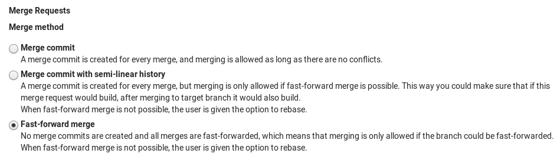

# Fast-forward merge requests

> Included in [GitLab Enterprise Edition Starter][products].

If you prefer a linear Git history and a way to accept merge requests without
creating merge commits, you can configure this on a per-project basis.

Navigate to the project's settings, select the **Fast-forward merge**
option and hit **Save changes** for the changes to take effect.

Now, when you visit the merge request page, you will be able to accept it
**only if a fast-forward merge is possible**.

If the target branch is ahead of the source branch, you need to rebase the
source branch before you will be able to do a fast-forward merge.

[products]: https://about.gitlab.com/products/ "GitLab products page"
