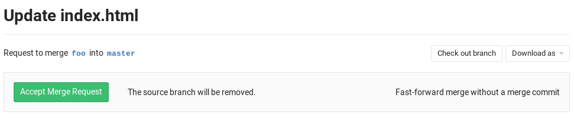

# Fast-forward merge requests **(FREE)**

Sometimes, a workflow policy might mandate a clean commit history without
merge commits. In such cases, the fast-forward merge is the perfect candidate.

With fast-forward merge requests, you can retain a linear Git history and a way
to accept merge requests without creating merge commits.

## Overview

When the fast-forward merge
([`--ff-only`](https://git-scm.com/docs/git-merge#git-merge---ff-only)) setting
is enabled, no merge commits are created and all merges are fast-forwarded,
which means that merging is only allowed if the branch can be fast-forwarded.

When a fast-forward merge is not possible, the user is given the option to rebase.

## Enabling fast-forward merges

1. Navigate to your project's **Settings** and search for the 'Merge method'
1. Select the **Fast-forward merge** option
1. Hit **Save changes** for the changes to take effect

Now, when you visit the merge request page, you can accept it
**only if a fast-forward merge is possible**.

If a fast-forward merge is not possible but a conflict free rebase is possible,
a rebase button is offered.

If the target branch is ahead of the source branch and a conflict free rebase is
not possible, you need to rebase the
source branch locally before you can do a fast-forward merge.

<!-- ## Troubleshooting

Include any troubleshooting steps that you can foresee. If you know beforehand what issues
one might have when setting this up, or when something is changed, or on upgrading, it's
important to describe those, too. Think of things that may go wrong and include them here.
This is important to minimize requests for support, and to avoid doc comments with
questions that you know someone might ask.

Each scenario can be a third-level heading, e.g. `### Getting error message X`.
If you have none to add when creating a doc, leave this section in place
but commented out to help encourage others to add to it in the future. -->
