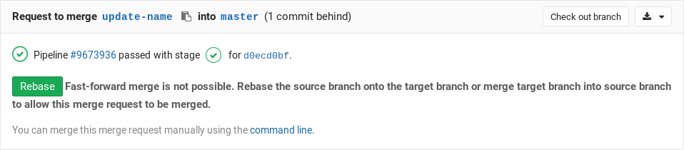
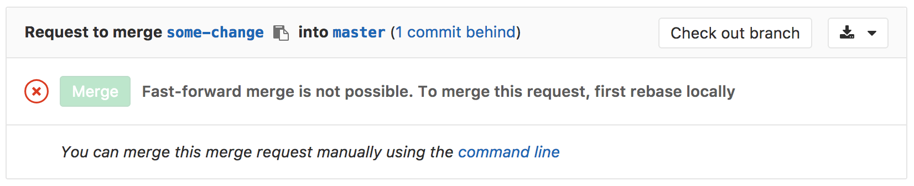

# Fast-forward merge requests

Retain a linear Git history and a way to accept merge requests without
creating merge commits.

## Overview

When the fast-forward merge ([`--ff-only`][ffonly]) setting is enabled, no merge
commits will be created and all merges are fast-forwarded, which means that
merging is only allowed if the branch could be fast-forwarded.

When a fast-forward merge is not possible, the user is given the option to rebase.

## Use cases

Sometimes, a workflow policy might mandate a clean commit history without
merge commits. In such cases, the fast-forward merge is the perfect candidate.

## Enabling fast-forward merges

1. Navigate to your project's **Settings** and search for the 'Merge method'
1. Select the **Fast-forward merge** option
1. Hit **Save changes** for the changes to take effect

Now, when you visit the merge request page, you will be able to accept it
**only if a fast-forward merge is possible**.

If the target branch is ahead of the source branch, you need to rebase the
source branch locally before you will be able to do a fast-forward merge.

[ffonly]: https://git-scm.com/docs/git-merge#git-merge---ff-only
