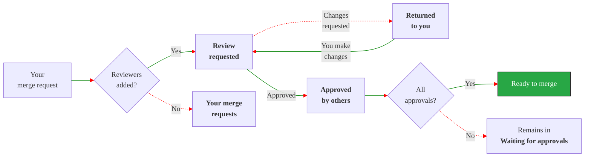
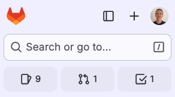
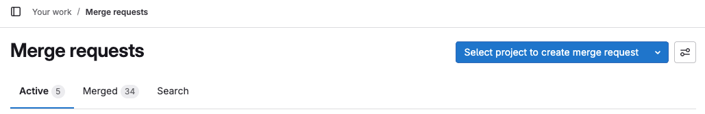
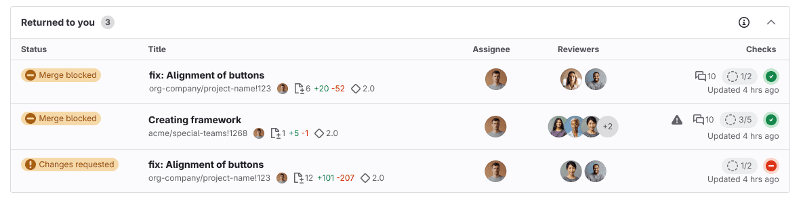



- Tier: Free, Premium, Ultimate
- Offering: GitLab.com, GitLab Self-Managed, GitLab Dedicated



If you are the author, assignee, or reviewer of a merge request, it appears on your merge request
homepage. This page sorts your merge requests by **Workflow** or by **Role**. The **Workflow** view
shows you which merge requests need your attention first, regardless of whether it's your work or
the work of someone else. The workflow view groups merge requests by their stage in this review process:

This review flow assumes reviewers use the **Start a review** and **Submit a review** features.

The **Role** view sorts your merge requests by your role in the merge request.

## See your merge request homepage



- Merge request homepage [introduced](https://gitlab.com/groups/gitlab-org/-/epics/13448) in GitLab 17.9 [with a flag](../../../administration/feature_flags/_index.md) named `merge_request_dashboard`. Disabled by default.
- Feature flag `merge_request_dashboard` [enabled](https://gitlab.com/gitlab-org/gitlab/-/issues/480854) on GitLab.com in GitLab 17.9.
- Feature flag `mr_dashboard_list_type_toggle` [enabled](https://gitlab.com/gitlab-org/gitlab/-/issues/535244) for GitLab.com in GitLab 18.1.
- Feature flag `merge_request_dashboard` [enabled by default](https://gitlab.com/gitlab-org/gitlab/-/merge_requests/194999) in GitLab 18.2.





The availability of this feature is controlled by a feature flag.
For more information, see the history.



GitLab shows your total **Active** merge requests on the left sidebar on all pages:

This user has:

- 9 open issues ()
- 1 active merge request ()
- 1 to-do item ()

Your merge request homepage shows more information about these merge requests. To see it,
use any of these methods:

- Use the <kbd>Shift</kbd>+<kbd>m</kbd> [keyboard shortcut](../../shortcuts.md).
- On the left sidebar, select **Merge requests** ().
- On the left sidebar, select **Search or go to**, then from the dropdown list, select **Merge requests**. If you've [turned on the new navigation](../../interface_redesign.md#turn-new-navigation-on-or-off), this field is on the top bar.

To help you focus on what needs your attention right now, GitLab organizes your merge request homepage
into three tabs:

- **Active**: These merge requests need attention from you, or a member of your team.
- **Merged**: These merge requests merged in the last 14 days. They are your work, or contain a review from you.
- **Search**: Search all merge requests, and filter them as needed.

- **Status**: The current status of the merge request.
- **Title**: Important metadata about the issue, including:
  - The merge request title.
  - The assignee's avatar.
  - The number of files and lines added and removed (`+` / `-`).
  - Milestone.
- **Author**: The author's avatar.
- **Reviewers**: The reviewers' avatars. Reviewers with a green check mark have approved the merge request.
- **Checks**: A compact assessment of mergeability.
  - A warning () if merge conflicts exist.
  - Number of unresolved threads, like `0 of 3`.
  - Current required [approval status](approvals/_index.md#in-the-list-of-merge-requests).
  - Most recent pipeline status.
  - Date of last update.

### Set your display preferences



- **Show your drafts** preference [introduced](https://gitlab.com/gitlab-org/gitlab/-/issues/551475) in GitLab 18.6.



In the upper right of your merge request homepage, select **Display preferences** ():

- Toggle **Show labels** to show or hide labels for each merge request.
- Sorting preferences: **Workflow** or **Role**.
  - **Workflow** groups merge requests by their status. GitLab shows the merge requests
    needing your attention first, regardless of whether you are the author or the reviewer.
  - **Role** groups merge requests by whether you are the reviewer or the author.
- Toggle **Show your drafts** to show or hide draft merge requests from the **Your merge requests** list.

Active merge requests count toward the total shown on the left sidebar. GitLab excludes **Inactive**
merge requests from your review count.

### Workflow view: active statuses

These merge requests need your attention. They count toward the total shown on the left sidebar:

- **Your merge requests**: You're the merge request author or assignee. Add reviewers to start the review process.
  Statuses:
  - **Draft**: The merge request is a draft.
  - **Reviewers needed**: The merge request is not a draft, but has no reviewers.
- **Review requested**: You're a reviewer. Review the merge request. Provide feedback. Optionally,
  approve or request changes. Statuses:
  - **Changes requested**: A reviewer has requested changes. The change request blocks the merge request,
    but [can be bypassed](reviews/_index.md#bypass-a-request-for-changes).
  - **Reviewer commented**: A reviewer has left comments but not requested changes.
- **Returned to you**: Reviewers have provided feedback, or requested changes. Address reviewer comments,
  and apply suggested changes. Statuses:
  - **Changes requested**: A reviewer has requested changes.
  - **Reviewer commented**: A reviewer has left comments but not requested changes.

### Workflow view: inactive statuses

GitLab excludes these merge requests from the active count, because no action is required from you right now:

- **Waiting for assignee**: If you're the author, the merge request is awaiting review. If you're
  the reviewer, you've requested changes. Statuses:
  - **You requested changes**: You've completed your review and requested changes.
  - **You commented**: You've commented, but have not completed your review.
- **Waiting for approvals**: Your assigned merge requests that are waiting for approvals, and reviews
  you have requested changes for. Statuses:
  - **Approvals required**: Number of required approvals remaining.
  - **Approved**: Either you have approved, or all required approvals are satisfied.
  - **Waiting for approvals**.
- **Approved by you**: Merge requests you've reviewed and approved.
  Statuses:
  - **Approved**: You've approved, and required approvals are satisfied.
  - **Approval required**: You've approved, but not all required approvals are satisfied.
- **Approved by others**: Merge requests that have received approvals from other team members.
  Potentially ready to merge, if all requirements are met. Statuses:
  - **Approved**: Your merge request has received the necessary approvals.

### Role view

The **Role** view groups merge requests you are an assignee or reviewer for:

- **Reviewer (Active)**: Awaiting review from you.
- **Reviewer (Inactive)**: Already reviewed by you.
- **Your merge requests (Active)**
- **Your merge requests (Inactive)**

Merge requests in the **Active** lists count toward the total shown on the left sidebar.

## Related topics

- [Merge request reviews](reviews/_index.md)
