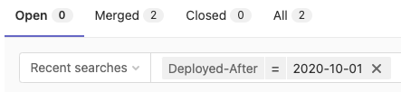

# Merge requests **(FREE)**

To incorporate changes from a source branch to a target branch, you use a *merge request* (MR).

When you open a merge request, you can visualize and collaborate on the changes before merge.
Merge requests include:

- A description of the request.
- Code changes and inline code reviews.
- Information about CI/CD pipelines.
- A comment section for discussion threads.
- The list of commits.

<i class="fa fa-youtube-play youtube" aria-hidden="true"></i>
For a quick overview of merge requests,
view [this GitLab Flow video](https://www.youtube.com/watch?v=InKNIvky2KE).

## Create a merge request

Learn the various ways to [create a merge request](creating_merge_requests.md).

### Use merge request templates

When you create a merge request, GitLab checks for the existence of a
[description template](../description_templates.md) to add data to your merge request.
GitLab checks these locations in order from 1 to 5, and applies the first template
found to your merge request:

| Name | Project UI<br>setting | Group<br>`default.md` | Instance<br>`default.md` | Project<br>`default.md` | No template |
| :-- | :--: | :--: | :--: | :--: | :--: |
| Standard commit message | 1 | 2 | 3 | 4 | 5 |
| Commit message with an [issue closing pattern](../issues/managing_issues.md#closing-issues-automatically) like `Closes #1234` | 1 | 2 | 3 | 4 | 5 \* |
| Branch name [prefixed with an issue ID](../repository/branches/index.md#prefix-branch-names-with-issue-numbers), like `1234-example` | 1 \* | 2 \* | 3 \* | 4 \* | 5 \* |

NOTE:
Items marked with an asterisk (\*) also append an [issue closing pattern](../issues/managing_issues.md#closing-issues-automatically).

## View merge requests

You can view merge requests for your project, group, or yourself.

### For a project

To view all merge requests for a project:

1. On the top bar, select **Main menu > Projects** and find your project.
1. On the left sidebar, select **Merge requests**.

Or, to use a [keyboard shortcut](../../shortcuts.md), press <kbd>g</kbd> + <kbd>m</kbd>.

### For all projects in a group

To view merge requests for all projects in a group:

1. On the top bar, select **Main menu > Groups** and find your group.
1. On the left sidebar, select **Merge requests**.

If your group contains subgroups, this view also displays merge requests from the subgroup projects.

### Assigned to you

To view all merge requests assigned to you:

<!-- vale gitlab.FirstPerson = NO -->

1. On the top bar, put your cursor in the **Search** box.
1. From the dropdown list, select **Merge requests assigned to me**.

<!-- vale gitlab.FirstPerson = YES -->

or:

- To use a [keyboard shortcut](../../shortcuts.md), press <kbd>Shift</kbd> + <kbd>m</kbd>.

or:

1. On the top bar, in the upper-right corner, select **Merge requests** (**{merge-request-open}**).
1. From the dropdown list, select **Assigned to you**.

## Filter the list of merge requests

> - Filtering by `approved-by` [introduced](https://gitlab.com/gitlab-org/gitlab/-/merge_requests/30335) in GitLab 13.0.
> - Filtering by `reviewer` [introduced](https://gitlab.com/gitlab-org/gitlab/-/merge_requests/47605) in GitLab 13.7.
> - Filtering by potential approvers was moved to GitLab Premium in 13.9.
> - Filtering by `approved-by` moved to GitLab Premium in 13.9.

To filter the list of merge requests:

1. Above the list of merge requests, select **Search or filter results...**.
1. From the dropdown list, select the attribute you wish to filter by. Some examples:
   - [**By environment or deployment date**](#by-environment-or-deployment-date).
   - **ID**: Enter filter `#30` to return only merge request 30.
   - User filters: Type (or select from the dropdown list) any of these filters to display a list of users:
     - **Approved-By**, for merge requests already approved by a user. **(PREMIUM)**.
     - **Approver**, for merge requests that this user is eligible to approve.
       (For more information, read about [Code owners](../codeowners/index.md)). **(PREMIUM)**
     - **Reviewer**, for merge requests reviewed by this user.
1. Select or type the operator to use for filtering the attribute. The following operators are
   available:
   - `=`: Is
   - `!=`: Is not
1. Enter the text to filter the attribute by.
   You can filter some attributes by **None** or **Any**.
1. Repeat this process to filter by multiple attributes. Multiple attributes are joined by a logical
   `AND`.
1. Select a **Sort direction**, either **{sort-lowest}** for descending order,
   or **{sort-highest}** for ascending order.

GitLab displays the results on-screen, but you can also
[retrieve them as an RSS feed](../../search/index.md#retrieve-search-results-as-feed).

### By environment or deployment date

> [Introduced](https://gitlab.com/gitlab-org/gitlab/-/merge_requests/44041) in GitLab 13.6.

To filter merge requests by deployment data, such as the environment or a date,
you can type (or select from the dropdown list) the following:

- Environment
- Deployed-before
- Deployed-after

NOTE:
Projects using a [fast-forward merge method](methods/index.md#fast-forward-merge)
do not return results, as this method does not create a merge commit.

When filtering by an environment, a dropdown list presents all environments that
you can choose from:


When filtering by `Deployed-before` or `Deployed-after`, the date refers to when
the deployment to an environment (triggered by the merge commit) completed successfully.
You must enter the deploy date manually. Deploy dates
use the format `YYYY-MM-DD`, and must be quoted if you wish to specify
both a date and time (`"YYYY-MM-DD HH:MM"`):



## Add changes to a merge request

If you have permission to add changes to a merge request, you can add your changes
to an existing merge request in several ways, depending on the complexity of your
change and whether you need access to a development environment:

- [Edit changes in the Web IDE](../web_ide/index.md) in your browser with the
  <kbd>.</kbd> [keyboard shortcut](../../shortcuts.md). Use this
  browser-based method to edit multiple files, or if you are not comfortable with Git commands.
  You cannot run tests from the Web IDE.
- [Edit changes in Gitpod](../../../integration/gitpod.md#launch-gitpod-in-gitlab), if you
  need a fully-featured environment to both edit files, and run tests afterward. Gitpod
  supports running the [GitLab Development Kit (GDK)](https://gitlab.com/gitlab-org/gitlab-development-kit).
  To use Gitpod, you must [enable Gitpod in your user account](../../../integration/gitpod.md#enable-gitpod-in-your-user-settings).
- [Push changes from the command line](../../../gitlab-basics/start-using-git.md), if you are
  familiar with Git and the command line.

## Assign a user to a merge request

To assign the merge request to a user, use the `/assign @user`
[quick action](../quick_actions.md#issues-merge-requests-and-epics) in a text area in
a merge request, or:

1. On the top bar, select **Main menu > Projects** and find your project.
1. On the left sidebar, select **Merge requests** and find your merge request.
1. On the right sidebar, expand the right sidebar and locate the **Assignees** section.
1. Select **Edit**.
1. Search for the user you want to assign, and select the user.

The merge request is added to the user's assigned merge request list.

### Assign multiple users **(PREMIUM)**

> Moved to GitLab Premium in 13.9.

GitLab enables multiple assignees for merge requests, if multiple people are
accountable for it:


To assign multiple assignees to a merge request, use the `/assign @user`
[quick action](../quick_actions.md#issues-merge-requests-and-epics) in a text area, or:

1. On the top bar, select **Main menu > Projects** and find your project.
1. On the left sidebar, select **Merge requests** and find your merge request.
1. On the right sidebar, expand the right sidebar and locate the **Assignees** section.
1. Select **Edit** and, from the dropdown list, select all users you want
   to assign the merge request to.

To remove an assignee, clear the user from the same dropdown list.

## Close a merge request

If you decide to permanently stop work on a merge request,
GitLab recommends you close the merge request rather than
[delete it](#delete-a-merge-request). The author and assignees of a merge request, and users with
Developer, Maintainer, or Owner [roles](../../permissions.md) in a project
can close merge requests in the project:

1. Go to the merge request you want to close.
1. Scroll to the comment box at the bottom of the page.
1. Following the comment box, select **Close merge request**.

GitLab closes the merge request, but preserves records of the merge request,
its comments, and any associated pipelines.

### Delete a merge request

GitLab recommends you close, rather than delete, merge requests.

WARNING:
You cannot undo the deletion of a merge request.

To delete a merge request:

1. Sign in to GitLab as a user with the project Owner role.
   Only users with this role can delete merge requests in a project.
1. Go to the merge request you want to delete, and select **Edit**.
1. Scroll to the bottom of the page, and select **Delete merge request**.

### Delete the source branch on merge

You can delete the source branch for a merge request:

- When you create a merge request, by selecting **Delete source branch when merge request accepted**.
- When you merge a merge request, if you have the Maintainer role, by selecting **Delete source branch**.

An administrator can make this option the default in the project's settings.

### Update merge requests when target branch merges **(FREE SELF)**

> - [Introduced](https://gitlab.com/gitlab-org/gitlab/-/issues/320902) in GitLab 13.9.
> - [Disabled on self-managed](https://gitlab.com/gitlab-org/gitlab/-/issues/320902) in GitLab 13.9.
> - [Enabled on self-managed](https://gitlab.com/gitlab-org/gitlab/-/issues/320895) GitLab 13.10.

Merge requests are often chained together, with one merge request depending on
the code added or changed in another merge request. To support keeping individual
merge requests small, GitLab can update up to four open merge requests when their
target branch merges into `main`. For example:

- **Merge request 1**: merge `feature-alpha` into `main`.
- **Merge request 2**: merge `feature-beta` into `feature-alpha`.

If these merge requests are open at the same time, and merge request 1 (`feature-alpha`)
merges into `main`, GitLab updates the destination of merge request 2 from `feature-alpha`
to `main`.

Merge requests with interconnected content updates are usually handled in one of these ways:

- Merge request 1 is merged into `main` first. Merge request 2 is then
  retargeted to `main`.
- Merge request 2 is merged into `feature-alpha`. The updated merge request 1, which
  now contains the contents of `feature-alpha` and `feature-beta`, is merged into `main`.

This feature works only when a merge request is merged. Selecting **Remove source branch**
after merging does not retarget open merge requests. This improvement is
[proposed as a follow-up](https://gitlab.com/gitlab-org/gitlab/-/issues/321559).

## Move sidebar actions

<!-- When the `moved_mr_sidebar` feature flag is removed, delete this topic and update the steps for these actions
like in https://gitlab.com/gitlab-org/gitlab/-/merge_requests/87727/diffs?diff_id=522279685#5d9afba799c4af9920dab533571d7abb8b9e9163 -->

> [Introduced](https://gitlab.com/gitlab-org/gitlab/-/merge_requests/85584) in GitLab 14.10 [with a flag](../../../administration/feature_flags.md) named `moved_mr_sidebar`. Disabled by default.

FLAG:
On self-managed GitLab, by default this feature is not available. To make it available per project or for your entire instance, ask an administrator to [enable the feature flag](../../../administration/feature_flags.md) named `moved_mr_sidebar`.
On GitLab.com, this feature is enabled in the following projects: `gitlab-org/gitlab`, `gitlab-com/www-gitlab-com`, and `gitlab-org/customers-gitlab-com`.

When this feature flag is enabled, in the upper-right corner,
**Merge request actions** (**{ellipsis_v}**) contains the following actions:

- The [notifications](../../profile/notifications.md#edit-notification-settings-for-issues-merge-requests-and-epics) toggle
- Mark merge request as ready or [draft](../merge_requests/drafts.md)
- Close merge request
- [Lock discussion](../../discussions/index.md#prevent-comments-by-locking-the-discussion)
- Copy reference

When this feature flag is disabled, these actions are in the right sidebar.

## Merge request workflows

For a software developer working in a team:

1. You check out a new branch, and submit your changes through a merge request.
1. You gather feedback from your team.
1. You work on the implementation optimizing code with [Code Quality reports](../../../ci/testing/code_quality.md).
1. You verify your changes with [Unit test reports](../../../ci/testing/unit_test_reports.md) in GitLab CI/CD.
1. You avoid using dependencies whose license is not compatible with your project with [License Compliance reports](../../compliance/license_compliance/index.md).
1. You request the [approval](approvals/index.md) from your manager.
1. Your manager:
   1. Pushes a commit with their final review.
   1. [Approves the merge request](approvals/index.md).
   1. Sets it to [merge when pipeline succeeds](merge_when_pipeline_succeeds.md).
1. Your changes get deployed to production with [manual jobs](../../../ci/jobs/job_control.md#create-a-job-that-must-be-run-manually) for GitLab CI/CD.
1. Your implementations were successfully shipped to your customer.

For a web developer writing a webpage for your company's website:

1. You check out a new branch and submit a new page through a merge request.
1. You gather feedback from your reviewers.
1. You preview your changes with [Review Apps](../../../ci/review_apps/index.md).
1. You request your web designers for their implementation.
1. You request the [approval](approvals/index.md) from your manager.
1. Once approved, your merge request is [squashed and merged](squash_and_merge.md), and [deployed to staging with GitLab Pages](https://about.gitlab.com/blog/2021/02/05/ci-deployment-and-environments/).
1. Your production team [cherry-picks](cherry_pick_changes.md) the merge commit into production.

## Filter activity in a merge request

> [Introduced](https://gitlab.com/gitlab-org/gitlab/-/merge_requests/115383) in GitLab 15.11 [with a flag](../../../administration/feature_flags.md) named `mr_activity_filters`. Disabled by default.

FLAG:
On self-managed GitLab, by default this feature is not available.
To make it available per user, ask an administrator to [enable the feature flag](../../../administration/feature_flags.md) named `mr_activity_filters` for individual or groups of users.
On GitLab.com, this feature is enabled for all GitLab team members.

To understand the history of a merge request, filter its activity feed to show you
only the items that are relevant to you.

1. On the top bar, select **Main menu > Projects** and find your project.
1. On the left sidebar, select **Merge requests**.
1. Scroll to **Activity**.
1. On the right side of the page, select **Activity filter** to show the filter options.
   If you've selected filter options previously, this field shows a summary of your
   choices, like **Activity + 5 more**.
1. Select the types of activity you want to see. Options include:

   - Assignees & Reviewers
   - Approvals
   - Comments
   - Commits & branches
   - Edits
   - Labels
   - Lock status
   - Mentions
   - Merge request status
   - Tracking

1. Optional. Select **Sort** (**{sort-lowest}**) to reverse the sort order.

Your selection persists across all merge requests. You can also change the
sort order by clicking the sort button on the right.

## Related topics

- [Create a merge request](creating_merge_requests.md)
- [Review a merge request](reviews/index.md)
- [Authorization for merge requests](authorization_for_merge_requests.md)
- [Testing and reports](../../../ci/testing/index.md)
- [GitLab keyboard shortcuts](../../shortcuts.md)
- [Comments and threads](../../discussions/index.md)
- [Suggest code changes](reviews/suggestions.md)
- [CI/CD pipelines](../../../ci/index.md)
- [Push options](../push_options.md) for merge requests

## Troubleshooting

### Rebase a merge request from the Rails console **(FREE SELF)**

In addition to the `/rebase` [quick action](../quick_actions.md#issues-merge-requests-and-epics),
users with access to the [Rails console](../../../administration/operations/rails_console.md)
can rebase a merge request from the Rails console. Replace `<username>`,
`<namespace/project>`, and `<iid>` with appropriate values:

WARNING:
Any command that changes data directly could be damaging if not run correctly,
or under the right conditions. We highly recommend running them in a test environment
with a backup of the instance ready to be restored, just in case.

```ruby
u = User.find_by_username('<username>')
p = Project.find_by_full_path('<namespace/project>')
m = p.merge_requests.find_by(iid: <iid>)
MergeRequests::RebaseService.new(project: m.target_project, current_user: u).execute(m)
```

### Fix incorrect merge request status **(FREE SELF)**

If a merge request remains **Open** after its changes are merged,
users with access to the [Rails console](../../../administration/operations/rails_console.md)
can correct the merge request's status. Replace `<username>`, `<namespace/project>`,
and `<iid>` with appropriate values:

WARNING:
Any command that changes data directly could be damaging if not run correctly,
or under the right conditions. We highly recommend running them in a test environment
with a backup of the instance ready to be restored, just in case.

```ruby
u = User.find_by_username('<username>')
p = Project.find_by_full_path('<namespace/project>')
m = p.merge_requests.find_by(iid: <iid>)
MergeRequests::PostMergeService.new(project: p, current_user: u).execute(m)
```

Running this command against a merge request with unmerged changes causes the
merge request to display an incorrect message: `merged into <branch-name>`.

### Close a merge request from the Rails console **(FREE SELF)**

If closing a merge request doesn't work through the UI or API, you may want to attempt to close it in a [Rails console session](../../../administration/operations/rails_console.md#starting-a-rails-console-session):

WARNING:
Commands that change data can cause damage if not run correctly or under the right conditions. Always run commands in a test environment first and have a backup instance ready to restore.

```ruby
u = User.find_by_username('<username>')
p = Project.find_by_full_path('<namespace/project>')
m = p.merge_requests.find_by(iid: <iid>)
MergeRequests::CloseService.new(project: p, current_user: u).execute(m)
```

### Delete a merge request from the Rails console **(FREE SELF)**

If deleting a merge request doesn't work through the UI or API, you may want to attempt to delete it in a [Rails console session](../../../administration/operations/rails_console.md#starting-a-rails-console-session):

WARNING:
Any command that changes data directly could be damaging if not run correctly,
or under the right conditions. We highly recommend running them in a test environment
with a backup of the instance ready to be restored, just in case.

```ruby
u = User.find_by_username('<username>')
p = Project.find_by_full_path('<namespace/project>')
m = p.merge_requests.find_by(iid: <iid>)
Issuable::DestroyService.new(container: m.project, current_user: u).execute(m)
```
