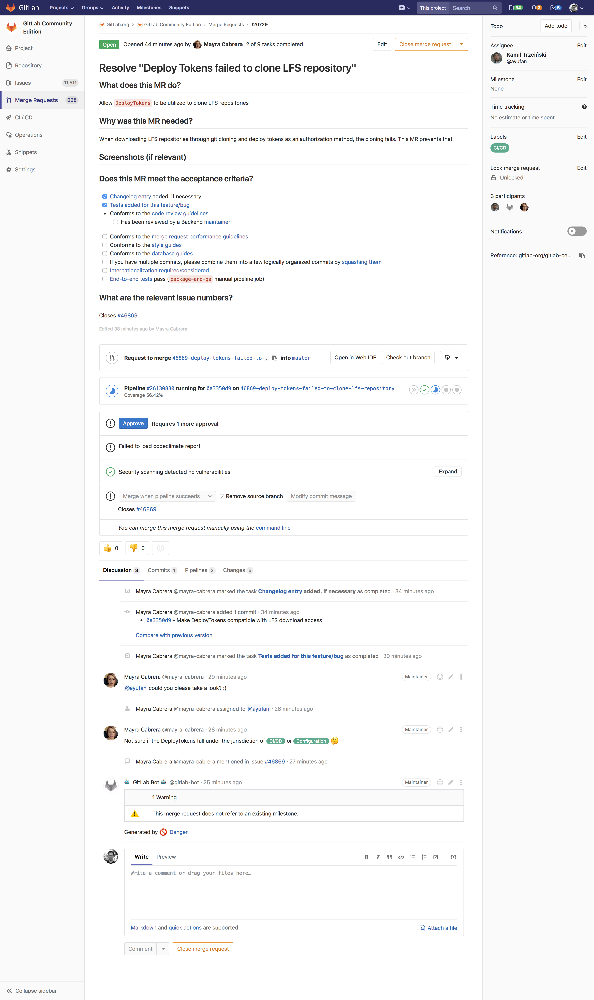
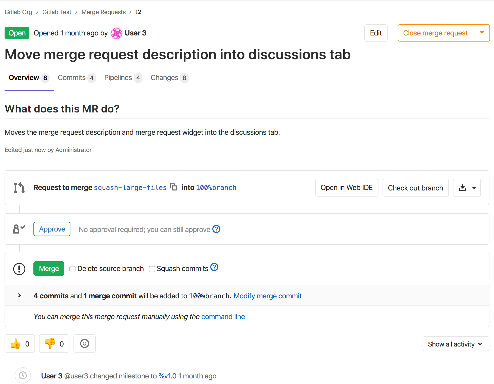

# Merge requests

Merge requests allow you to visualize and collaborate on the proposed changes
to source code that exist as commits on a given Git branch.



A Merge Request (**MR**) is the basis of GitLab as a code collaboration and version
control platform. It is as simple as the name implies: a _request_ to _merge_ one
branch into another.

## Use cases

A. Consider you are a software developer working in a team:

1. You checkout a new branch, and submit your changes through a merge request
1. You gather feedback from your team
1. You work on the implementation optimizing code with [Code Quality reports](code_quality.md) **(STARTER)**
1. You verify your changes with [JUnit test reports](../../../ci/junit_test_reports.md) in GitLab CI/CD
1. You avoid using dependencies whose license is not compatible with your project with [License Compliance reports](../../application_security/license_compliance/index.md) **(ULTIMATE)**
1. You request the [approval](merge_request_approvals.md) from your manager **(STARTER)**
1. Your manager:
   1. Pushes a commit with their final review
   1. [Approves the merge request](merge_request_approvals.md) **(STARTER)**
   1. Sets it to [merge when pipeline succeeds](merge_when_pipeline_succeeds.md)
1. Your changes get deployed to production with [manual actions](../../../ci/yaml/README.md#whenmanual) for GitLab CI/CD
1. Your implementations were successfully shipped to your customer

B. Consider you're a web developer writing a webpage for your company's website:

1. You checkout a new branch, and submit a new page through a merge request
1. You gather feedback from your reviewers
1. Your changes are previewed with [Review Apps](../../../ci/review_apps/index.md)
1. You request your web designers for their implementation
1. You request the [approval](merge_request_approvals.md) from your manager **(STARTER)**
1. Once approved, your merge request is [squashed and merged](squash_and_merge.md), and [deployed to staging with GitLab Pages](https://about.gitlab.com/blog/2016/08/26/ci-deployment-and-environments/)
1. Your production team [cherry picks](cherry_pick_changes.md) the merge commit into production

## Overview

Merge requests (aka "MRs") display a great deal of information about the changes proposed.
The body of an MR contains its description, along with its widget (displaying information
about CI/CD pipelines, when present), followed by the discussion threads of the people
collaborating with that MR.

MRs also contain navigation tabs from which you can see the discussion happening on the thread,
the list of commits, the list of pipelines and jobs, the code changes and inline code reviews.

To get started, read the [introduction to merge requests](getting_started.md).

## Merge request navigation tabs at the top

> [Introduced](https://gitlab.com/gitlab-org/gitlab/issues/33813) in GitLab 12.6. This positioning is experimental.

So far, the navigation tabs present in merge requests to display **Discussion**,
**Commits**, **Pipelines**, and **Changes** were located after the merge request
widget.

To facilitate this navigation without having to scroll up and down through the page
to find these tabs, based on user feedback, we are experimenting with a new positioning
of these tabs. They are now located at the top of the merge request, with a new
**Overview** tab, containing the description of the merge request followed by the
widget. Next to **Overview**, you can find **Pipelines**, **Commits**, and **Changes**.



Please note this change is currently behind a feature flag which is enabled by default. For
self-managed instances, it can be disabled through the Rails console by a GitLab
administrator with the following command:

```ruby
Feature.disable(:mr_tabs_position)
```

## Creating merge requests

Learn [how to create a merge request](creating_merge_requests.md).

## Reviewing and managing merge requests

See the features at your displosal to [review and manage merge requests](reviewing_and_managing_merge_requests.md).

## Testing and reports in merge requests

GitLab has the ability to test the changes included in a merge request, and can display
or link to useful information directly in the merge request page:

| Feature                                                                                                | Description                                                                                                                                                                                               |
|--------------------------------------------------------------------------------------------------------|-----------------------------------------------------------------------------------------------------------------------------------------------------------------------------------------------------------|
| [Browser Performance Testing](browser_performance_testing.md) **(PREMIUM)**                            | Quickly determine the performance impact of pending code changes.                                                                                                                                         |
| [Code Quality](code_quality.md) **(STARTER)**                                                          | Analyze your source code quality using the [Code Climate](https://codeclimate.com/) analyzer and show the Code Climate report right in the merge request widget area.                                     |
| [Display arbitrary job artifacts](../../../ci/yaml/README.md#artifactsexpose_as)                       | Configure CI pipelines with the `artifacts:expose_as` parameter to directly link to selected [artifacts](../pipelines/job_artifacts.md) in merge requests.                                                |
| [GitLab CI/CD](../../../ci/README.md)                                                                  | Build, test, and deploy your code in a per-branch basis with built-in CI/CD.                                                                                                                              |
| [JUnit test reports](../../../ci/junit_test_reports.md)                                                | Configure your CI jobs to use JUnit test reports, and let GitLab display a report on the merge request so that it’s easier and faster to identify the failure without having to check the entire job log. |
| [Metrics Reports](../../../ci/metrics_reports.md) **(PREMIUM)**                                        | Display the Metrics Report on the merge request so that it's fast and easy to identify changes to important metrics.                                                                                      |
| [Multi-Project pipelines](../../../ci/multi_project_pipelines.md) **(PREMIUM)**                        | When you set up GitLab CI/CD across multiple projects, you can visualize the entire pipeline, including all cross-project interdependencies.                                                              |
| [Pipelines for merge requests](../../../ci/merge_request_pipelines/index.md)                           | Customize a specific pipeline structure for merge requests in order to speed the cycle up by running only important jobs.                                                                                 |
| [Pipeline Graphs](../../../ci/pipelines.md#visualizing-pipelines)                                      | View the status of pipelines within the merge request, including the deployment process.                                                                                                                  |

### Security Reports **(ULTIMATE)**

In addition to the reports listed above, GitLab can do many types of [Security reports](../../application_security/index.md),
generated by scanning and reporting any vulnerabilities found in your project:

| Feature                                                                                 | Description                                                      |
|-----------------------------------------------------------------------------------------|------------------------------------------------------------------|
| [Container Scanning](../../application_security/container_scanning/index.md)            | Analyze your Docker images for known vulnerabilities.            |
| [Dynamic Application Security Testing (DAST)](../../application_security/dast/index.md) | Analyze your running web applications for known vulnerabilities. |
| [Dependency Scanning](../../application_security/dependency_scanning/index.md)          | Analyze your dependencies for known vulnerabilities.             |
| [License Compliance](../../application_security/license_compliance/index.md)            | Manage the licenses of your dependencies.                        |
| [Static Application Security Testing (SAST)](../../application_security/sast/index.md)  | Analyze your source code for known vulnerabilities.              |

## Authorization for merge requests

There are two main ways to have a merge request flow with GitLab:

1. Working with [protected branches](../protected_branches.md) in a single repository
1. Working with forks of an authoritative project

[Learn more about the authorization for merge requests.](authorization_for_merge_requests.md)
