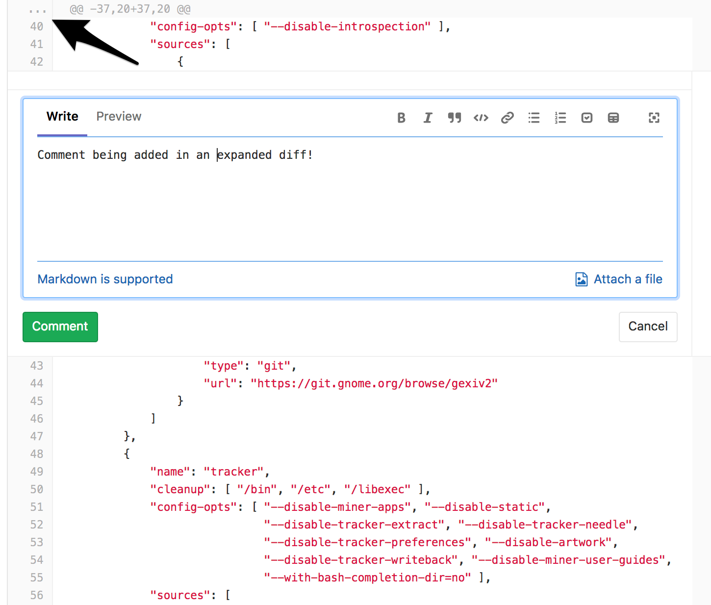

# Merge requests

Merge requests allow you to visualize and collaborate on the proposed changes
to source code that exist as commits on a given Git branch.


## Overview

A Merge Request (**MR**) is the basis of GitLab as a code collaboration
and version control platform.
It is as simple as the name implies: a _request_ to _merge_ one branch into another.

With GitLab merge requests, you can:

- Compare the changes between two [branches](https://git-scm.com/book/en/v2/Git-Branching-Branches-in-a-Nutshell#_git_branching)
- [Review and discuss](../../discussions/index.md#threads) the proposed modifications inline
- Live preview the changes when [Review Apps](../../../ci/review_apps/index.md) is configured for your project
- Build, test, and deploy your code in a per-branch basis with built-in [GitLab CI/CD](../../../ci/README.md)
- Prevent the merge request from being merged before it's ready with [WIP MRs](#work-in-progress-merge-requests)
- View the deployment process through [Pipeline Graphs](../../../ci/pipelines.md#visualizing-pipelines)
- [Automatically close the issue(s)](../../project/issues/managing_issues.md#closing-issues-automatically) that originated the implementation proposed in the merge request
- Assign it to any registered user, and change the assignee how many times you need
- Assign a [milestone](../../project/milestones/index.md) and track the development of a broader implementation
- Organize your issues and merge requests consistently throughout the project with [labels](../../project/labels.md)
- Add a time estimation and the time spent with that merge request with [Time Tracking](../../../workflow/time_tracking.md#time-tracking)
- [Resolve merge conflicts from the UI](#resolve-conflicts)
- Enable [fast-forward merge requests](#fast-forward-merge-requests)
- Enable [semi-linear history merge requests](#semi-linear-history-merge-requests) as another security layer to guarantee the pipeline is passing in the target branch
- [Create new merge requests by email](#create-new-merge-requests-by-email)
- [Allow collaboration](allow_collaboration.md) so members of the target project can push directly to the fork
- [Squash and merge](squash_and_merge.md) for a cleaner commit history

With **[GitLab Enterprise Edition][ee]**, you can also:

- Prepare a full review and submit it once it's ready with [Merge Request Reviews](../../discussions/index.md#merge-request-reviews-premium) **(PREMIUM)**
- View the deployment process across projects with [Multi-Project Pipelines](../../../ci/multi_project_pipelines.md) **(PREMIUM)**
- Request [approvals](merge_request_approvals.md) from your managers **(STARTER)**
- Analyze the impact of your changes with [Code Quality reports](code_quality.md) **(STARTER)**
- Manage the licenses of your dependencies with [License Compliance](../../application_security/license_compliance/index.md) **(ULTIMATE)**
- Analyze your source code for vulnerabilities with [Static Application Security Testing](../../application_security/sast/index.md) **(ULTIMATE)**
- Analyze your running web applications for vulnerabilities with [Dynamic Application Security Testing](../../application_security/dast/index.md) **(ULTIMATE)**
- Analyze your dependencies for vulnerabilities with [Dependency Scanning](../../application_security/dependency_scanning/index.md) **(ULTIMATE)**
- Analyze your Docker images for vulnerabilities with [Container Scanning](../../application_security/container_scanning/index.md) **(ULTIMATE)**
- Determine the performance impact of changes with [Browser Performance Testing](#browser-performance-testing-premium) **(PREMIUM)**
- Specify merge order dependencies with [Cross-project Merge Request Dependencies](#cross-project-merge-request-dependencies-premium) **(PREMIUM)**

## Use cases

A. Consider you are a software developer working in a team:

1. You checkout a new branch, and submit your changes through a merge request
1. You gather feedback from your team
1. You work on the implementation optimizing code with [Code Quality reports](code_quality.md) **(STARTER)**
1. You verify your changes with [JUnit test reports](../../../ci/junit_test_reports.md) in GitLab CI/CD
1. You avoid using dependencies whose license is not compatible with your project with [License Compliance reports](../../application_security/license_compliance/index.md) **(ULTIMATE)**
1. You request the [approval](#merge-request-approvals-starter) from your manager
1. Your manager pushes a commit with their final review, [approves the merge request](merge_request_approvals.md), and set it to [merge when pipeline succeeds](#merge-when-pipeline-succeeds) (Merge Request Approvals are available in GitLab Starter)
1. Your changes get deployed to production with [manual actions](../../../ci/yaml/README.md#whenmanual) for GitLab CI/CD
1. Your implementations were successfully shipped to your customer

B. Consider you're a web developer writing a webpage for your company's website:

1. You checkout a new branch, and submit a new page through a merge request
1. You gather feedback from your reviewers
1. Your changes are previewed with [Review Apps](../../../ci/review_apps/index.md)
1. You request your web designers for their implementation
1. You request the [approval](merge_request_approvals.md) from your manager **(STARTER)**
1. Once approved, your merge request is [squashed and merged](squash_and_merge.md), and [deployed to staging with GitLab Pages](https://about.gitlab.com/2016/08/26/ci-deployment-and-environments/)
1. Your production team [cherry picks](#cherry-pick-changes) the merge commit into production

## Merge requests per project

View all the merge requests within a project by navigating to **Project > Merge Requests**.

When you access your project's merge requests, GitLab will present them in a list,
and you can use the tabs available to quickly filter by open and closed. You can also [search and filter the results](../../search/index.md#issues-and-merge-requests-per-project).


## Merge requests per group

View merge requests in all projects in the group, including all projects of all descendant subgroups of the group. Navigate to **Group > Merge Requests** to view these merge requests. This view also has the open and closed merge requests tabs.

You can [search and filter the results](../../search/index.md#issues-and-merge-requests-per-group) from here.


## Deleting the source branch

When creating a merge request, select the "Delete source branch when merge
request accepted" option and the source branch will be deleted when the merge
request is merged.

This option is also visible in an existing merge request next to the merge
request button and can be selected/deselected before merging. It's only visible
to users with [Maintainer permissions](../../permissions.md) in the source project.

If the user viewing the merge request does not have the correct permissions to
delete the source branch and the source branch is set for deletion, the merge
request widget will show the "Deletes source branch" text.


## Allow collaboration on merge requests across forks

When a user opens a merge request from a fork, they are given the option to allow
upstream maintainers to collaborate with them on the source branch. This allows
the maintainers of the upstream project to make small fixes or rebase branches
before merging, reducing the back and forth of accepting community contributions.

[Learn more about allowing upstream members to push to forks.](allow_collaboration.md)

## Authorization for merge requests

There are two main ways to have a merge request flow with GitLab:

1. Working with [protected branches][] in a single repository
1. Working with forks of an authoritative project

[Learn more about the authorization for merge requests.](authorization_for_merge_requests.md)

## Cherry-pick changes

Cherry-pick any commit in the UI by simply clicking the **Cherry-pick** button
in a merged merge requests or a commit.

[Learn more about cherry-picking changes.](cherry_pick_changes.md)

## Semi-linear history merge requests

A merge commit is created for every merge, but the branch is only merged if
a fast-forward merge is possible. This ensures that if the merge request build
succeeded, the target branch build will also succeed after merging.

Navigate to a project's settings, select the **Merge commit with semi-linear
history** option under **Merge Requests: Merge method** and save your changes.

## Fast-forward merge requests

If you prefer a linear Git history and a way to accept merge requests without
creating merge commits, you can configure this on a per-project basis.

[Read more about fast-forward merge requests.](fast_forward_merge.md)

## Merge when pipeline succeeds

When reviewing a merge request that looks ready to merge but still has one or
more CI jobs running, you can set it to be merged automatically when CI
pipeline succeeds. This way, you don't have to wait for the pipeline to finish
and remember to merge the request manually.

[Learn more about merging when pipeline succeeds.](merge_when_pipeline_succeeds.md)

## Resolve threads in merge requests reviews

Keep track of the progress during a code review with resolving comments.
Resolving comments prevents you from forgetting to address feedback and lets
you hide threads that are no longer relevant.

[Read more about resolving threads in merge requests reviews.](../../discussions/index.md)

## Commenting on any file line in merge requests

> [Introduced](https://gitlab.com/gitlab-org/gitlab-ce/issues/13950) in GitLab 11.5.

GitLab provides a way of leaving comments in any part of the file being changed
in a Merge Request. To do so, click the **...** button in the gutter of the Merge Request diff UI to expand the diff lines and leave a comment, just as you would for a changed line.



## Perform a Review **(PREMIUM)**

Start a review in order to create multiple comments on a diff and publish them once you're ready.
Starting a review allows you to get all your thoughts in order and ensure you haven't missed anything
before submitting all your comments.

[Learn more about Merge Request Reviews](../../discussions/index.md#merge-request-reviews-premium)

## Squash and merge

GitLab allows you to squash all changes present in a merge request into a single
commit when merging, to allow for a neater commit history.

[Learn more about squash and merge.](squash_and_merge.md)

## Suggest changes

> [Introduced](https://gitlab.com/gitlab-org/gitlab-ce/issues/18008) in GitLab 11.6.

As a reviewer, you can add suggestions to change the content in
merge request threads, and users with appropriate [permission](../../permissions.md)
can easily apply them to the codebase directly from the UI. Read
through the documentation on [Suggest changes](../../discussions/index.md#suggest-changes)
to learn more.

## Multiple assignees **(STARTER)**

> [Introduced](https://gitlab.com/gitlab-org/gitlab-ee/issues/2004)
in [GitLab Starter 11.11](https://about.gitlab.com/pricing).

Multiple people often review merge requests at the same time. GitLab allows you to have multiple assignees for merge requests to indicate everyone that is reviewing or accountable for it.


To assign multiple assignees to a merge request:

1. From a merge request, expand the right sidebar and locate the **Assignees** section.
1. Click on **Edit** and from the dropdown menu, select as many users as you want
   to assign the merge request to.

Similarly, assignees are removed by deselecting them from the same dropdown menu.

It's also possible to manage multiple assignees:

- When creating a merge request.
- Using [quick actions](../quick_actions.md#quick-actions-for-issues-merge-requests-and-epics).

## Resolve conflicts

When a merge request has conflicts, GitLab may provide the option to resolve
those conflicts in the GitLab UI.

[Learn more about resolving merge conflicts in the UI.](resolve_conflicts.md)

## Create new merge requests by email

_This feature needs [incoming email](../../../administration/incoming_email.md)
to be configured by a GitLab administrator to be available for CE/EE users, and
it's available on GitLab.com._

You can create a new merge request by sending an email to a user-specific email
address. The address can be obtained on the merge requests page by clicking on
a **Email a new merge request to this project** button.  The subject will be
used as the source branch name for the new merge request and the target branch
will be the default branch for the project. The message body (if not empty)
will be used as the merge request description. You need
["Reply by email"](../../../administration/reply_by_email.md) enabled to use
this feature. If it's not enabled to your instance, you may ask your GitLab
administrator to do so.

This is a private email address, generated just for you. **Keep it to yourself**
as anyone who gets ahold of it can create issues or merge requests as if they were you.
You can add this address to your contact list for easy access.


_In GitLab 11.7, we updated the format of the generated email address.
However the older format is still supported, allowing existing aliases
or contacts to continue working._

### Adding patches when creating a merge request via e-mail

> [Introduced](https://gitlab.com/gitlab-org/gitlab-ce/merge_requests/22723) in GitLab 11.5.

You can add commits to the merge request being created by adding
patches as attachments to the email. All attachments with a filename
ending in `.patch` will be considered patches and they will be processed
ordered by name.

The combined size of the patches can be 2MB.

If the source branch from the subject does not exist, it will be
created from the repository's HEAD or the specified target branch to
apply the patches. The target branch can be specified using the
[`/target_branch` quick action](../quick_actions.md). If the source
branch already exists, the patches will be applied on top of it.

## Git push options

> [Introduced](https://gitlab.com/gitlab-org/gitlab-ce/merge_requests/26752) in GitLab 11.10.

NOTE: **Note:**
Git push options are only available with Git 2.10 or newer. With Git older than 2.18
`git push --push-option=...` should be used instead of `git push -o ...`.

GitLab supports using
[Git push options](https://git-scm.com/docs/git-push#Documentation/git-push.txt--oltoptiongt)
to perform the following actions against merge requests at the same time
as pushing changes:

- Create a new merge request for the pushed branch.
- Set the target of the merge request to a particular branch.
- Set the merge request to merge when its pipeline succeeds.
- Set the merge request to remove the source branch when it's merged.
- Set the title of the merge request to a particular title.
- Set the description of the merge request to a particular description.
- Add or remove labels from the merge request.

### Create a new merge request using git push options

To create a new merge request for a branch, use the
`merge_request.create` push option:

```sh
git push -o merge_request.create
```

### Set the target branch of a merge request using git push options

To update an existing merge request's target branch, use the
`merge_request.target=<branch_name>` push option:

```sh
git push -o merge_request.target=branch_name
```

You can also create a merge request and set its target branch at the
same time using a `-o` flag per push option:

```sh
git push -o merge_request.create -o merge_request.target=branch_name
```

### Set merge when pipeline succeeds using git push options

To set an existing merge request to
[merge when its pipeline succeeds](merge_when_pipeline_succeeds.md), use
the `merge_request.merge_when_pipeline_succeeds` push option:

```sh
git push -o merge_request.merge_when_pipeline_succeeds
```

You can also create a merge request and set it to merge when its
pipeline succeeds at the same time using a `-o` flag per push option:

```sh
git push -o merge_request.create -o merge_request.merge_when_pipeline_succeeds
```

### Set removing the source branch using git push options

> [Introduced](https://gitlab.com/gitlab-org/gitlab-ce/issues/64320) in GitLab 12.2.

To set an existing merge request to remove the source branch when the
merge request is merged, the
`merge_request.remove_source_branch` push option can be used:

```sh
git push -o merge_request.remove_source_branch
```

You can also use this push option in addition to the
`merge_request.create` push option.

### Set merge request title using git push options

> [Introduced](https://gitlab.com/gitlab-org/gitlab-ce/issues/64320) in GitLab 12.2.

To set the title of an existing merge request, use
the `merge_request.title` push option:

```sh
git push -o merge_request.title="The title I want"
```

You can also use this push option in addition to the
`merge_request.create` push option.

### Set merge request description using git push options

> [Introduced](https://gitlab.com/gitlab-org/gitlab-ce/issues/64320) in GitLab 12.2.

To set the description of an existing merge request, use
the `merge_request.description` push option:

```sh
git push -o merge_request.description="The description I want"
```

You can also use this push option in addition to the
`merge_request.create` push option.

### Add or remove labels using git push options

You can add or remove labels from merge requests using push options.

For example, to add two labels to an existing merge request, use the
`merge_request.label` push option:

```sh
git push -o merge_request.label="label1" -o merge_request.label="label2"
```

To remove two labels from an existing merge request, use
the `merge_request.unlabel` push option:

```sh
git push -o merge_request.unlabel="label1" -o merge_request.unlabel="label2"
```

You can also use these push options in addition to the
`merge_request.create` push option.

To create a merge request and add two labels to it, use:

```sh
git push -o merge_request.create -o merge_request.label="label1" -o merge_request.label="label2"
```

## Find the merge request that introduced a change

> [Introduced](https://gitlab.com/gitlab-org/gitlab-ce/issues/2383) in GitLab 10.5.

When viewing the commit details page, GitLab will link to the merge request (or
merge requests, if it's in more than one) containing that commit.

This only applies to commits that are in the most recent version of a merge
request - if a commit was in a merge request, then rebased out of that merge
request, they will not be linked.

[Read more about merge request versions](versions.md)

## Revert changes

GitLab implements Git's powerful feature to revert any commit with introducing
a **Revert** button in merge requests and commit details.

[Learn more about reverting changes in the UI](revert_changes.md)

## Merge requests versions

Every time you push to a branch that is tied to a merge request, a new version
of merge request diff is created. When you visit a merge request that contains
more than one pushes, you can select and compare the versions of those merge
request diffs.

[Read more about merge request versions](versions.md)

## Work In Progress merge requests

To prevent merge requests from accidentally being accepted before they're
completely ready, GitLab blocks the "Accept" button for merge requests that
have been marked as a **Work In Progress**.

[Learn more about setting a merge request as "Work In Progress".](work_in_progress_merge_requests.md)

## Merge Requests for Confidential Issues

Create [merge requests to resolve confidential issues](../issues/confidential_issues.md#merge-requests-for-confidential-issues)
for preventing leakage or early release of sentive data through regular merge requests.

## Merge request approvals **(STARTER)**

> Included in [GitLab Starter][products].

If you want to make sure every merge request is approved by one or more people,
you can enforce this workflow by using merge request approvals. Merge request
approvals allow you to set the number of necessary approvals and predefine a
list of approvers that will need to approve every merge request in a project.

[Read more about merge request approvals.](merge_request_approvals.md)

## Code Quality **(STARTER)**

> Introduced in [GitLab Starter][products] 9.3.

If you are using [GitLab CI][ci], you can analyze your source code quality using
the [Code Climate][cc] analyzer [Docker image][cd]. Going a step further, GitLab
can show the Code Climate report right in the merge request widget area.

[Read more about Code Quality reports.](code_quality.md)

## Metrics Reports **(PREMIUM)**

> [Introduced](https://gitlab.com/gitlab-org/gitlab-ee/issues/9788) in [GitLab Premium][products] 11.10.
Requires GitLab Runner 11.10 and above.

If you are using [GitLab CI][ci], you can configure your job to output custom
metrics and GitLab will display the Metrics Report on the merge request so
that it's fast and easy to identify changes to important metrics.

[Read more about Metrics Report](../../../ci/metrics_reports.md).

## Browser Performance Testing **(PREMIUM)**

> Introduced in [GitLab Premium][products] 10.3.

If your application offers a web interface and you are using [GitLab CI/CD][ci], you can quickly determine the performance impact of pending code changes. GitLab uses [Sitespeed.io][sitespeed], a free and open source tool for measuring the performance of web sites, to analyze the performance of specific pages.

GitLab runs the [Sitespeed.io container][sitespeed-container] and displays the difference in overall performance scores between the source and target branches.

[Read more about Browser Performance Testing.](browser_performance_testing.md)

## Cross-project Merge Request Dependencies **(PREMIUM)**

> Introduced in [GitLab Premium][products] 12.2.

A single logical change may be split across several merge requests, across
several projects. When this happens, the order in which MRs are merged is
important.

GitLab allows you to specify that a merge request depends on other MRs. With
this relationship in place, the merge request cannot be merged until all of its
dependencies have also been merged, helping to maintain the consistency of a
single logical change.

[Read more about cross-project merge request dependencies.](merge_request_dependencies.md)

## Security reports **(ULTIMATE)**

GitLab can scan and report any vulnerabilities found in your project.

[Read more about security reports.](../../application_security/index.md)

## JUnit test reports

Configure your CI jobs to use JUnit test reports, and let GitLab display a report
on the merge request so that it’s easier and faster to identify the failure
without having to check the entire job log.

[Read more about JUnit test reports](../../../ci/junit_test_reports.md).

## Merge request diff file navigation

When reviewing changes in the **Changes** tab the diff can be navigated using
the file tree or file list. As you scroll through large diffs with many
changes, you can quickly jump to any changed file using the file tree or file
list.


### Incrementally expand merge request diffs

By default, the diff shows only the parts of a file which are changed.
To view more unchanged lines above or below a change click on the
**Expand up** or **Expand down** icons. You can also click on **Show all lines**
to expand the entire file.


## Ignore whitespace changes in Merge Request diff view

If you click the **Hide whitespace changes** button, you can see the diff
without whitespace changes (if there are any). This is also working when on a
specific commit page.


>**Tip:**
You can append `?w=1` while on the diffs page of a merge request to ignore any
whitespace changes.

## Live preview with Review Apps

If you configured [Review Apps](https://about.gitlab.com/features/review-apps/) for your project,
you can preview the changes submitted to a feature-branch through a merge request
in a per-branch basis. No need to checkout the branch, install and preview locally;
all your changes will be available to preview by anyone with the Review Apps link.

With GitLab's [Route Maps](../../../ci/review_apps/index.md#route-maps) set, the
merge request widget takes you directly to the pages changed, making it easier and
faster to preview proposed modifications.

[Read more about Review Apps](../../../ci/review_apps/index.md).

## Pipelines for merge requests

When a developer updates a merge request, a pipeline should quickly report back
its result to the developer, but often pipelines take long time to complete
because general branch pipelines contain unnecessary jobs from the merge request standpoint.
You can customize a specific pipeline structure for merge requests in order to
speed the cycle up by running only important jobs.

Learn more about [pipelines for merge requests](../../../ci/merge_request_pipelines/index.md).

## Pipeline status in merge requests

If you've set up [GitLab CI/CD](../../../ci/README.md) in your project,
you will be able to see:

- Both pre and post-merge pipelines and the environment information if any.
- Which deployments are in progress.

If there's an [environment](../../../ci/environments.md) and the application is
successfully deployed to it, the deployed environment and the link to the
Review App will be shown as well.

### Post-merge pipeline status

When a merge request is merged, you can see the post-merge pipeline status of
the branch the merge request was merged into. For example, when a merge request
is merged into the master branch and then triggers a deployment to the staging
environment.

Deployments that are ongoing will be shown, as well as the deploying/deployed state
for environments. If it's the first time the branch is deployed, the link
will return a `404` error until done. During the deployment, the stop button will
be disabled. If the pipeline fails to deploy, the deployment info will be hidden.


For more information, [read about pipelines](../../../ci/pipelines.md).

## Bulk editing merge requests

Find out about [bulk editing merge requests](../../project/bulk_editing.md).

## Troubleshooting

Sometimes things don't go as expected in a merge request, here are some
troubleshooting steps.

### Merge request cannot retrieve the pipeline status

This can occur for one of two reasons:

- Sidekiq doesn't pick up the changes fast enough
- Because of the bug described in [#41545](https://gitlab.com/gitlab-org/gitlab-ce/issues/41545)

#### Sidekiq

Sidekiq didn't process the CI state change fast enough. Please wait a few
seconds and the status will update automatically.

#### Bug

Merge Request pipeline statuses can't be retrieved when the following occurs:

1. A Merge Request is created
1. The Merge Request is closed
1. Changes are made in the project
1. The Merge Request is reopened

To enable the pipeline status to be properly retrieved, close and reopen the
Merge Request again.

## Tips

Here are some tips that will help you be more efficient with merge requests in
the command line.

> **Note:**
This section might move in its own document in the future.

### Checkout merge requests locally

A merge request contains all the history from a repository, plus the additional
commits added to the branch associated with the merge request. Here's a few
tricks to checkout a merge request locally.

Please note that you can checkout a merge request locally even if the source
project is a fork (even a private fork) of the target project.

#### Checkout locally by adding a git alias

Add the following alias to your `~/.gitconfig`:

```
[alias]
    mr = !sh -c 'git fetch $1 merge-requests/$2/head:mr-$1-$2 && git checkout mr-$1-$2' -
```

Now you can check out a particular merge request from any repository and any
remote. For example, to check out the merge request with ID 5 as shown in GitLab
from the `origin` remote, do:

```
git mr origin 5
```

This will fetch the merge request into a local `mr-origin-5` branch and check
it out.

#### Checkout locally by modifying `.git/config` for a given repository

Locate the section for your GitLab remote in the `.git/config` file. It looks
like this:

```
[remote "origin"]
  url = https://gitlab.com/gitlab-org/gitlab-ce.git
  fetch = +refs/heads/*:refs/remotes/origin/*
```

You can open the file with:

```
git config -e
```

Now add the following line to the above section:

```
fetch = +refs/merge-requests/*/head:refs/remotes/origin/merge-requests/*
```

In the end, it should look like this:

```
[remote "origin"]
  url = https://gitlab.com/gitlab-org/gitlab-ce.git
  fetch = +refs/heads/*:refs/remotes/origin/*
  fetch = +refs/merge-requests/*/head:refs/remotes/origin/merge-requests/*
```

Now you can fetch all the merge requests:

```
git fetch origin

...
From https://gitlab.com/gitlab-org/gitlab-ce.git
 * [new ref]         refs/merge-requests/1/head -> origin/merge-requests/1
 * [new ref]         refs/merge-requests/2/head -> origin/merge-requests/2
...
```

And to check out a particular merge request:

```
git checkout origin/merge-requests/1
```

all the above can be done with [git-mr] script.

[git-mr]: https://gitlab.com/glensc/git-mr
[products]: https://about.gitlab.com/products/ "GitLab products page"
[protected branches]: ../protected_branches.md
[ci]: ../../../ci/README.md
[cc]: https://codeclimate.com/
[cd]: https://hub.docker.com/r/codeclimate/codeclimate/
[sitespeed]: https://www.sitespeed.io
[sitespeed-container]: https://hub.docker.com/r/sitespeedio/sitespeed.io/
[ee]: https://about.gitlab.com/pricing/ "GitLab Enterprise Edition"
