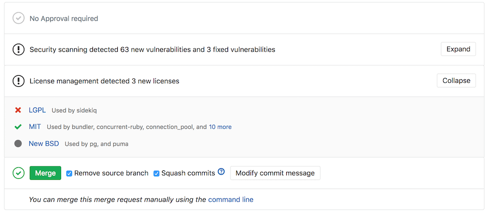
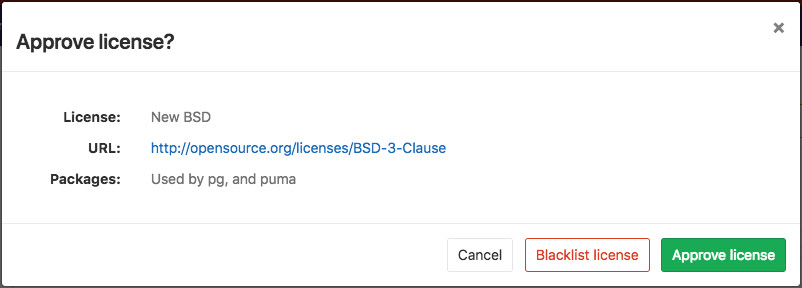

# License Management

> [Introduced][ee-5483] in [GitLab Ultimate][ee] 11.0.

## Overview

If you are using [GitLab CI/CD][ci], you can search your project dependencies for their licenses
using License Management, either by
including the CI job in your [existing `.gitlab-ci.yml` file][cc-docs] or
by implicitly using [Auto License Management](../../../topics/autodevops/index.md#auto-dependency-scanning)
that is provided by [Auto DevOps](../../../topics/autodevops/index.md).

Going a step further, GitLab can show the licenses list right in the merge
request widget area, highlighting the presence of licenses you don't want to use, or new
ones that need a decision.
Licenses can be accepted or blacklisted in the project settings, or directly from the
merge request widget.

## Use cases

It helps you find what licenses your project uses in its dependencies, and decide for each of then
whether to allow it or forbid it. For example, your application is using an external (open source)
library whose license is incompatible with yours.

## Supported languages and package managers

The following languages and package managers are supported.

| Language   | Package managers                                                  |
|------------|-------------------------------------------------------------------|
| JavaScript | [Bower](https://bower.io/), [npm](https://www.npmjs.com/)         |
| Go         | [Godep](https://github.com/tools/godep), go get                   |
| Java       | [Gradle](https://gradle.org/), [Maven](https://maven.apache.org/) |
| .NET       | [Nuget](https://www.nuget.org/)                                   |
| Python     | [pip](https://pip.pypa.io/en/stable/)                             |
| Ruby       | [gem](https://rubygems.org/)                                      |

## How it works

First of all, you need to define a job named `license_management` in your
`.gitlab-ci.yml` file. [Check how the `license_management` job should look like][cc-docs].

In order for the report to show in the merge request, there are two
prerequisites:

- the specified job **must** be named `license_management`
- the resulting report **must** be named `gl-license-management-report.json`
  and uploaded as an artifact

>**Note:**
If the license management report doesn't have anything to compare to, no information
will be displayed in the merge request area. That is the case when you add the
`license_management` job in your `.gitlab-ci.yml` for the very first time.
Consecutive merge requests will have something to compare to and the license
management report will be shown properly.

The `license_management` job will search the application dependencies for licenses,
the resulting JSON file will be uploaded as an artifact, and
GitLab will then check this file and show the information inside the merge
request. Blacklisted licenses will be clearly visible, as well as new licenses which
need a decision from you.

You can click on a license to be given the choice to approve it or blacklist it.

The list of licenses and their status can also be managed from the project settings.

[ee-5483]: https://gitlab.com/gitlab-org/gitlab-ee/issues/5483
[ee]: https://about.gitlab.com/pricing/
[ci]: ../../../ci/README.md
[cc-docs]: ../../../ci/examples/license_management.md
