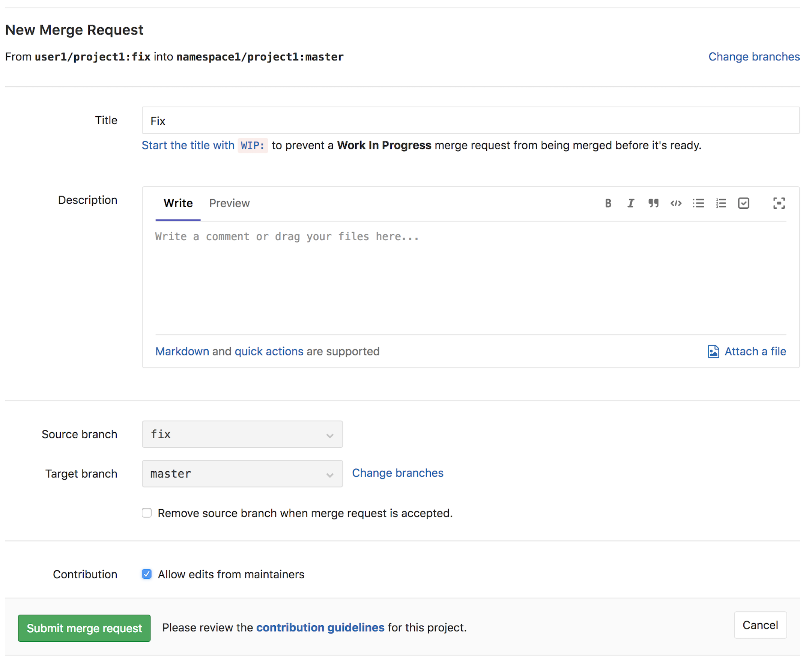

# Allow maintainer pushes for merge requests across forks

This feature is available for merge requests across forked projects that are
publicly accessible. It makes it easier for maintainers of projects to collaborate
on merge requests across forks.

When enabling this feature for a merge request, you give can give members with push access to the target project rights to edit files on the source branch of the merge request.

The feature can only be enabled by users who already have push access to the source project. And only lasts while the merge request is open.

Enable this functionality while creating a merge request:

