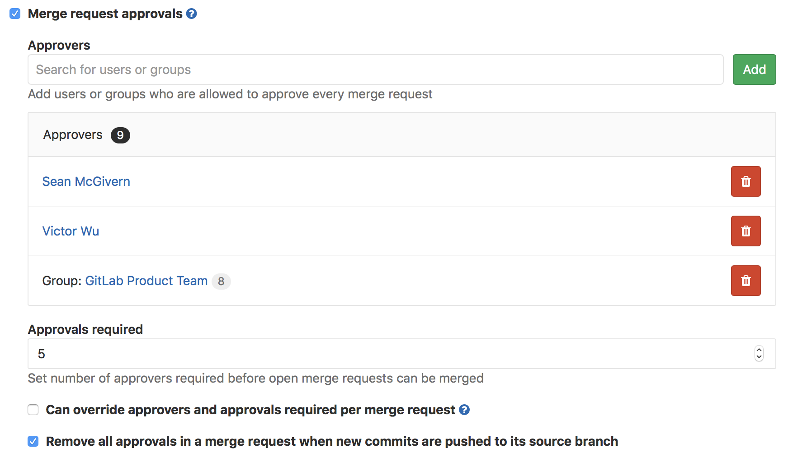
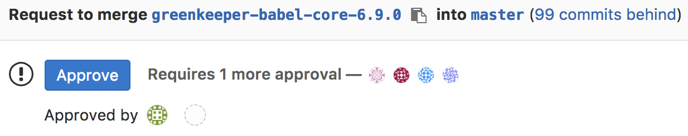
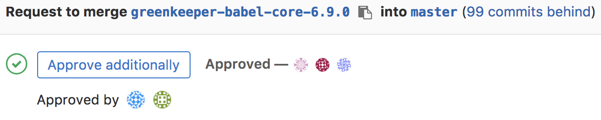
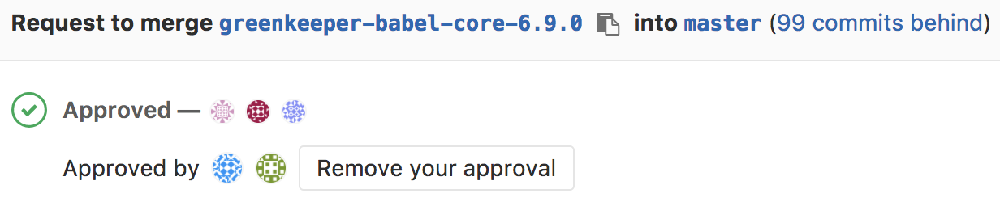

# Merge request approvals

> Introduced in [GitLab Enterprise Edition 7.12](https://about.gitlab.com/2015/06/22/gitlab-7-12-released/#merge-request-approvers-ee-only), available in [GitLab Starter](https://about.gitlab.com/products/).

## Overview

Merge request approvals enable enforced code review by requiring specified people to approve a merge request before it can be unblocked for merging.

## Use cases

1. Enforcing review of all code that gets merged into a repository.
2. Specifying code maintainers for an entire repository.
3. Specifying reviewers for a given proposed code change.
4. Specifying categories of reviewers, such as BE, FE, QA, DB, etc., for all proposed code changes.

## Activating approvals

To activate the merge request approvals:

1. Navigate to your project's **Settings > General** and expand the
   **Merge requests settings**
1. Tick the "Merge requests approvals" checkbox
1. Search for users or groups that will be [eligible to approve](#eligible-approvers)
   merge requests and click the **Add** button to add them as approvers
1. Set the minimum number of required approvals under the "Approvals required"
   box
1. Click **Save changes**

    

The steps above are the minimum required to get approvals working in your
merge requests, but there are a couple more options available that might be
suitable to your workflow:

- Choose whether the default settings can be
  [overridden per merge request](#overriding-the-merge-request-approvals-default-settings)
- Choose whether [approvals will be reset with new pushed commits](#resetting-approvals-on-push)

NOTE: **Note:**
If the approvers are changed via the project's settings after a merge request
is created, the merge request retains the previous approvers, but you can always
change them by [editing the merge request](#overriding-the-merge-request-approvals-default-settings).

## Eligible approvers

An individual user is an eligible approver if they are a member of the given project,
a member of the project's immediate parent group, or a member of a group that has share access
to the project via a [share](../members/share_project_with_groups.md).

A group is also an eligible approver. [In the future](https://gitlab.com/gitlab-org/gitlab-ee/issues/2048),
group approvers will be restricted.

If a user is added as an individual approver and is also part of a group approver,
then that user is just counted once. The merge request author does not count as
an eligible approver.

Let's say that `m` is the number of required approvals, and `Ω` is the set of
explicit approvers. Depending on their number, there are different cases:

- If `m <= Ω`, then only those explicit approvers can approve the merge request.
- If `m > Ω` , then all the explicit approvers _and_ the members of the given
  project with Developer role or higher are eligible approvers of the merge
  request.

NOTE: **Note:**
If the approvals settings are [overridden](#overriding-the-merge-request-approvals-default-settings)
for the particular merge request, then the set of explicit approvers is the
union of the default approvers and the extra approvers set in the merge request.

## Adding or removing an approval

If approvals are activated for the given project, when a user visits an open
merge request, depending on their [eligibility](#eligible-approvers), one of
the following is possible:

- **They are not an eligible approver**: They cannot do anything with respect
  to approving this merge request.
- **They have not approved this merge request**:
  - If the required number of approvals has _not_ been yet met, they can approve
    it by clicking the displayed **Approve** button.
      

  - If the required number of approvals has already been met, they can still
    approve it by clicking the displayed **Add approval** button.
      

    ---

- **They have already approved this merge request**: They can remove their approval.

    

NOTE: **Note:**
The merge request author is not allowed to approve their own merge request.

For the given merge request, if the required number of approvals has been met
(i.e., the number of approvals given to the merge request is greater or equal
than the required number), then the merge request is unblocked and can be merged.
Note, that meeting the required number of approvals is a necessary, but not
sufficient condition for unblocking a merge request from being merged. There
are other conditions that may block it, such as merge conflicts,
[pending discussions](../../discussions/index.md#l#only-allow-merge-requests-to-be-merged-if-all-discussions-are-resolved)
or a [failed CI/CD pipeline](merge_when_pipeline_succeeds.md).

## Overriding the merge request approvals default settings

> Introduced in GitLab Enterprise Edition 9.4.

If approvals are [activated at the project level](#activating-approvals), the
default configuration (number of required approvals and approvers) can be
overridden for each merge request in that project.

One possible scenario would be to to assign a group of approvers at the project
level and change them later when creating or editing the merge request.

First, you have to enable this option in the project's settings:

1. Navigate to your project's **Settings > General** and expand the
   **Merge requests settings**
1. Tick the "Can override approvers and approvals required per merge request"
   checkbox

    

1. Click **Save changes**

---

The default approval settings can now be overridden when creating a
[merge request](index.md) or by editing it after it's been created:

1. Search for users or groups that will be [eligible to approve](#eligible-approvers)
   merge requests and click the **Add** button to add them as approvers or
   remove existing approvers that were set in the project's settings
1. If you want to change the number of required approvals, set a new number
   in the "Approvals required" box
1. Click **Save changes**

There are however some restrictions:

- The amount of required approvals, if changed, must be greater than the default
  set at the project level. This ensures that you're not forced to adjust settings
  when someone is unavailable for approval, yet the process is still enforced.
- The number of Approvers must be greater or equal to the as the minimum required
  approvals as set in the default settings.

NOTE: **Note:**
If you are contributing to a forked project, things are a little different.
Read what happens  when the
[source and target branches are not the same](#merge-requests-with-different-source-branch-and-target-branch-projects).

## Resetting approvals on push

If approvals are [activated at the project level](#activating-approvals),
you can choose whether all approvals on a merge request are removed when
new commits are pushed to the source branch of the merge request:

1. Navigate to your project's **Settings > General** and expand the
   **Merge requests settings**
1. Tick the "Can override approvers and approvals required per merge request"
   checkbox

    

1. Click **Save changes**

NOTE: **Note:**
Approvals do not get reset when [rebasing a merge request](fast_forward_merge.md)
from the UI.
However, approvals will be reset if the target branch is changed.

If you want approvals to persist, independent of changes to the merge request,
turn this setting to off by unchecking the box and saving the changes.

## Merge requests with different source branch and target branch projects

If the merge request source branch and target branch belong to different
projects (which happens in merge requests in forked projects), everything is
with respect to the target branch's project (typically the original project).
In particular, since the merge request in this case is part of the target
branch's project, the relevant settings are the target project's. The source
branch's project settings are not applicable. Even if you start the merge
request from the source branch's project UI, pay attention to the created merge
request itself. It belongs to the target branch's project.
