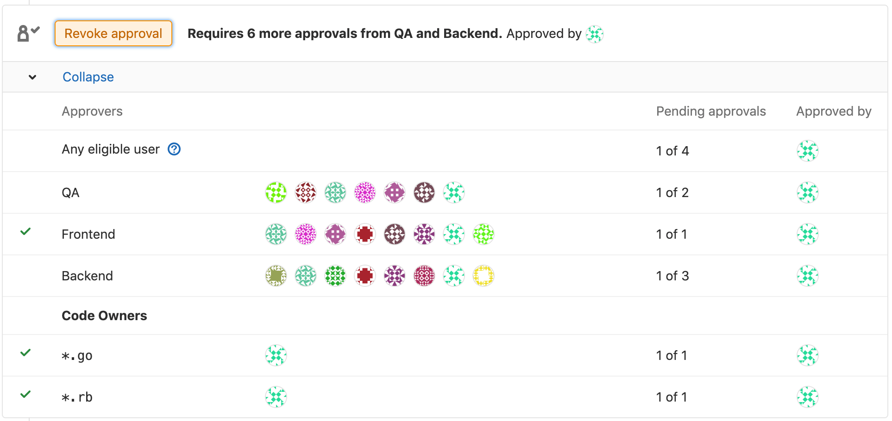

# Merge request approvals **(STARTER)**

> Introduced in [GitLab Enterprise Edition 7.12](https://about.gitlab.com/releases/2015/06/22/gitlab-7-12-released/#merge-request-approvers-ee-only).

Merge request approvals enable enforced code review by requiring specified people
to approve a merge request before it can be merged.

Merge request approvals enable multiple use cases:

- Enforcing review of all code that gets merged into a repository.
- Specifying reviewers for a given proposed code change, as well as a minimum number
  of reviewers, through [Approval rules](#approval-rules).
- Specifying categories of reviewers, such as backend, frontend, quality assurance,
  database, etc., for all proposed code changes.
- Automatically designating [Code Owners as eligible approvers](#code-owners-as-eligible-approvers),
  determined by the files changed in a merge request.
- [Requiring approval from a security team](#security-approvals-in-merge-requests-ultimate)
  before merging code that could introduce a vulnerability.**(ULTIMATE)**

## Approval rules

Approval rules define how many approvals a merge request must receive before it can
be merged, and optionally which users should do the approving. Approvals can be defined:

- [As project defaults](#adding--editing-a-default-approval-rule).
- [Per merge request](#editing--overriding-approval-rules-per-merge-request).

If no approval rules are defined, any user can approve a merge request, though the default
minimum number of required approvers can still be set in the [project settings for merge request approvals](#merge-request-approvals-project-settings).

### Eligible approvers

The following users can approve merge requests:

- Users who have been added as approvers at the project or merge request levels with
  developer or higher [permissions](../../permissions.md).
- [Code owners](#code-owners-as-eligible-approvers) of the files changed by the merge request
  that have developer or higher [permissions](../../permissions.md).

An individual user can be added as an approver for a project if they are a member of:

- The project.
- The project's immediate parent group.
- A group that has access to the project via a [share](../members/share_project_with_groups.md).

A group of users can also be added as approvers. In the future, group approvers may be
[restricted to only groups with share access to the project](https://gitlab.com/gitlab-org/gitlab/-/issues/2048).

If a user is added as an individual approver and is also part of a group approver,
then that user is just counted once. The merge request author, as well as users who have committed
to the merge request, do not count as eligible approvers,
if [**Prevent author approval**](#allowing-merge-request-authors-to-approve-their-own-merge-requests) (enabled by default)
and [**Prevent committers approval**](#prevent-approval-of-merge-requests-by-their-committers) (disabled by default)
are enabled on the project settings.

#### Implicit approvers

If the number of required approvals is greater than the number of assigned approvers,
approvals from other users will count towards meeting the requirement. These would be
users with developer [permissions](../../permissions.md) or higher in the project who
were not explicitly listed in the approval rules.

#### Code Owners as eligible approvers

> [Introduced](https://gitlab.com/gitlab-org/gitlab/-/merge_requests/7933) in [GitLab Starter](https://about.gitlab.com/pricing/) 11.5.

If you add [Code Owners](../code_owners.md) to your repository, the owners to the
corresponding files will become eligible approvers, together with members with Developer
or higher [permissions](../../permissions.md).

To enable this merge request approval rule:

1. Navigate to your project's **Settings > General** and expand
   **Merge request approvals**.
1. Locate **Any eligible user** and choose the number of approvals required.


Once set, merge requests can only be merged once approved by the
number of approvals you've set. GitLab will accept approvals from
users with Developer or higher permissions, as well as by Code Owners,
indistinguishably.

Alternatively, you can **require**
[Code Owner's approvals for Protected Branches](../protected_branches.md#protected-branches-approval-by-code-owners-premium). **(PREMIUM)**

### Adding / editing a default approval rule

To add or edit the default merge request approval rule:

1. Navigate to your project's **{settings}** **Settings > General** and expand **Merge request approvals**.

1. Click **Add approval rule**, or **Edit**.
   - Add or change the **Rule name**.
   - Set the number of required approvals in **No. approvals required**. The minimum value is `0`.
   - (Optional) Search for users or groups that will be [eligible to approve](#eligible-approvers)
     merge requests and click the **Add** button to add them as approvers. Before typing
     in the search field, approvers will be suggested based on the previous authors of
     the files being changed by the merge request.
   - (Optional) Click the **{remove}** **Remove** button next to a group or user to delete it from
     the rule.
1. Click **Add approval rule** or **Update approval rule**.

Any merge requests that were created before changing the rules will not be changed.
They will keep the original approval rules, unless manually [overridden](#editing--overriding-approval-rules-per-merge-request).

NOTE: **Note:**
If a merge request targets a different project, such as from a fork to the upstream project,
the default approval rules will be taken from the target (upstream) project, not the
source (fork).

#### Editing / overriding approval rules per merge request

> Introduced in GitLab Enterprise Edition 9.4.

By default, the merge request approval rule listed in each merge request (MR) can be
edited by the MR author or a user with sufficient [permissions](../../permissions.md).
This ability can be disabled in the [merge request approvals settings](#prevent-overriding-default-approvals).

One possible scenario would be to add more approvers than were defined in the default
settings.

When creating or editing a merge request, find the **Approval rules** section, then follow
the same steps as [Adding / editing a default approval rule](#adding--editing-a-default-approval-rule).

### Multiple approval rules **(PREMIUM)**

> [Introduced](https://gitlab.com/gitlab-org/gitlab/-/issues/1979) in [GitLab Premium](https://about.gitlab.com/pricing/) 11.10.

In GitLab Premium, it is possible to have multiple approval rules per merge request,
as well as multiple default approval rules per project.

Adding or editing multiple default rules is identical to
[adding or editing a single default approval rule](#adding--editing-a-default-approval-rule),
except the **Add approval rule** button will be available to add more rules, even after
a rule is already defined.

Similarly, editing or overriding multiple approval rules per merge request is identical
to [editing or overriding approval rules per merge request](#editing--overriding-approval-rules-per-merge-request),
except the **Add approval rule** button will be available to add more rules, even after
a rule is already defined.

When an [eligible approver](#eligible-approvers) approves a merge request, it will
reduce the number of approvals left for all rules that the approver belongs to.



### Scoped to Protected Branch **(PREMIUM)**

> [Introduced](https://gitlab.com/gitlab-org/gitlab/-/issues/460) in [GitLab Premium](https://about.gitlab.com/pricing/) 12.8.

Approval rules are often only relevant to specific branches, like `master`.
When configuring [**Default Approval Rules**](#adding--editing-a-default-approval-rule)
these can be scoped to all the protected branches at once by navigating to your project's
**Settings**, expanding **Merge request approvals**, and selecting **Any branch** from
the **Target branch** dropdown.

Alternatively, you can select a very specific protected branch from the **Target branch** dropdown:


To enable this configuration, see [Code Owner’s approvals for protected branches](../protected_branches.md#protected-branches-approval-by-code-owners-premium).

## Adding or removing an approval

When an [eligible approver](#eligible-approvers) visits an open merge request,
one of the following is possible:

- If the required number of approvals has _not_ been yet met, they can approve
  it by clicking the displayed **Approve** button.

  

- If the required number of approvals has already been met, they can still
  approve it by clicking the displayed **Approve additionally** button.

  

- **They have already approved this merge request**: They can remove their approval.

  

NOTE: **Note:**
The merge request author is not allowed to approve their own merge request if
[**Prevent author approval**](#allowing-merge-request-authors-to-approve-their-own-merge-requests)
is enabled in the project settings.

Once the approval rules have been met, the merge request can be merged if there is nothing
else blocking it. Note that the merge request could still be blocked by other conditions,
such as merge conflicts, [pending discussions](../../discussions/index.md#only-allow-merge-requests-to-be-merged-if-all-threads-are-resolved),
or a [failed CI/CD pipeline](merge_when_pipeline_succeeds.md).

## Merge request approvals project settings

The project settings for Merge request approvals are found by going to
**{settings}** **Settings > General** and expanding **Merge request approvals**.

### Prevent overriding default approvals

By default, users are able to edit the approval rules in merge requests. If disabled,
the approval rules for all new merge requests will be determined by the
[default approval rules](#adding--editing-a-default-approval-rule). To disable this feature:

1. Uncheck the **Can override approvers and approvals required per merge request** checkbox.
1. Click **Save changes**.

### Resetting approvals on push

You can force all approvals on a merge request to be removed when new commits are
pushed to the source branch of the merge request. If disabled, approvals will persist
even if there are changes added to the merge request. To enable this feature:

1. Check the **Remove all approvals in a merge request when new commits are pushed to its source branch**
   checkbox.
1. Click **Save changes**.

NOTE: **Note:**
Approvals do not get reset when [rebasing a merge request](fast_forward_merge.md)
from the UI. However, approvals will be reset if the target branch is changed.

### Allowing merge request authors to approve their own merge requests

> [Introduced](https://gitlab.com/gitlab-org/gitlab/-/issues/3349) in [GitLab Starter](https://about.gitlab.com/pricing/) 11.3.

You can allow merge request authors to self-approve merge requests. Authors
also need to be included in the approvers list in order to be able to
approve their merge request. To enable this feature:

1. Uncheck the **Prevent approval of merge requests by merge request author** checkbox,
   which is enabled by default.
1. Click **Save changes**.

### Prevent approval of merge requests by their committers

> [Introduced](https://gitlab.com/gitlab-org/gitlab/-/issues/10441) in [GitLab Starter](https://about.gitlab.com/pricing/) 11.10.

You can prevent users that have committed to a merge request from approving it. To
enable this feature:

1. Check the **Prevent approval of merge requests by their committers** checkbox.
1. Click **Save changes**.

### Require authentication when approving a merge request

> [Introduced](https://gitlab.com/gitlab-org/gitlab/-/issues/5981) in [GitLab Starter](https://about.gitlab.com/pricing/) 12.0.

You can force the approver to enter a password in order to authenticate before adding
the approval. This enables an Electronic Signature for approvals such as the one defined
by [CFR Part 11](https://www.accessdata.fda.gov/scripts/cdrh/cfdocs/cfcfr/CFRSearch.cfm?CFRPart=11&showFR=1&subpartNode=21:1.0.1.1.8.3)).
To enable this feature:

1. Check the **Require user password to approve** checkbox.
1. Click **Save changes**.

## Security approvals in merge requests **(ULTIMATE)**

Merge Request Approvals can be configured to require approval from a member
of your security team when a vulnerability would be introduced by a merge request.

For more information, see
[Security approvals in merge requests](../../application_security/index.md#security-approvals-in-merge-requests).

## Enabling the new approvals interface

Since [GitLab v12.0](https://gitlab.com/gitlab-org/gitlab/-/issues/10685), an updated approvals
interface is available by default. In versions older than 12.0, the updated interface is not
available unless the `approval_rules` feature flag is enabled, which can be done from
the Rails console by instance administrators.

Use these commands to start the Rails console:

```shell
# Omnibus GitLab
gitlab-rails console

# Installation from source
cd /home/git/gitlab
sudo -u git -H bin/rails console -e production
```

Then run `Feature.enable(:approval_rules)` to enable the updated interface.

<!-- ## Troubleshooting

Include any troubleshooting steps that you can foresee. If you know beforehand what issues
one might have when setting this up, or when something is changed, or on upgrading, it's
important to describe those, too. Think of things that may go wrong and include them here.
This is important to minimize requests for support, and to avoid doc comments with
questions that you know someone might ask.

Each scenario can be a third-level heading, e.g. `### Getting error message X`.
If you have none to add when creating a doc, leave this section in place
but commented out to help encourage others to add to it in the future. -->
