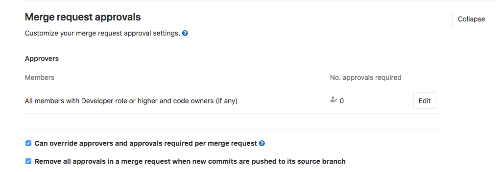
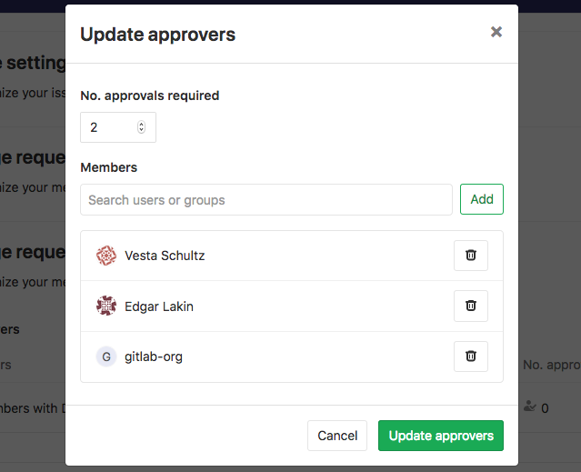
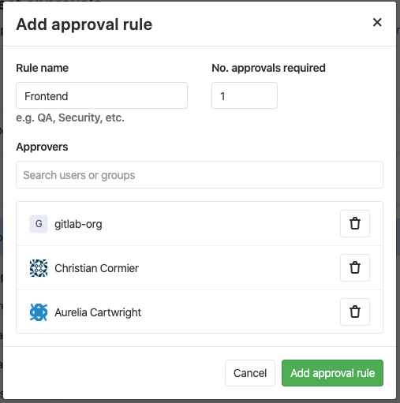
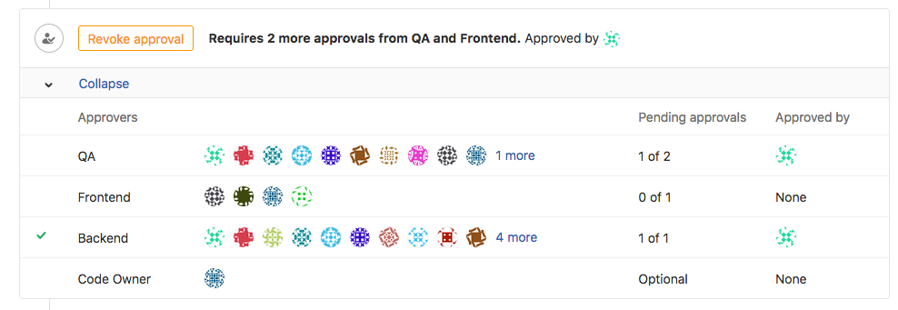
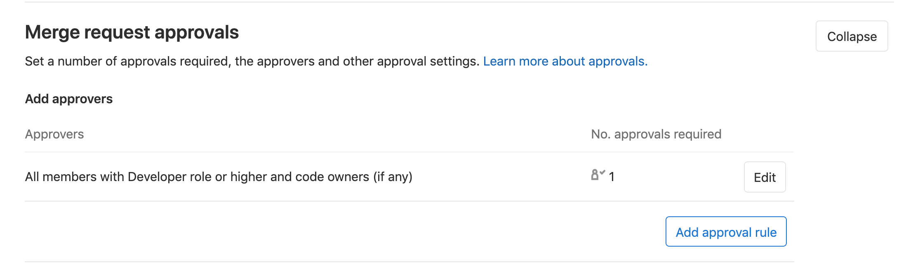
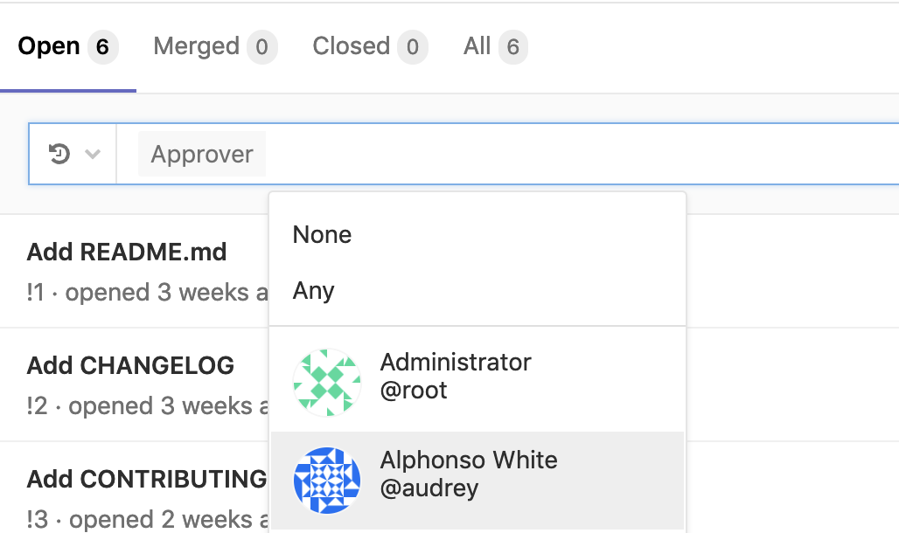

# Merge request approvals **(STARTER)**

> Introduced in [GitLab Enterprise Edition 7.12](https://about.gitlab.com/blog/2015/06/22/gitlab-7-12-released/#merge-request-approvers-ee-only).

Merge request approvals enable enforced code review by requiring specified people
to approve a merge request before it can be unblocked for merging.

## Use cases

1. Enforcing review of all code that gets merged into a repository.
1. Specifying code maintainers for an entire repository.
1. Specifying reviewers for a given proposed code change.
1. Specifying categories of reviewers, such as BE, FE, QA, DB, etc., for all proposed code changes.

## Enabling the new approvals interface

NOTE: **Note:**
Prior to 12.0, if you are running a self-managed instance, the new interface shown on
this page will not be available unless the feature flag
`approval_rules` is enabled, which can be done from the Rails console by
instance administrators.

Use these commands to start the Rails console:

```sh
# Omnibus GitLab
gitlab-rails console

# Installation from source
cd /home/git/gitlab
sudo -u git -H bin/rails console RAILS_ENV=production
```

Then run `Feature.enable(:approval_rules)` to enable the feature flag.

## Editing approvals

To edit the merge request approvals:

1. Navigate to your project's **Settings > General** and expand
   **Merge request approvals**.

   

1. Click **Edit**.
1. Search for users or groups that will be [eligible to approve](#eligible-approvers)
   merge requests and click the **Add** button to add them as approvers. Note: selecting
   approvers is optional.
1. Set the minimum number of required approvals under the **No. approvals required**
   box. Note: the minimum can be 0.
1. Click **Update approvers**.

   

The steps above are the minimum required to get approvals working in your
merge requests, but there are a couple more options available that might be
suitable to your workflow:

- Choose whether the default settings can be
  [overridden per merge request](#overriding-the-merge-request-approvals-default-settings)
- Choose whether [approvals will be reset with new pushed commits](#resetting-approvals-on-push)

## Editing approvals **(PREMIUM)**

> [Introduced](https://gitlab.com/gitlab-org/gitlab/issues/1979) in [GitLab Premium](https://about.gitlab.com/pricing/) 11.10.

For GitLab Premium, [multiple approver rules](#multiple-approval-rules-premium) can be configured. To configure the merge
request approval rules:

1. Navigate to your project's **Settings > General** and expand **Merge request approvals**.
1. Click **Add approvers** to create a new approval rule.
1. Just like in [GitLab Starter](#editing-approvals), select the approval members and approvals required.
1. Give the approval rule a name that describes the set of approvers selected.
1. Click **Add approval rule** to submit the new rule.

   

## Multiple approval rules **(PREMIUM)**

> [Introduced](https://gitlab.com/gitlab-org/gitlab/issues/1979) in [GitLab Premium](https://about.gitlab.com/pricing/) 11.10.

For GitLab Premium, a merge request's overall approval status is determined by a set of rules. Each rule contains:

- A set of [eligible approvers](#eligible-approvers).
- A minimum number of approvals required.

When an [eligible approver](#eligible-approvers) approves a merge request, it will reduce the number of approvals left for
all rules that the approver belongs to.



If no approval rules are set, then the overall minimum number of approvals required can be configured. With no approval rules,
any [eligible approver](#eligible-approvers) may approve.

## Eligible approvers

The following can approve merge requests:

- Users being added as approvers at project or merge request level.
- [Code owners](#code-owners-as-eligible-approvers-starter) to the files changed by the merge request.

An individual user can be added as an approver for a project if they are a member of:

- The project.
- The project's immediate parent group.
- A group that has access to the project via a [share](../members/share_project_with_groups.md).

A group can also be added as an approver. [In the future](https://gitlab.com/gitlab-org/gitlab/issues/2048),
group approvers will be restricted.

If a user is added as an individual approver and is also part of a group approver,
then that user is just counted once. The merge request author, as well as users who have committed
to the merge request, do not count as eligible approvers,
if [**Prevent author approval**](#allowing-merge-request-authors-to-approve-their-own-merge-requests) (enabled by default)
and [**Prevent committers approval**](#prevent-approval-of-merge-requests-by-their-committers) (disabled by default)
are enabled on the project settings.

### Code Owners as eligible approvers **(STARTER)**

> [Introduced](https://gitlab.com/gitlab-org/gitlab/merge_requests/7933) in [GitLab Starter](https://about.gitlab.com/pricing/) 11.5.

Once you've added [Code Owners](../code_owners.md) to your
repository, the owners to the corresponding files will become
eligible approvers, together with members with Developer or
higher permissions.

To enable this merge request approval rule:

1. Navigate to your project's **Settings > General** and expand
**Merge request approvals**.
1. Locate **All members with Developer role or higher and code owners (if any)** and click **Edit** to choose the number of approvals required.



Once set, merge requests can only be merged once approved by the
number of approvals you've set. GitLab will accept approvals from
users with Developer or higher permissions, as well as by Code Owners,
indistinguishably.

Alternatively, you can **require**
[Code Owner's approvals for Protected Branches](../protected_branches.md#protected-branches-approval-by-code-owners-premium). **(PREMIUM)**

### Implicit approvers

If the number of required approvals is greater than the number of approvers,
other users will become implicit approvers to fill the gap.
Those implicit approvers include members of the given project with Developer role or higher.

## Adding or removing an approval

If approvals are activated for the given project, when a user visits an open
merge request, depending on their [eligibility](#eligible-approvers), one of
the following is possible:

- **They are not an eligible approver**: They cannot do anything with respect
  to approving this merge request.

- **They have not approved this merge request**:

  - If the required number of approvals has _not_ been yet met, they can approve
    it by clicking the displayed **Approve** button.

    

  - If the required number of approvals has already been met, they can still
    approve it by clicking the displayed **Approve additionally** button.

    

- **They have already approved this merge request**: They can remove their approval.

  

NOTE: **Note:**
The merge request author is only allowed to approve their own merge request
if [**Prevent author approval**](#allowing-merge-request-authors-to-approve-their-own-merge-requests) is disabled on the project settings.

For a given merge request, if the approval restrictions have been satisfied,
the merge request is unblocked and can be merged.
Note that meeting the required number of approvals is a necessary, but not
sufficient condition for unblocking a merge request from being merged. There
are other conditions that may block it, such as merge conflicts,
[pending discussions](../../discussions/index.md#only-allow-merge-requests-to-be-merged-if-all-threads-are-resolved)
or a [failed CI/CD pipeline](merge_when_pipeline_succeeds.md).

## Overriding the merge request approvals default settings

> Introduced in GitLab Enterprise Edition 9.4.

NOTE: **Note:**
If you are using GitLab Premium, things are a little different with [multiple approval rules](#multiple-approval-rules-premium).
Read the differences [in GitLab Premium when overriding merge request approvals](#overriding-merge-request-approvals-default-settings-premium).

If approvals are [set at the project level](#editing-approvals), the
default configuration (number of required approvals and approvers) can be
overridden for each merge request in that project.

One possible scenario would be to assign a group of approvers at the project
level and change them later when creating or editing the merge request.

First, you have to enable this option in the project's settings:

1. Navigate to your project's **Settings > General** and expand
   **Merge request approvals**
1. Tick the "Can override approvers and approvals required per merge request"
   checkbox

   

1. Click **Save changes**

NOTE: **Note:**
If approver overriding is enabled
and the project level approvers are changed after a merge request is created,
the merge request retains the previous approvers.
However, the approvers can be changed by [editing the merge request](#overriding-the-merge-request-approvals-default-settings).

The default approval settings can now be overridden when creating a
[merge request](index.md) or by editing it after it's been created:

1. Click **Edit** under the **Approvers** section.
1. Search for users or groups that will be [eligible to approve](#eligible-approvers)
   merge requests and click the **Add** button to add them as approvers or
   remove existing approvers that were set in the project's settings.
1. If you want to change the number of required approvals, set a new number
   in the **No. approvals required** box.
1. Click **Update approvers**.

NOTE: **Note:**
If you are contributing to a forked project, things are a little different.
Read what happens  when the
[source and target branches are not the same](#merge-requests-with-different-source-branch-and-target-branch-projects).

## Overriding merge request approvals default settings **(PREMIUM)**

In GitLab Premium, when the approval rules are [set at the project level](#editing-approvals-premium),
and **Can override approvers and approvals required per merge request** is checked,
approval rules can be added to an MR with no restriction.

## Resetting approvals on push

If approvals are [set at the project level](#editing-approvals),
you can choose whether all approvals on a merge request are removed when
new commits are pushed to the source branch of the merge request:

1. Navigate to your project's **Settings > General** and expand
   **Merge request approvals**
1. Tick the "Remove all approvals in a merge request when new commits are pushed to its source branch"
   checkbox

   

1. Click **Save changes**

NOTE: **Note:**
Approvals do not get reset when [rebasing a merge request](fast_forward_merge.md)
from the UI.
However, approvals will be reset if the target branch is changed.

If you want approvals to persist, independent of changes to the merge request,
turn this setting to off by unchecking the box and saving the changes.

## Allowing merge request authors to approve their own merge requests

> [Introduced](https://gitlab.com/gitlab-org/gitlab/issues/3349) in [GitLab Starter](https://about.gitlab.com/pricing/) 11.3.

You can allow merge request authors to self-approve merge requests by
enabling it [at the project level](#editing-approvals). Authors
also need to be included in the approvers list in order to be able to
approve their merge request.

1. Navigate to your project's **Settings > General** and expand **Merge request approvals**.
1. Uncheck the **Prevent approval of merge requests by merge request author** checkbox, which is enabled by default.
1. Click **Save changes**.

## Prevent approval of merge requests by their committers

> [Introduced](https://gitlab.com/gitlab-org/gitlab/issues/10441) in [GitLab Starter](https://about.gitlab.com/pricing/) 11.10.

You can prevent users that have committed to a merge request from approving it by
enabling [**Prevent approval of merge requests by their committers**](#prevent-approval-of-merge-requests-by-their-committers).

1. Navigate to your project's **Settings > General** and expand **Merge request approvals**.
1. Tick the checkbox **Prevent approval of merge requests by their committers**.
1. Click **Save changes**.

## Require authentication when approving a merge request **(STARTER)**

> [Introduced](https://gitlab.com/gitlab-org/gitlab/issues/5981) in [GitLab Starter](https://about.gitlab.com/pricing/) 12.0.

You can force the approver to enter a password in order to authenticate who is approving the merge request by
enabling **Require user password to approve**. This enables an Electronic Signature
for approvals such as the one defined by [CFR Part 11](https://www.accessdata.fda.gov/scripts/cdrh/cfdocs/cfcfr/CFRSearch.cfm?CFRPart=11&showFR=1&subpartNode=21:1.0.1.1.8.3)):

1. Navigate to your project's **Settings > General** and expand **Merge request approvals**.
1. Tick the checkbox **Require user password to approve**.
1. Click **Save changes**.

## Merge requests with different source branch and target branch projects

If the merge request source branch and target branch belong to different
projects (which happens in merge requests in forked projects), everything is
with respect to the target branch's project (typically the original project).
In particular, since the merge request in this case is part of the target
branch's project, the relevant settings are the target project's. The source
branch's project settings are not applicable. Even if you start the merge
request from the source branch's project UI, pay attention to the created merge
request itself. It belongs to the target branch's project.

## Approver suggestions

Approvers are suggested for merge requests based on the previous authors of the files affected by the merge request.

## Filtering merge requests by approvers

> [Introduced](https://gitlab.com/gitlab-org/gitlab/merge_requests/9468) in [GitLab Starter](https://about.gitlab.com/pricing/) 11.9.

To filter merge requests by an individual approver, you can type (or select from
the dropdown) `approver` and select the user.



## Security approvals in merge requests **(ULTIMATE)**

> Introduced in [GitLab Ultimate](https://about.gitlab.com/pricing/) 12.2.

Merge Request Approvals can be configured to require approval from a member
of your security team when a vulnerability would be introduced by a merge request.

For more information, see
[Security approvals in merge requests](../../application_security/index.md#security-approvals-in-merge-requests-ultimate).

## License compliance approvals in merge requests **(ULTIMATE)**

> Introduced in [GitLab Ultimate](https://about.gitlab.com/pricing/) 12.3.

Merge Request Approvals can be configured to require approval from a member
of your security team when a blacklisted software license would be introduced by a merge request.

For more information, see
[Security approvals in merge requests](../../application_security/index.md#security-approvals-in-merge-requests-ultimate).

<!-- ## Troubleshooting

Include any troubleshooting steps that you can foresee. If you know beforehand what issues
one might have when setting this up, or when something is changed, or on upgrading, it's
important to describe those, too. Think of things that may go wrong and include them here.
This is important to minimize requests for support, and to avoid doc comments with
questions that you know someone might ask.

Each scenario can be a third-level heading, e.g. `### Getting error message X`.
If you have none to add when creating a doc, leave this section in place
but commented out to help encourage others to add to it in the future. -->
