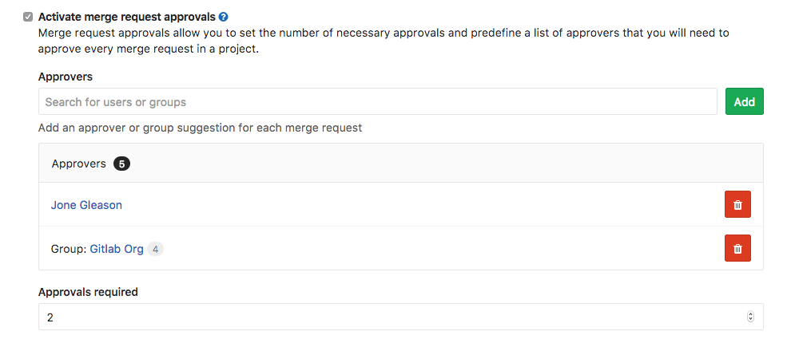
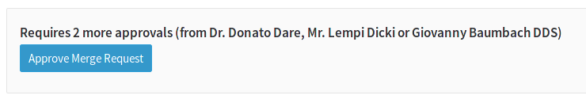
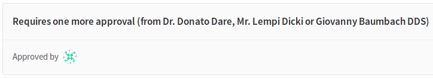

# Merge request approvals

> Introduced in GitLab Enterprise Edition 7.13.

If you want to make sure every merge request is approved by one or more
people, you can enforce this workflow by using merge request approvals.
Merge request approvals allow you to set the number of necessary approvals
and predefine a list of approvers that will need to approve every
merge request in a project.

## Configuring Approvals

You can configure the approvals in the project settings, under merge requests.
To enable it, set **Approvals required** to 1 or higher and search for the
users you want to be approvers.

### Approvals Required

This sets the amount of approvals required before being able to merge a merge request.
At 0, this disables the feature. Any value above 0 requires that amount of different
users to approve the merge request.

The number of approvers can be higher than the required approvals.

### Reset approvals on push

With this setting turned on, approvals are reset when a new push
is done to the merge request branch.

Turn **Reset approvals on push** off if you want approvals to persist,
independent of changes to the merge request.

Approvals do not get reset when rebasing a merge request from the UI.

If one of the approvers pushes a commit to the branch that is tied to the
merge request, they automatically get excluded from the approvers list.

### Approvers

At the approvers area you can define the default set of users that need to
approve a merge request.

Depending on the number of required approvals and the number of approvers set,
there are different cases:

- If there are more approvers than required approvals, any subset of these users
  can approve the merge request.
- If there are less approvers than required approvals, all the set approvers plus
  any other user(s) need to approve the merge request before being able to merge it.
- If the approvers are equal to the amount of required approvals, all the
  approvers are required to approve the merge request.

Note that approvers and the number of required approvals can be changed while
creating or editing a merge request.

When someone is marked as a required approver for a merge request, an email is
sent to them and a todo is added to their list of todos.

## Groups

You can also assign one or more groups that can be assigned as approvers, it works in the same way like regular approvers, the only difference is that you assign several users with one action. It's also possible to assign group at the project level and you can always change them later by editing the merge request.

## Using approvals

After configuring approvals, you will be able to change the default set of
approvers and the amount of required approvals before creating the merge request.
The amount of required approvals, if changed, must be greater than the default
set at the project level. This ensures that you're not forced to adjust settings
when someone is unavailable for approval, yet the process is still enforced.

If the approvers are changed via the project's settings after a merge request
is created, the merge request retains the previous approvers, but you can always
change them by editing the merge request.

The author of a merge request cannot be set as an approver for that merge
request.

To approve a merge request, simply press the **Approve merge request** button.

Once you approve, the button will disappear and the number of approvers
will be decreased by one.

