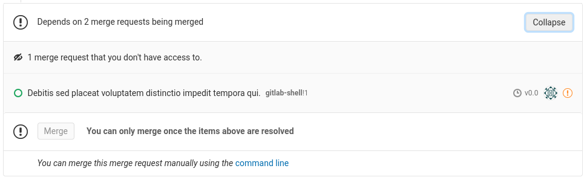
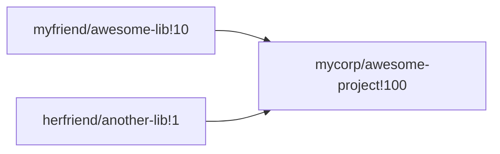
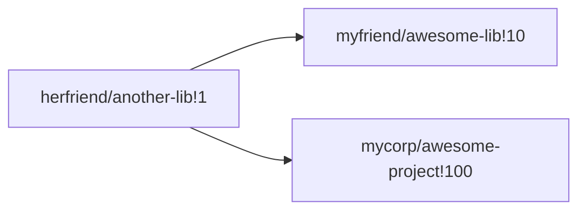

# Cross-project merge request dependencies **(PREMIUM)**

> Introduced in GitLab Premium 12.2

Cross-project merge request dependencies allows a required order of merging
between merge requests in different projects to be expressed. If a
merge request "depends on" another, then it cannot be merged until its
dependency is itself merged.

NOTE: **Note:**
Merge requests dependencies are a **PREMIUM** feature, but this restriction is
only enforced for the dependent merge request. A merge request in a **CORE** or
**STARTER** project can be a dependency of a **PREMIUM** merge request, but not
vice-versa.

NOTE: **Note:**
A merge request can only depend on merge requests in a different project. Two
merge requests in the same project cannot depend on each other.

## Use cases

- Ensure changes to a library are merged before changes to a project that
  imports the library
- Prevent a documentation-only merge request from being merged before the merge request
  implementing the feature to be documented
- Require an merge request updating a permissions matrix to be merged before merging an
  merge request from someone who hasn't yet been granted permissions

It is common for a single logical change to span several merge requests, spread
out across multiple projects, and the order in which they are merged can be
significant.

For example, given a project `mycorp/awesome-project` that imports a library
at `myfriend/awesome-lib`, adding a feature in `awesome-project` may **also**
require changes to `awesome-lib`, and so necessitate two merge requests. Merging
the `awesome-project` merge request before the `awesome-lib` one would
break the `master`branch.

The `awesome-project` merge request could be [marked as
WIP](work_in_progress_merge_requests.md),
and the reason for the WIP stated included in the comments. However, this
requires the state of the `awesome-lib` merge request to be manually
tracked, and doesn't scale well if the `awesome-project` merge request
depends on changes to **several** other projects.

By making the `awesome-project` merge request depend on the
`awesome-lib` merge request instead, this relationship is
automatically tracked by GitLab, and the WIP state can be used to
communicate the readiness of the code in each individual merge request
instead.

## Configuration

To continue the above example, you can configure a dependency when creating the
new merge request in `awesome-project` (or by editing it, if it already exists).
The dependency needs to be configured on the **dependent** merge
request. There is a "Cross-project dependencies" section in the form:

Anyone who can edit a merge request can change the list of dependencies.

New dependencies can be added by reference, or by URL. To remove a dependency,
press the "X" by its reference.

As dependencies are specified across projects, it's possible that someone else
has added a dependency for a merge request in a project you don't have access to.
These are shown as a simple count:

If necessary, you can remove all the dependencies like this by pressing the "X",
just as you would for a single, visible dependency.

Once you're finished, press the "Save changes" button to submit the request, or
"Cancel" to return without making any changes.

The list of configured dependencies, and the status of each one, is shown in the
merge request widget:

Until all dependencies have, themselves, been merged, the "Merge"
button will be disabled for the dependent merge request. In
particular, note that **closed** merge request still prevent their
dependents from being merged - it is impossible to automatically
determine whether the dependency expressed by a closed merge request
has been satisfied in some other way or not.

If a merge request has been closed **and** the dependency is no longer relevant,
it must be removed as a dependency, following the instructions above, before
merge.

## Limitations

- API support: [gitlab-ee#12551](https://gitlab.com/gitlab-org/gitlab-ee/issues/12551)
- Dependencies are not preserved across project export/import: [gitlab-ee#12549](https://gitlab.com/gitlab-org/gitlab-ee/issues/12549)
- Complex merge order dependencies are not supported: [gitlab-ee#11393](https://gitlab.com/gitlab-org/gitlab-ee/issues/11393)

The last item merits a little more explanation. Dependencies between merge
requests can be described as a graph of relationships. The simplest possible
graph has one merge request that depends upon another:

A more complex (and still supported) graph might have one merge request that
directly depends upon several others:

Several different merge requests can also directly depend upon the
same merge request:

What is **not** supported is a "deep", or "nested" graph of dependencies, e.g.:

In this example, `myfriend/awesome-lib!10` depends on `herfriend/another-lib!1`,
and is itself a dependent of `mycorp/awesome-project!100`. This means that
`myfriend/awesome-lib!10` becomes an **indirect** dependency of
`mycorp/awesome-project!100`, which is not yet supported.
