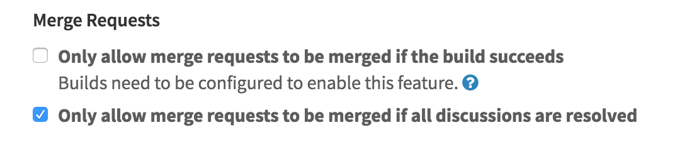
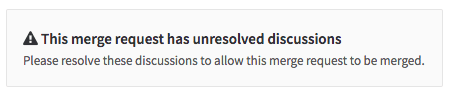
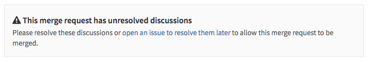
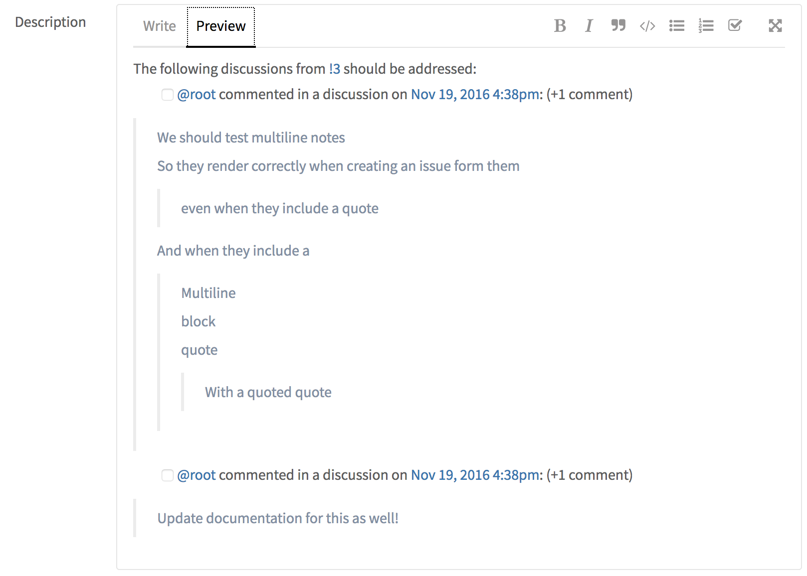
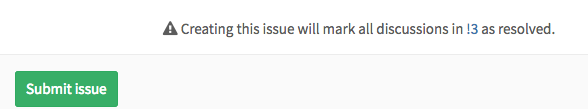

# Merge Request discussion resolution

> [Introduced][ce-5022] in GitLab 8.11.

Discussion resolution helps keep track of progress during code review.
Resolving comments prevents you from forgetting to address feedback and lets you
hide discussions that are no longer relevant.

!["A discussion between two people on a piece of code"][discussion-view]

Comments and discussions can be resolved by anyone with at least Developer
access to the project, as well as by the author of the merge request.

## Marking a comment or discussion as resolved

You can mark a discussion as resolved by clicking the "Resolve discussion"
button at the bottom of the discussion.

!["Resolve discussion" button][resolve-discussion-button]

Alternatively, you can mark each comment as resolved individually.

!["Resolve comment" button][resolve-comment-button]

## Jumping between unresolved discussions

When a merge request has a large number of comments it can be difficult to track
what remains unresolved. You can jump between unresolved discussions with the
Jump button next to the Reply field on a discussion.

You can also jump to the first unresolved discussion from the button next to the
resolved discussions tracker.

!["3/4 discussions resolved"][discussions-resolved]

## Only allow merge requests to be merged if all discussions are resolved

> [Introduced][ce-7125] in GitLab 8.14.

You can prevent merge requests from being merged until all discussions are
resolved.

Navigate to your project's settings page, select the
**Only allow merge requests to be merged if all discussions are resolved** check
box and hit **Save** for the changes to take effect.

From now on, you will not be able to merge from the UI until all discussions
are resolved.

## Move all unresolved discussions in a merge request to an issue

> [Introduced][ce-7180] in GitLab 8.15.

To delegate unresolved discussions to a new issue you can click the link **open
an issue to resolve them later**.

This will prepare an issue with content referring to the merge request and
discussions.

Hitting **Submit issue** will cause all discussions to be marked as resolved and
add a note referring to the newly created issue.

You can now proceed to merge the merge request from the UI.

[ce-5022]: https://gitlab.com/gitlab-org/gitlab-ce/merge_requests/5022
[ce-7125]: https://gitlab.com/gitlab-org/gitlab-ce/merge_requests/7125
[ce-7180]: https://gitlab.com/gitlab-org/gitlab-ce/merge_requests/7180
[resolve-discussion-button]: img/resolve_discussion_button.png
[resolve-comment-button]: img/resolve_comment_button.png
[discussion-view]: img/discussion_view.png
[discussions-resolved]: img/discussions_resolved.png
