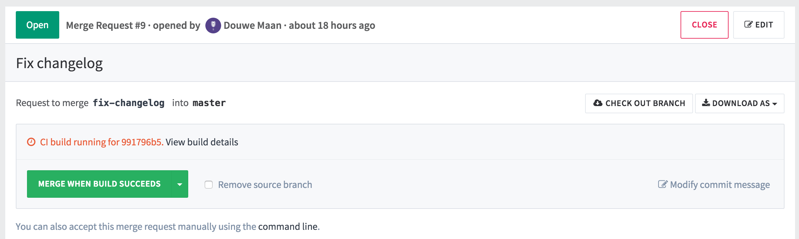
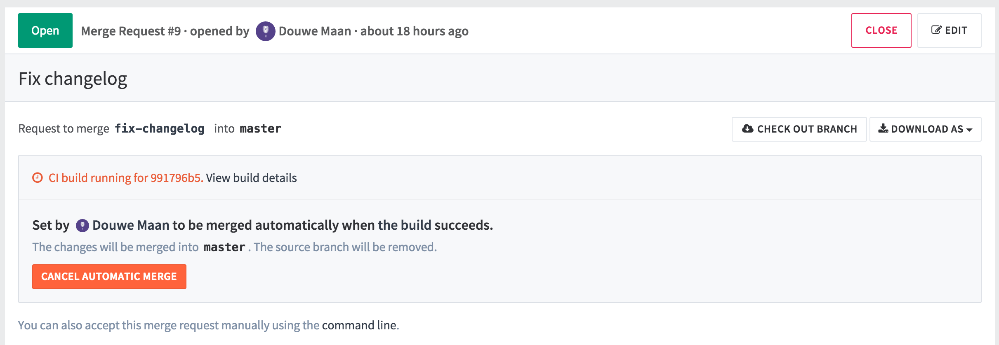

# Merge When Build Succeeds

When reviewing a merge request that looks ready to merge but still has one or
more CI builds running, you can set it to be merged automatically when all
builds succeed. This way, you don't have to wait for the builds to finish and
remember to merge the request manually.

When you hit the "Merge When Build Succeeds" button, the status of the merge
request will be updated to represent the impending merge. If you cannot wait
for the build to succeed and want to merge immediately, this option is available
in the dropdown menu on the right of the main button.

Both team developers and the author of the merge request have the option to
cancel the automatic merge if they find a reason why it shouldn't be merged
after all.

When the build succeeds, the merge request will automatically be merged. When
the build fails, the author gets a chance to retry any failed builds, or to
push new commits to fix the failure.

When the builds are retried and succeed on the second try, the merge request
will automatically be merged after all. When the merge request is updated with
new commits, the automatic merge is automatically canceled to allow the new
changes to be reviewed.
