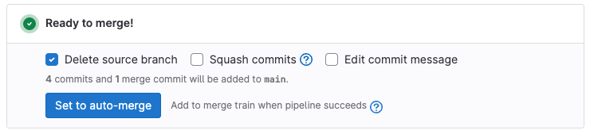
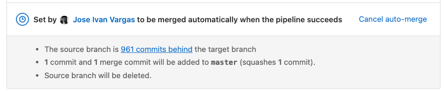

# Auto-merge

DETAILS:
**Tier:** Free, Premium, Ultimate
**Offering:** GitLab.com, Self-managed, GitLab Dedicated

> - **Merge when pipeline succeeds** and **Add to merge train when pipeline succeeds** [renamed](https://gitlab.com/gitlab-org/gitlab/-/issues/409530) to **Auto-merge** in GitLab 16.0 [with a flag](../../../administration/feature_flags.md) named `auto_merge_labels_mr_widget`. Enabled by default.
> - [Generally available](https://gitlab.com/gitlab-org/gitlab/-/merge_requests/120922) in GitLab 16.0. Feature flag `auto_merge_labels_mr_widget` removed.

If the content of a merge request is ready to merge, use **Set to auto-merge** on
the merge request. You don't have to remember later to merge the work manually. If set,
a merge request auto-merges when all these conditions are met:

- The merge request pipeline must complete successfully.
- All required approvals must be given.

The [merge when checks pass](#merge-when-checks-pass) feature, available in
GitLab 16.9 and later, adds more checks to the auto-merge process.

## Auto-merge a merge request

Prerequisites:

- You must have at least the Developer role in the project.
- If the project is configured to require it, all threads in the
  merge request [must be resolved](index.md#resolve-a-thread).
- The merge request must have received all required approvals.

To do this when pushing from the command line, use the `merge_request.merge_when_pipeline_succeeds`
[push option](../push_options.md).

To do this from the GitLab user interface:

1. On the left sidebar, select **Search or go to** and find your project.
1. Select **Code > Merge requests**.
1. Select the merge request to edit.
1. Scroll to the merge request reports section.
1. Optional. Select your desired merge options, such as **Delete source branch**,
   **Squash commits**, or **Edit commit message**.
1. Select **Auto-merge**.

If a new comment is added to the merge request after you select **Auto-merge**,
but before the pipeline completes, GitLab blocks the merge until you
resolve all existing threads.

### Merge when pipeline succeeds

If the pipeline succeeds, the merge request is merged. If the pipeline fails, the
author can either retry any failed jobs, or push new commits to fix the failure:

- If a retried job succeeds on the second try, the merge request is merged.
- If new commits are added to the merge request, GitLab cancels the request
  to ensure the new changes are reviewed before merge.
- If new commits are added to the target branch of the merge request and
  fast-forward only merge request is configured, GitLab cancels the request
  to prevent merge conflicts.

### Merge when checks pass

DETAILS:
**Tier:** Free, Premium, Ultimate
**Offering:** GitLab.com, Self-managed

> - [Introduced](https://gitlab.com/groups/gitlab-org/-/epics/10874) in GitLab 16.5 [with two flags](../../../administration/feature_flags.md) named `merge_when_checks_pass` and `additional_merge_when_checks_ready`. Disabled by default.
> - [Enabled on GitLab.com](https://gitlab.com/gitlab-org/gitlab/-/issues/412995) in GitLab 16.9.

FLAG:
On self-managed GitLab, by default this feature is not available. To enable the feature,
an administrator can [enable the feature flags](../../../administration/feature_flags.md)
named `merge_when_checks_pass` and `additional_merge_when_checks_ready`.
On GitLab.com, this feature is available. On GitLab Dedicated, this feature is not available.

In GitLab 16.9 and later, **Merge when checks pass** adds more checks to the auto-merge
process. When set to auto-merge, all of these checks must pass for a merge request to merge:

- The merge request pipeline must complete successfully, regardless of the project setting.
- All required approvals must be given.
- The merge request must not be a **Draft**.
- All discussions must be resolved.
- All blocking merge requests must be merged or closed.

## Cancel an auto-merge

If a merge request is set to auto-merge, you can cancel it.

Prerequisites:

- You must either be the author of the merge request, or a project member with
  at least the Developer role.
- The merge request's pipeline must still be in progress.

To do this:

1. On the left sidebar, select **Search or go to** and find your project.
1. Select **Code > Merge requests**.
1. Select the merge request to edit.
1. Scroll to the merge request reports section.
1. Select **Cancel auto-merge**.

## Require a successful pipeline for merge

You can configure your project to require a complete and successful pipeline before
merge. This configuration works for both:

- GitLab CI/CD pipelines.
- Pipelines run from an [external CI integration](../integrations/index.md#available-integrations).

As a result, [disabling GitLab CI/CD pipelines](../../../ci/pipelines/settings.md#disable-gitlab-cicd-pipelines)
does not disable this feature, but you can use pipelines from external
CI providers with it.

Prerequisites:

- Ensure CI/CD is configured to run a pipeline for every merge request.
- You must have at least the Maintainer role in the project.

To enable this setting:

1. On the left sidebar, select **Search or go to** and find your project.
1. Select **Settings > Merge requests**.
1. Scroll to **Merge checks**, and select **Pipelines must succeed**.
   This setting also prevents merge requests from being merged if there is no pipeline,
   which can [conflict with some rules](#merge-request-cannot-be-merged-despite-no-failed-pipeline).
1. Select **Save**.

If [multiple pipeline types run for the same merge request](#merge-request-can-still-be-merged-despite-a-failed-pipeline),
merge request pipelines take precedence over other pipeline types. For example,
an older but successful merge request pipeline allows a merge request to be merged,
despite a newer but failed branch pipeline.

### Allow merge after skipped pipelines

When the **Pipelines must succeed** checkbox is checked,
[skipped pipelines](../../../ci/pipelines/index.md#skip-a-pipeline) prevent
merge requests from being merged.

Prerequisites:

- You must have at least the Maintainer role in the project.

To change this behavior:

1. On the left sidebar, select **Search or go to** and find your project.
1. Select **Settings > Merge requests**.
1. Under **Merge checks**:
   - Select **Pipelines must succeed**.
   - Select **Skipped pipelines are considered successful**.
1. Select **Save**.

## Troubleshooting

### Merge request cannot be merged despite no failed pipeline

In some cases, you can [require a successful pipeline for merge](#require-a-successful-pipeline-for-merge),
but be unable to merge a merge request with no failed pipelines. The setting requires
the existence of a successful pipeline, not the absence of failed pipelines. If the merge request
has no pipelines at all, it is not considered to have a successful pipeline and cannot be merged.

When the setting is enabled, use [`rules`](../../../ci/yaml/index.md#rules) or [`workflow:rules`](../../../ci/yaml/index.md#workflowrules)
to ensure pipelines run for every merge request.

### Merge request can still be merged despite a failed pipeline

In some cases, you can [require a successful pipeline for merge](#require-a-successful-pipeline-for-merge),
but still merge a merge request with a failed pipeline.

Merge request pipelines have the highest priority for the **Pipelines must succeed** setting.
If multiple pipeline types run for the same merge request, only the merge request pipelines
are checked for success.

Multiple pipeline types in the same merge request can be caused by:

- A [`rules`](../../../ci/yaml/index.md#rules) configuration that causes [duplicate pipelines](../../../ci/jobs/job_control.md#avoid-duplicate-pipelines):
  one merge request pipeline and one branch pipeline. In this case, the status of the
  latest merge request pipeline determines if a merge request can be merged, not the branch pipeline.
- Pipelines triggered by external tools that target the same branch as the merge request.

In all cases, update your CI/CD configuration to prevent multiple pipeline types for the same merge request.
