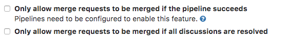
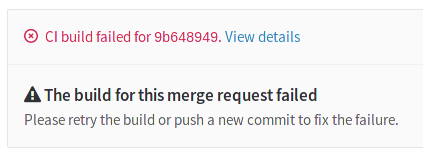

# Merge when pipeline succeeds

When reviewing a merge request that looks ready to merge but still has one or
more CI jobs running, you can set it to be merged automatically when the
jobs pipeline succeeds. This way, you don't have to wait for the jobs to
finish and remember to merge the request manually.


## How it works

When you hit the "Merge When Pipeline Succeeds" button, the status of the merge
request will be updated to represent the impending merge. If you cannot wait
for the pipeline to succeed and want to merge immediately, this option is
available in the dropdown menu on the right of the main button.

Both team developers and the author of the merge request have the option to
cancel the automatic merge if they find a reason why it shouldn't be merged
after all.


When the pipeline succeeds, the merge request will automatically be merged.
When the pipeline fails, the author gets a chance to retry any failed jobs,
or to push new commits to fix the failure.

When the jobs are retried and succeed on the second try, the merge request
will automatically be merged after all. When the merge request is updated with
new commits, the automatic merge is automatically canceled to allow the new
changes to be reviewed.

## Only allow merge requests to be merged if the pipeline succeeds

You can prevent merge requests from being merged if their pipeline did not succeed
or if there are threads to be resolved. This works for both:

- GitLab CI/CD pipelines
- Pipelines run from an [external CI integration](../integrations/project_services.md#services)

As a result, [disabling GitLab CI/CD pipelines](../../../ci/enable_or_disable_ci.md)
will not disable this feature, as it will still be possible to use pipelines from external
CI providers with this feature. To enable it, you must:

1. Navigate to your project's **Settings > General** page.
1. Expand the **Merge requests** section.
1. In the **Merge checks** subsection, select the **Pipelines must succeed** checkbox.
1. Press **Save** for the changes to take effect.

NOTE: **Note:** This setting also prevents merge requests from being merged if there is no pipeline.



From now on, every time the pipeline fails you will not be able to merge the
merge request from the UI, until you make all relevant jobs pass.



### Limitations

When this setting is enabled, a merge request is prevented from being merged if there is no pipeline. This may conflict with some use cases where [`only/except`](../../../ci/yaml/README.md#onlyexcept-advanced) rules are used and they don't generate any pipelines.

Users that expect to be able to merge a merge request in this scenario should ensure that [there is always a pipeline](https://gitlab.com/gitlab-org/gitlab-foss/issues/54226) and that it's succesful.

For example, to that on merge requests there is always a passing job even though `only/except` rules may not generate any other jobs:

```yaml
enable_merge:
  only: [merge_requests]
  script:
    - echo true
```

<!-- ## Troubleshooting

Include any troubleshooting steps that you can foresee. If you know beforehand what issues
one might have when setting this up, or when something is changed, or on upgrading, it's
important to describe those, too. Think of things that may go wrong and include them here.
This is important to minimize requests for support, and to avoid doc comments with
questions that you know someone might ask.

Each scenario can be a third-level heading, e.g. `### Getting error message X`.
If you have none to add when creating a doc, leave this section in place
but commented out to help encourage others to add to it in the future. -->

## Use it from the command line

You can use [Push Options](../push_options.md) to trigger this feature when
pushing.
