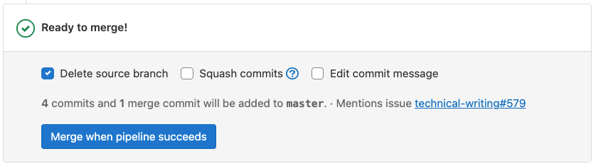

# Auto-merge **(FREE)**

> **Merge when pipeline succeeds** and **Add to merge train when pipeline succeeds** [renamed](https://gitlab.com/gitlab-org/gitlab/-/issues/409530) to **Auto-merge** in GitLab 16.0 [with a flag](../../../administration/feature_flags.md) named `auto_merge_labels_mr_widget`. Enabled by default.

NOTE:
[In GitLab 16.0 and later](https://gitlab.com/gitlab-org/gitlab/-/issues/359057), **Merge when pipeline succeeds** and **Add to merge train when pipeline succeeds** become **Set to auto-merge**.

If you review a merge request and it's ready to merge, but the pipeline hasn't
completed yet, you can set it to merge when the pipeline succeeds (MWPS). You don't
have to remember later to merge the work manually:



If the pipeline succeeds, the merge request is merged. If the pipeline fails, the
author can either retry any failed jobs, or push new commits to fix the failure:

- If a retried job succeeds on the second try, the merge request is merged.
- If new commits are added to the merge request, GitLab cancels the MWPS request
  to ensure the new changes are reviewed before merge.

## Set a merge request to MWPS

Prerequisites:

- You must have at least the Developer role in the project.
- If the project is configured to require it, all threads in the
  merge request [must be resolved](../../discussions/index.md#resolve-a-thread).
- The merge request must have received all required approvals.

To do this when pushing from the command line, use the `merge_request.merge_when_pipeline_succeeds`
[push option](../push_options.md).

To do this from the GitLab user interface:

1. On the top bar, select **Main menu > Projects** and find your project.
1. On the left sidebar, select **Merge requests**.
1. Scroll to the merge request reports section.
1. Optional. Select your desired merge options, such as **Delete source branch**,
   **Squash commits**, or **Edit commit message**.
1. Select **Merge when pipeline succeeds**.

If a new comment is added to the merge request after you select **Merge when pipeline succeeds**,
but before the pipeline completes, GitLab blocks the merge until you
resolve all existing threads.

## Cancel an auto-merge

If a merge request is set to MWPS, you can cancel it.

Prerequisites:

- You must either be the author of the merge request, or a project member with
  at least the Developer role.
- The merge request's pipeline must still be in progress.

To do this:

1. On the top bar, select **Main menu > Projects** and find your project.
1. On the left sidebar, select **Merge requests**.
1. Scroll to the merge request reports section.
1. Select **Cancel auto-merge**.


## Require a successful pipeline for merge

You can configure your project to require a complete and successful pipeline before
merge. This configuration works for both:

- GitLab CI/CD pipelines.
- Pipelines run from an [external CI integration](../integrations/index.md#available-integrations).

As a result, [disabling GitLab CI/CD pipelines](../../../ci/enable_or_disable_ci.md)
does not disable this feature, but you can use pipelines from external
CI providers with it.

Prerequisites:

- Ensure CI/CD is configured to run a pipeline for every merge request.
- You must have at least the Maintainer role in the project.

To enable this setting:

1. On the top bar, select **Main menu > Projects** and find your project.
1. On the left sidebar, select **Settings > Merge requests**.
1. Scroll to **Merge checks**, and select **Pipelines must succeed**.
   This setting also prevents merge requests from being merged if there is no pipeline,
   which can [conflict with some rules](#merge-requests-dont-merge-when-successful-pipeline-is-required).
1. Select **Save**.

### Allow merge after skipped pipelines

> [Introduced](https://gitlab.com/gitlab-org/gitlab/-/issues/211482) in GitLab 13.1.

When the **Pipelines must succeed** checkbox is checked,
[skipped pipelines](../../../ci/pipelines/index.md#skip-a-pipeline) prevent
merge requests from being merged.

Prerequisite:

- You must have at least the Maintainer role in the project.

To change this behavior:

1. On the top bar, select **Main menu > Projects** and find your project.
1. On the left sidebar, select **Settings > General**.
1. Expand **Merge requests**.
1. Under **Merge checks**:
   - Select **Pipelines must succeed**.
   - Select **Skipped pipelines are considered successful**.
1. Select **Save**.

## Troubleshooting

### Merge requests don't merge when successful pipeline is required

If you require a successful pipeline for a merge, this setting can conflict with some
use cases that do not generate pipelines, such as [`only/except`](../../../ci/yaml/index.md#only--except)
or [`rules`](../../../ci/yaml/index.md#rules). Ensure your project
[runs a pipeline](https://gitlab.com/gitlab-org/gitlab-foss/-/issues/54226) for
every merge request, and that the pipeline is successful.

### Ensure test parity between pipeline types

If a merge request triggers both a branch pipeline and a merge request pipeline,
the success or failure of only the *merge request pipeline* is checked.
If the merge request pipeline contains fewer jobs than the branch pipeline,
it could allow code that fails tests to be merged, like in this example:

```yaml
branch-pipeline-job:
  rules:
    - if: $CI_PIPELINE_SOURCE == "push"
  script:
    - echo "Testing happens here."

merge-request-pipeline-job:
  rules:
    - if: $CI_PIPELINE_SOURCE == "merge_request_event"
  script:
    - echo "No testing happens here. This pipeline always succeeds, and enables merge."
    - echo true
```

Instead, use branch (`push`) pipelines or merge request pipelines, when possible.
For details on avoiding two pipelines for a single merge request, read the
[`rules` documentation](../../../ci/jobs/job_control.md#avoid-duplicate-pipelines).

### Merged results pipeline allows merge, despite a failed branch pipeline

When [the **Pipelines must succeed** setting](#require-a-successful-pipeline-for-merge)
is combined with
[the **Merged results pipelines** feature](../../../ci/pipelines/merged_results_pipelines.md),
failed branch pipeline may be ignored.
[Issue 385841](https://gitlab.com/gitlab-org/gitlab/-/issues/385841) is open to track this.
