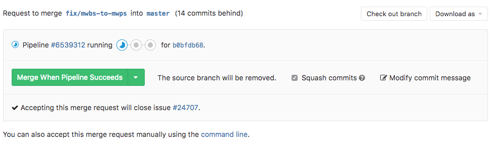
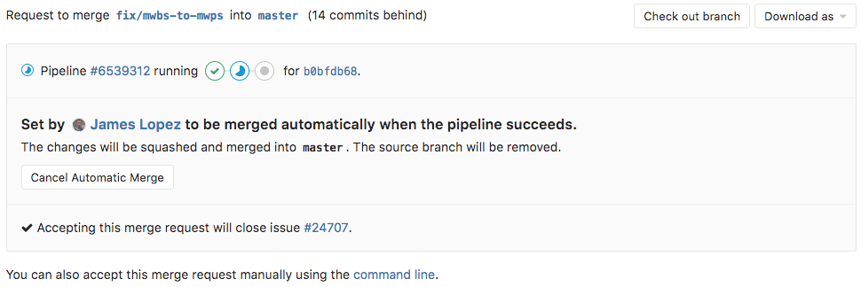

# Merge when pipeline succeeds **(FREE)**

When reviewing a merge request that looks ready to merge but still has a
pipeline running, you can set it to merge automatically when the
pipeline succeeds. This way, you don't have to wait for the pipeline to
finish and remember to merge the request manually.



## How it works

When you click "Merge When Pipeline Succeeds", the status of the merge
request is updated to show the impending merge. If you can't wait
for the pipeline to succeed, you can choose **Merge immediately**
in the dropdown menu on the right of the main button.

The author of the merge request and project members with the Developer role can
cancel the automatic merge at any time before the pipeline finishes.



When the pipeline succeeds, the merge request is automatically merged.
When the pipeline fails, the author gets a chance to retry any failed jobs,
or to push new commits to fix the failure.

When the jobs are retried and succeed on the second try, the merge request
is automatically merged. When the merge request is updated with
new commits, the automatic merge is canceled to allow the new
changes to be reviewed.

By default, all threads must be resolved before you see the **Merge when
pipeline succeeds** button. If someone adds a new comment after
the button is selected, but before the jobs in the CI pipeline are
complete, the merge is blocked until you resolve all existing threads.

## Only allow merge requests to be merged if the pipeline succeeds

You can prevent merge requests from being merged if:

- No pipeline ran.
- The pipeline did not succeed.

This works for both:

- GitLab CI/CD pipelines
- Pipelines run from an [external CI integration](../integrations/overview.md#integrations-listing)

As a result, [disabling GitLab CI/CD pipelines](../../../ci/enable_or_disable_ci.md)
does not disable this feature, as it is possible to use pipelines from external
CI providers with this feature. To enable it, you must:

1. Navigate to your project's **Settings > General** page.
1. Expand the **Merge requests** section.
1. In the **Merge checks** subsection, select the **Pipelines must succeed** checkbox.
1. Press **Save** for the changes to take effect.

This setting also prevents merge requests from being merged if there is no pipeline.
You should be careful to configure CI/CD so that pipelines run for every merge request.

### Limitations

When this setting is enabled, a merge request is prevented from being merged if there
is no pipeline. This may conflict with some use cases where [`only/except`](../../../ci/yaml/index.md#only--except)
or [`rules`](../../../ci/yaml/index.md#rules) are used and they don't generate any pipelines.

You should ensure that [there is always a pipeline](https://gitlab.com/gitlab-org/gitlab-foss/-/issues/54226)
and that it's successful.

If both a branch pipeline and a merge request pipeline are triggered for a single
merge request, only the success or failure of the *merge request pipeline* is checked.
If the merge request pipeline is configured with fewer jobs than the branch pipeline,
it could allow code that fails tests to be merged:

```yaml
branch-pipeline-job:
  rules:
    - if: '$CI_PIPELINE_SOURCE == "push"'
  script:
    - echo "Code testing scripts here, for example."

merge-request-pipeline-job:
  rules:
    - if: '$CI_PIPELINE_SOURCE == "merge_request_event"'
  script:
    - echo "No tests run, but this pipeline always succeeds and enables merge."
    - echo true
```

You should avoid configuration like this, and only use branch (`push`) pipelines
or merge request pipelines, when possible. See [`rules` documentation](../../../ci/jobs/job_control.md#avoid-duplicate-pipelines)
for details on avoiding two pipelines for a single merge request.

### Skipped pipelines

> [Introduced](https://gitlab.com/gitlab-org/gitlab/-/issues/211482) in GitLab 13.1.

When the **Pipelines must succeed** checkbox is checked, [skipped pipelines](../../../ci/yaml/index.md#skip-pipeline) prevent
merge requests from being merged. To change this behavior:

1. Navigate to your project's **Settings > General** page.
1. Expand the **Merge requests** section.
1. In the **Merge checks** subsection, ensure **Pipelines must succeed** is checked.
1. In the **Merge checks** subsection, select the **Skipped pipelines are considered successful** checkbox.
1. Press **Save** for the changes to take effect.

## From the command line

You can use [Push Options](../push_options.md) to enable merge when pipeline succeeds
for a merge request when pushing from the command line.

<!-- ## Troubleshooting

Include any troubleshooting steps that you can foresee. If you know beforehand what issues
one might have when setting this up, or when something is changed, or on upgrading, it's
important to describe those, too. Think of things that may go wrong and include them here.
This is important to minimize requests for support, and to avoid doc comments with
questions that you know someone might ask.

Each scenario can be a third-level heading, e.g. `### Getting error message X`.
If you have none to add when creating a doc, leave this section in place
but commented out to help encourage others to add to it in the future. -->
