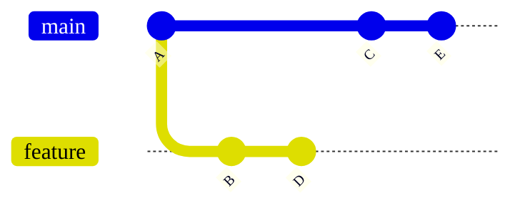
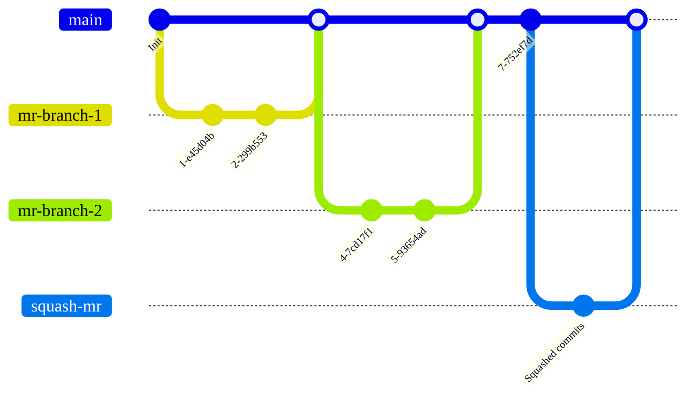
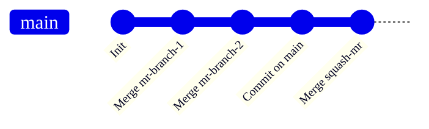

DETAILS:
**Tier:** Free, Premium, Ultimate
**Offering:** GitLab.com, GitLab Self-Managed, GitLab Dedicated

The merge method you select for your project determines how the changes in your
merge requests are merged into an existing branch.

The examples on this page assume a `main` branch with commits A, C, and E, and a
`feature` branch with commits B and D:



## Configure a project's merge method

1. On the left sidebar, select **Search or go to** and find your project.
1. Select **Settings > Merge requests**.
1. Select your desired **Merge method** from these options:
   - Merge commit
   - Merge commit with semi-linear history
   - Fast-forward merge
1. In **Squash commits when merging**, select the default behavior for handling commits:
   - **Do not allow**: Squashing is never performed, and the user cannot change the behavior.
   - **Allow**: Squashing is off by default, but the user can change the behavior.
   - **Encourage**: Squashing is on by default, but the user can change the behavior.
   - **Require**: Squashing is always performed, and the user cannot change the behavior.
1. Select **Save changes**.

## Merge commit

By default, GitLab creates a merge commit when a branch is merged into `main`.
A separate merge commit is always created, regardless of whether or not commits
are [squashed when merging](../squash_and_merge.md). This strategy can result
in both a squash commit and a merge commit being added to your `main` branch.

These diagrams show how the `feature` branch merges into `main` if you use the
**Merge commit** strategy. They are equivalent to the command `git merge --no-ff <feature>`,
and selecting `Merge commit` as the **Merge method** in the GitLab UI:

- After a feature branch is merged with the **Merge commit** method, your `main` branch
looks like this:

  ```mermaid
  %%{init: { 'gitGraph': {'logLevel': 'debug', 'showBranches': true, 'showCommitLabel':true,'mainBranchName': 'main', 'fontFamily': 'GitLab Sans'}} }%%
  gitGraph
     accTitle: Diagram of a merge commit
     accDescr: A Git graph showing how merge commits are created in GitLab when a feature branch is merged.
     commit id: "A"
     branch feature
     commit id: "B"
     commit id: "D"
     checkout main
     commit id: "C"
     commit id: "E"
     merge feature
  ```

- In comparison, a **squash merge** constructs a squash commit, a virtual copy of all commits
from the `feature` branch. The original commits (B and D) remain unchanged
on the `feature` branch, and then a merge commit is made on the `main` branch to merge in the squashed branch:

  ```mermaid
  %%{init: { 'gitGraph': {'showBranches': true, 'showCommitLabel':true,'mainBranchName': 'main', 'fontFamily': 'GitLab Sans'}} }%%
  gitGraph
     accTitle: Diagram of of a squash merge
     accDescr: A Git graph showing repository and branch structure after a squash commit is added to the main branch.
     commit id:"A"
     branch feature
     checkout main
     commit id:"C"
     checkout feature
     commit id:"B"
     commit id:"D"
     checkout main
     commit id:"E"
     branch "B+D"
     commit id: "B+D"
     checkout main
     merge "B+D"
  ```

The squash merge graph is equivalent to these settings in the GitLab UI:

- **Merge method**: Merge commit.
- **Squash commits when merging** should be set to either:
  - Require.
  - Either Allow or Encourage, and squashing must be selected on the merge request.

The squash merge graph is also equivalent to these commands:

  ```shell
  git checkout `git merge-base feature main`
  git merge --squash feature
  git commit --no-edit
  SOURCE_SHA=`git rev-parse HEAD`
  git checkout main
  git merge --no-ff $SOURCE_SHA
  ```

## Merge commit with semi-linear history

A merge commit is created for every merge, but the branch is only merged if
a fast-forward merge is possible. This ensures that if the merge request build
succeeded, the target branch build also succeeds after the merge. An example
commit graph generated using this merge method:



When you visit the merge request page with `Merge commit with semi-linear history`
method selected, you can accept it **only if a fast-forward merge is possible**.
When a fast-forward merge is not possible, the user is given the option to rebase, see
[Rebasing in (semi-)linear merge methods](#rebasing-in-semi-linear-merge-methods).

This method is equivalent to the same Git commands as in the **Merge commit** method. However,
if your source branch is based on an out-of-date version of the target branch (such as `main`),
you must rebase your source branch.
This merge method creates a cleaner-looking history, while still enabling you to
see where every branch began and was merged.

## Fast-forward merge

Sometimes, a workflow policy might mandate a clean commit history without
merge commits. In such cases, the fast-forward merge is appropriate. With
fast-forward merge requests, you can retain a linear Git history and a way
to accept merge requests without creating merge commits. An example commit graph
generated using this merge method:



This method is equivalent to:

- `git merge --ff <source-branch>` for regular merges.
- `git merge --squash <source-branch>` followed by `git commit` for squash merges.

When the fast-forward merge
([`--ff-only`](https://git-scm.com/docs/git-merge#git-merge---ff-only)) setting
is enabled, no merge commits are created and all merges are fast-forwarded.
Merging is only allowed if the branch can be fast-forwarded.
When a fast-forward merge is not possible, the user is given the option to rebase, see
[Rebasing in (semi-)linear merge methods](#rebasing-in-semi-linear-merge-methods).

When you visit the merge request page with `Fast-forward merge`
method selected, you can accept it **only if a fast-forward merge is possible**.

## Rebasing in (semi-)linear merge methods

In these merge methods, you can merge only when your source branch is up-to-date with the target branch:

- Merge commit with semi-linear history.
- Fast-forward merge.

If a fast-forward merge is not possible but a conflict-free rebase is possible,
GitLab provides:

- The [`/rebase` quick action](../conflicts.md#rebase-with-a-quick-action).
- The option to select **Rebase** in the user interface.

You must rebase the source branch locally before a fast-forward merge if both
conditions are true:

- The target branch is ahead of the source branch.
- A conflict-free rebase is not possible.

Rebasing may be required before squashing, even though squashing can itself be
considered equivalent to rebasing.

### Rebase without CI/CD pipeline

> - Changed to [Generally available](https://gitlab.com/gitlab-org/gitlab/-/issues/350262) in GitLab 15.3. Feature flag `rebase_without_ci_ui` removed.

To rebase a merge request's branch without triggering a CI/CD pipeline, select
**Rebase without pipeline** from the merge request reports section.

This option is:

- Available when fast-forward merge is not possible but a conflict-free rebase is possible.
- Not available when the **Pipelines must succeed** option is enabled.

Rebasing without a CI/CD pipeline saves resources in projects with a semi-linear
workflow that requires frequent rebases.

## Related topics

- [Squash and merge](../squash_and_merge.md)
