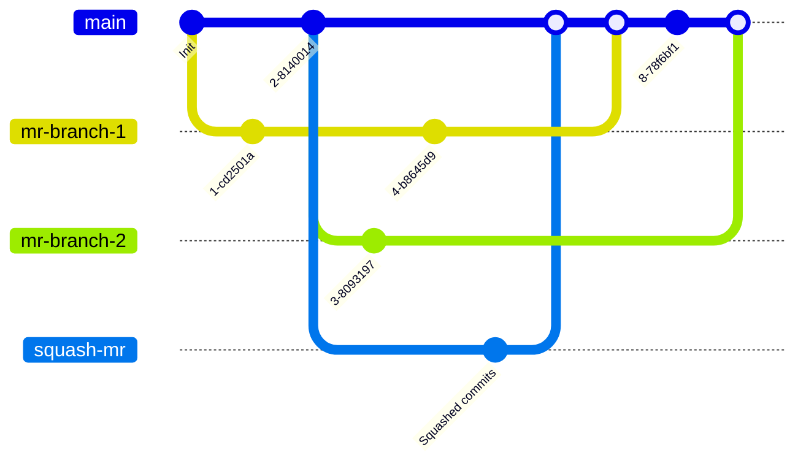

# Merge methods **(FREE)**

The merge method you select for your project determines how the changes in your
merge requests are merged into an existing branch.

## Configure a project's merge method

1. On the top bar, select **Menu > Projects** and find your project.
1. On the left sidebar, select **Settings > General**.
1. Expand **Merge requests**.
1. In the **Merge method** section, select your desired merge method.
1. Select **Save changes**.

## Merge commit

This setting is the default. It always creates a separate merge commit,
even when using [squash](../squash_and_merge.md). An example commit graph generated using this merge method:



- For regular merges, it is equivalent to the command `git merge --no-ff <source-branch>`.
- For squash merges, it squashes all commits in the source branch before merging it normally. It performs actions similar to:

  ```shell
  git checkout `git merge-base <source-branch> <target-branch>`
  git merge --squash <source-branch>
  SOURCE_SHA=`git rev-parse HEAD`
  git checkout <target-branch>
  git merge --no-ff $SOURCE_SHA
  ```

## Merge commit with semi-linear history

A merge commit is created for every merge, but the branch is only merged if
a fast-forward merge is possible. This ensures that if the merge request build
succeeded, the target branch build also succeeds after the merge. An example commit graph generated using this merge method:


When you visit the merge request page with `Merge commit with semi-linear history`
method selected, you can accept it **only if a fast-forward merge is possible**.
When a fast-forward merge is not possible, the user is given the option to rebase, see
[Rebasing in (semi-)linear merge methods](#rebasing-in-semi-linear-merge-methods).

This method is equivalent to the same Git commands as in the **Merge commit** method. However,
if your source branch is based on an out-of-date version of the target branch (such as `main`),
you must rebase your source branch.
This merge method creates a cleaner-looking history, while still enabling you to
see where every branch began and was merged.

## Fast-forward merge

Sometimes, a workflow policy might mandate a clean commit history without
merge commits. In such cases, the fast-forward merge is appropriate. With
fast-forward merge requests, you can retain a linear Git history and a way
to accept merge requests without creating merge commits. An example commit graph
generated using this merge method:


This method is equivalent to `git merge --ff <source-branch>` for regular merges, and to
`git merge -squash <source-branch>` for squash merges.

When the fast-forward merge
([`--ff-only`](https://git-scm.com/docs/git-merge#git-merge---ff-only)) setting
is enabled, no merge commits are created and all merges are fast-forwarded,
which means that merging is only allowed if the branch can be fast-forwarded.
When a fast-forward merge is not possible, the user is given the option to rebase, see
[Rebasing in (semi-)linear merge methods](#rebasing-in-semi-linear-merge-methods).

NOTE:
Projects using the fast-forward merge strategy can't filter merge requests
[by deployment date](../index.md#filter-merge-requests-by-environment-or-deployment-date),
because no merge commit is created.

When you visit the merge request page with `Fast-forward merge`
method selected, you can accept it **only if a fast-forward merge is possible**.


## Rebasing in (semi-)linear merge methods

In these merge methods, you can merge only when your source branch is up-to-date with the target branch:

- Merge commit with semi-linear history.
- Fast-forward merge.

If a fast-forward merge is not possible but a conflict-free rebase is possible,
GitLab offers you the [`/rebase` quick action](../../../../topics/git/git_rebase.md#rebase-from-the-gitlab-ui),
and the ability to select **Rebase** from the user interface.

If the target branch is ahead of the source branch and a conflict-free rebase is
not possible, you must rebase the source branch locally before you can do a fast-forward merge.


Rebasing may be required before squashing, even though squashing can itself be
considered equivalent to rebasing.

### Rebase without CI/CD pipeline

> [Introduced](https://gitlab.com/gitlab-org/gitlab/-/issues/118825) in GitLab 14.7 [with a flag](../../../../administration/feature_flags.md) named `rebase_without_ci_ui`. Disabled by default.

FLAG:
On GitLab.com and self-managed GitLab, by default this feature is not available. To make it available,
ask an administrator to [enable the feature flag](../../../../administration/feature_flags.md) named `rebase_without_ci_ui`.
The feature is not ready for production use.

To rebase a merge request's branch without triggering a CI/CD pipeline, select
**Rebase without pipeline** from the merge request reports section.
This option is available when fast-forward merge is not possible but a conflict-free
rebase is possible.

Rebasing without a CI/CD pipeline saves resources in projects with a semi-linear
workflow that requires frequent rebases.

## Related topics

- [Commits history](../commits.md)
- [Squash and merge](../squash_and_merge.md)
