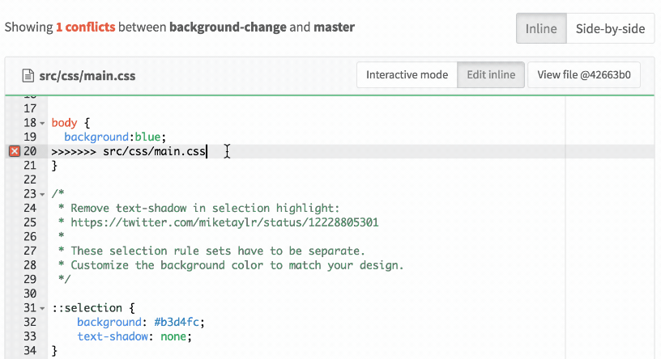

# Merge request conflict resolution **(FREE)**

Merge conflicts occur when two branches have different changes that cannot be
merged automatically.

Git can merge changes between branches in most cases, but
occasionally Git requires your assistance to resolve the
conflicts manually. Typically, this is necessary when people change the same
parts of the same files.

GitLab prevents merge requests from being merged until all conflicts are
resolved. Conflicts can be resolved locally, or in many cases in GitLab
(see [conflicts available for resolution](#conflicts-available-for-resolution)
for information on when this is available).

NOTE:
GitLab resolves conflicts by creating a merge commit in the source branch that
is not automatically merged into the target branch. The merge
commit can be reviewed and tested before the changes are merged. This prevents
unintended changes entering the target branch without review or breaking the
build.

## Resolve conflicts: interactive mode

Clicking **Resolve Conflicts** displays a list of files with conflicts, with conflict sections
highlighted:

After all conflicts have been marked as using 'ours' or 'theirs', the conflict
can be resolved. Resolving conflicts merges the target branch of the merge
request into the source branch, using the options
chosen. If the source branch is `feature` and the target branch is `main`,
this is similar to performing `git checkout feature; git merge main` locally.

## Resolve conflicts: inline editor

Some merge conflicts are more complex, requiring you to manually modify a file to
resolve them. Use the merge conflict resolution editor to resolve complex
conflicts in the GitLab interface. Click **Edit inline** to open the editor.
After you're sure about your changes, click **Commit to source branch**.

## Conflicts available for resolution

GitLab allows resolving conflicts in a file where all of the below are true:

- The file is text, not binary
- The file is in a UTF-8 compatible encoding
- The file does not already contain conflict markers
- The file, with conflict markers added, is not over 200 KB in size
- The file exists under the same path in both branches

If any file in your merge request containing conflicts can't meet all of these
criteria, you can't resolve the merge conflict in the UI.

Additionally, GitLab does not detect conflicts in renames away from a path. For
example, this does not create a conflict:

1. On branch `a`, doing `git mv file1 file2`
1. On branch `b`, doing `git mv file1 file3`.

Instead, both files are present in the branch after the merge request is merged.

<!-- ## Troubleshooting

Include any troubleshooting steps that you can foresee. If you know beforehand what issues
one might have when setting this up, or when something is changed, or on upgrading, it's
important to describe those, too. Think of things that may go wrong and include them here.
This is important to minimize requests for support, and to avoid doc comments with
questions that you know someone might ask.

Each scenario can be a third-level heading, e.g. `### Getting error message X`.
If you have none to add when creating a doc, leave this section in place
but commented out to help encourage others to add to it in the future. -->
