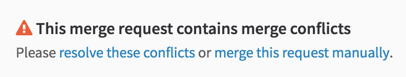
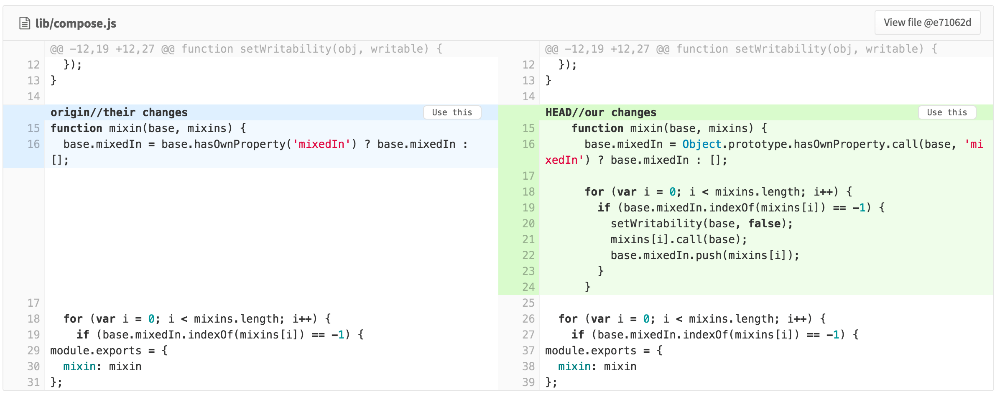

# Merge conflict resolution

> [Introduced][ce-5479] in GitLab 8.11.

When a merge request has conflicts, GitLab may provide the option to resolve
those conflicts in the GitLab UI. (See
[conflicts available for resolution](#conflicts-available-for-resolution) for
more information on when this is available.) If this is an option, you will see
a **resolve these conflicts** link in the merge request widget:

Clicking this will show a list of files with conflicts, with conflict sections
highlighted:

Once all conflicts have been marked as using 'ours' or 'theirs', the conflict
can be resolved. This will perform a merge of the target branch of the merge
request into the source branch, resolving the conflicts using the options
chosen. If the source branch is `feature` and the target branch is `master`,
this is similar to performing `git checkout feature; git merge master` locally.

## Conflicts available for resolution

GitLab allows resolving conflicts in a file where all of the below are true:

- The file is text, not binary
- The file is in a UTF-8 compatible encoding
- The file does not already contain conflict markers
- The file, with conflict markers added, is not over 200 KB in size
- The file exists under the same path in both branches

If any file with conflicts in that merge request does not meet all of these
criteria, the conflicts for that merge request cannot be resolved in the UI.

Additionally, GitLab does not detect conflicts in renames away from a path. For
example, this will not create a conflict: on branch `a`, doing `git mv file1
file2`; on branch `b`, doing `git mv file1 file3`. Instead, both files will be
present in the branch after the merge request is merged.

[ce-5479]: https://gitlab.com/gitlab-org/gitlab-ce/merge_requests/5479
