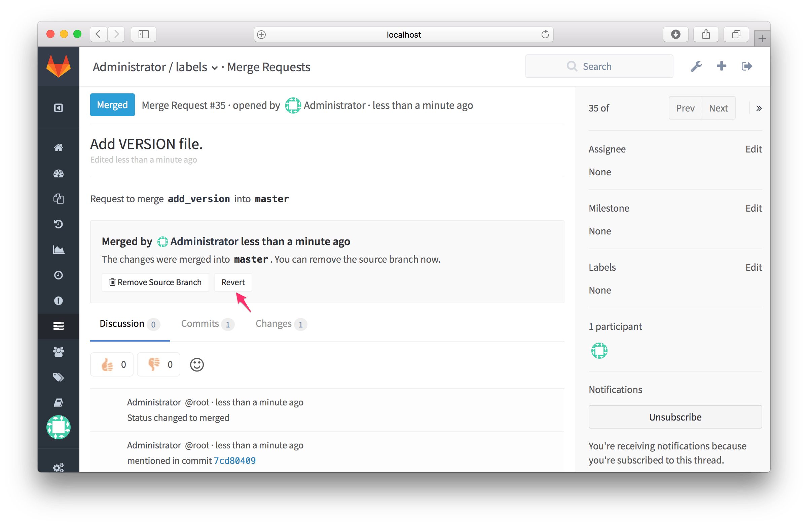
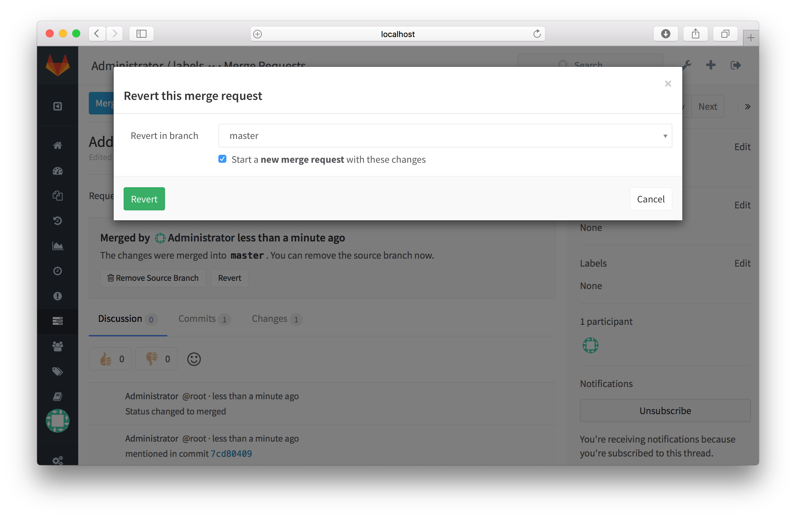
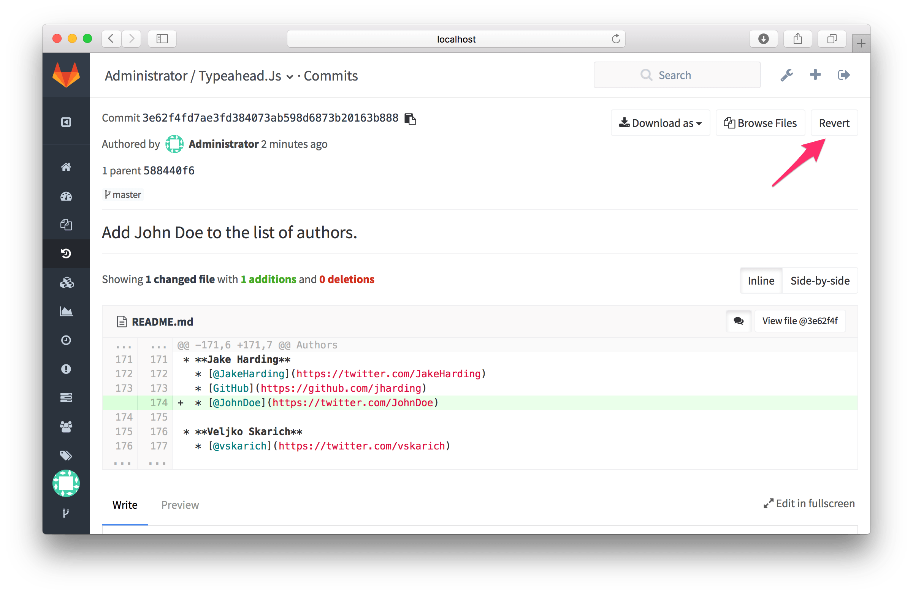

# Reverting changes

> [Introduced][ce-1990] in GitLab 8.5.

---

GitLab implements Git's powerful feature to [revert any commit][git-revert]
with introducing a **Revert** button in Merge Requests and commit details.

## Reverting a Merge Request

_**Note:** The **Revert** button will only be available for Merge Requests
created since GitLab 8.5. However, you can still revert a Merge Request
by reverting the merge commit from the list of Commits page._

After the Merge Request has been merged, a **Revert** button will be available
to revert the changes introduced by that Merge Request:



---

You can revert the changes directly into the selected branch or you can opt to
create a new Merge Request with the revert changes:



---

After the Merge Request has been reverted, the **Revert** button will not be
available anymore.

## Reverting a Commit

You can revert a Commit from the Commit details page:



---

Similar to reverting a Merge Request, you can opt to revert the changes
directly into the target branch or create a new Merge Request to revert the
changes:


---

After the Commit has been reverted, the **Revert** button will not be available
anymore.

Please note that when reverting merge commits, the mainline will always be the
first parent. If you want to use a different mainline then you need to do that
from the command line.

Here is a quick example to revert a merge commit using the second parent as the
mainline:

```bash
git revert -m 2 7a39eb0
```

[ce-1990]: https://gitlab.com/gitlab-org/gitlab-ce/merge_requests/1990 "Revert button Merge Request"
[git-revert]: https://git-scm.com/docs/git-revert "Git revert documentation"
