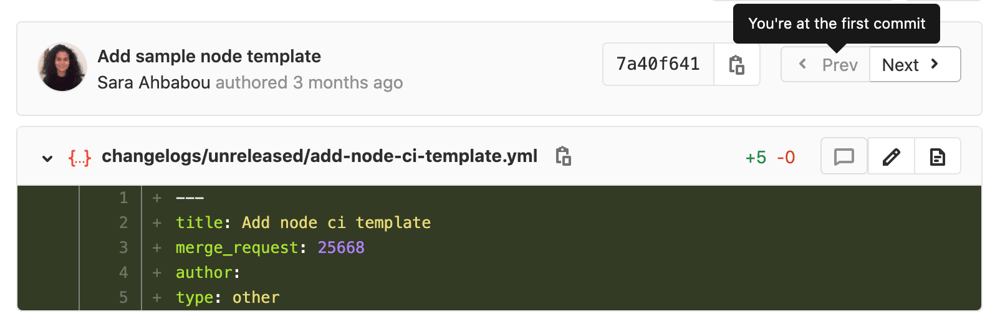
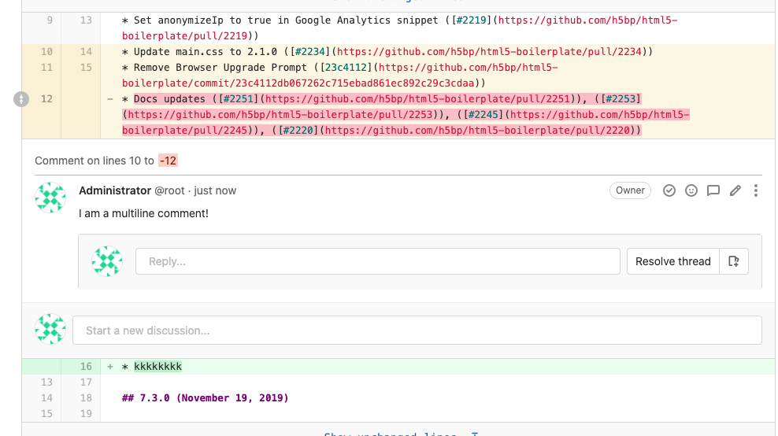

# Reviewing and managing merge requests **(FREE)**

Merge requests are the primary method of making changes to files in a GitLab project.
Changes are proposed by [creating and submitting a merge request](creating_merge_requests.md),
which is then reviewed, and accepted (or rejected).

## View project merge requests

View all the merge requests in a project by navigating to **Project > Merge Requests**.

When you access your project's merge requests, GitLab displays them in a list.
Use the tabs to quickly filter by open and closed. You can also [search and filter the results](../../search/index.md#filtering-issue-and-merge-request-lists).


## View merge requests for all projects in a group

View merge requests in all projects in the group, including all projects of all descendant subgroups of the group. Navigate to **Group > Merge Requests** to view these merge requests. This view also has the open and closed merge requests tabs.

You can [search and filter the results](../../search/index.md#filtering-issue-and-merge-request-lists) from here.


## Cached merge request count

> - [Introduced](https://gitlab.com/gitlab-org/gitlab/-/issues/299542) in GitLab 13.11.
> - It's [deployed behind a feature flag](../../feature_flags.md), enabled by default.
> - It's enabled on GitLab.com.
> - It's recommended for production use.
> - For GitLab self-managed instances, GitLab administrators can opt to [disable it](#enable-or-disable-cached-merge-request-count).

WARNING:
This feature might not be available to you. Check the **version history** note above for details.

In a group, the sidebar displays the total count of open merge requests and this value is cached if higher
than 1000. The cached value is rounded to thousands (or millions) and updated every 24 hours.

### Enable or disable cached merge request count **(FREE SELF)**

Cached merge request count in the left sidebar is under development but ready for production use. It is
deployed behind a feature flag that is **enabled by default**.
[GitLab administrators with access to the GitLab Rails console](../../../administration/feature_flags.md)
can disable it.

To disable it:

```ruby
Feature.disable(:cached_sidebar_merge_requests_count)
```

To enable it:

```ruby
Feature.enable(:cached_sidebar_merge_requests_count)
```

## Semi-linear history merge requests

A merge commit is created for every merge, but the branch is only merged if
a fast-forward merge is possible. This ensures that if the merge request build
succeeded, the target branch build also succeeds after the merge.

Navigate to a project's settings, select the **Merge commit with semi-linear history**
option under **Merge Requests: Merge method** and save your changes.

## View changes between file versions

The **Changes** tab, below the main merge request details and next to the discussion tab,
shows the changes to files between branches or commits. This view of changes to a
file is also known as a **diff**. By default, the diff view compares the file in the
merge request branch and the file in the target branch.

The diff view includes the following:

- The file's name and path.
- The number of lines added and deleted.
- Buttons for the following options:
  - Toggle comments for this file; useful for inline reviews.
  - Edit the file in the merge request's branch.
  - Show full file, in case you want to look at the changes in context with the rest of the file.
  - View file at the current commit.
  - Preview the changes with [Review Apps](../../../ci/review_apps/index.md).
- The changed lines, with the specific changes highlighted.


### Merge request diff file navigation

When reviewing changes in the **Changes** tab the diff can be navigated using
the file tree or file list. As you scroll through large diffs with many
changes, you can quickly jump to any changed file using the file tree or file
list.


### Collapsed files in the Changes view

> [Introduced](https://gitlab.com/gitlab-org/gitlab/-/issues/232820) in GitLab 13.4.

When you review changes in the **Changes** tab, files with a large number of changes are collapsed
to improve performance. When files are collapsed, a warning appears at the top of the changes.
Click **Expand file** on any file to view the changes for that file.

### File-by-file diff navigation

> - [Introduced](https://gitlab.com/gitlab-org/gitlab/-/issues/222790) in GitLab 13.2.
> - [Feature flag removed](https://gitlab.com/gitlab-org/gitlab/-/issues/229848) in GitLab 13.7.

For larger merge requests, consider reviewing one file at a time. To enable this feature:

1. In the top-right corner, select your avatar.
1. Select **Preferences**.
1. Scroll to the **Behavior** section and select **Show one file at a time on merge request's Changes tab**.
1. Select **Save changes**.

After you enable this setting, GitLab displays only one file at a time in the **Changes** tab when you review merge requests. You can click **Prev** and **Next** to view other changed files.


In [GitLab 13.7](https://gitlab.com/gitlab-org/gitlab/-/issues/233898) and later, if you want to change
this behavior, you can do so from your **User preferences** (as explained above) or directly in a
merge request:

1. Go to the merge request's **Changes** tab.
1. Select the cog icon (**{settings}**) to reveal the merge request's settings dropdown.
1. Select or deselect the checkbox **Show one file at a time** to change the setting accordingly.

This change overrides the choice you made in your user preferences and persists until you clear your
browser's cookies or change this behavior again.

### Merge requests commit navigation

> [Introduced](https://gitlab.com/gitlab-org/gitlab/-/issues/18140) in GitLab 13.0.

To seamlessly navigate among commits in a merge request:

1. Select the **Commits** tab.
1. Select a commit to open it in the single-commit view.
1. Navigate through the commits by either:

   - Selecting **Prev** and **Next** buttons on the top-right of the page.
   - Using the <kbd>X</kbd> and <kbd>C</kbd> keyboard shortcuts.



### Incrementally expand merge request diffs

By default, the diff shows only the parts of a file which are changed.
To view more unchanged lines above or below a change click on the
**Expand up** or **Expand down** icons. You can also click on **Show unchanged lines**
to expand the entire file.


In GitLab [versions 13.1 and later](https://gitlab.com/gitlab-org/gitlab/-/issues/205401), when viewing a
merge request's **Changes** tab, if a certain file was only renamed, you can expand it to see the
entire content by clicking **Show file contents**.

### Ignore whitespace changes in Merge Request diff view

If you click the **Hide whitespace changes** button, you can see the diff
without whitespace changes (if there are any). This is also working when on a
specific commit page.


NOTE:
You can append `?w=1` while on the diffs page of a merge request to ignore any
whitespace changes.

## Mark files as viewed

> - [Introduced](https://gitlab.com/gitlab-org/gitlab/-/merge_requests/51513) in GitLab 13.9.
> - It's deployed behind a feature flag, enabled by default.
> - It's enabled on GitLab.com.
> - It's recommended for production use.
> - For GitLab self-managed instances, GitLab administrators can opt to [disable it](#enable-or-disable-file-views). **(FREE SELF)**

When reviewing a merge request with many files multiple times, it may be useful to the reviewer
to focus on new changes and ignore the files that they have already reviewed and don't want to
see anymore unless they are changed again.

To mark a file as viewed:

1. Go to the merge request's **Diffs** tab.
1. On the right-top of the file, locate the **Viewed** checkbox.
1. Check it to mark the file as viewed.

Once checked, the file remains marked for that reviewer unless there are newly introduced
changes to its content or the checkbox is unchecked.

### Enable or disable file views **(FREE SELF)**

The file view feature is under development but ready for production use.
It is deployed behind a feature flag that is **enabled by default**.
[GitLab administrators with access to the GitLab Rails console](../../../administration/feature_flags.md)
can opt to enable it for your instance.

To enable it:

```ruby
Feature.enable(:local_file_reviews)
```

To disable it:

```ruby
Feature.disable(:local_file_reviews)
```

## Perform inline code reviews

> [Introduced](https://gitlab.com/gitlab-org/gitlab-foss/-/issues/13950) in GitLab 11.5.

In a merge request, you can leave comments in any part of the file being changed.
In the Merge Request Diff UI, you can:

- **Comment on a single line**: Click the **{comment}** **comment** icon in the
  gutter to expand the diff lines and display a comment box.
- [**Comment on multiple lines**](#commenting-on-multiple-lines).

### Commenting on multiple lines

> - [Introduced](https://gitlab.com/gitlab-org/ux-research/-/issues/870) in GitLab 13.2.
> - [Added](https://gitlab.com/gitlab-org/gitlab/-/merge_requests/49875) click-and-drag features in GitLab 13.8.
> - [Feature flag removed](https://gitlab.com/gitlab-org/gitlab/-/issues/299121) in GitLab 13.9.

When commenting on a diff, you can select which lines of code your comment refers
to by either:


- Clicking and dragging the **{comment}** **comment** icon in the gutter to highlight
  lines in the diff. GitLab expands the diff lines and displays a comment box.
- After starting a comment by clicking the **{comment}** **comment** icon in the
  gutter, select the first line number your comment refers to in the **Commenting on lines**
  select box. New comments default to single-line comments, unless you select
  a different starting line.

Multiline comments display the comment's line numbers above the body of the comment:



## Pipeline status in merge requests widgets

If you've set up [GitLab CI/CD](../../../ci/README.md) in your project,
you can see:

- Both pre-merge and post-merge pipelines and the environment information if any.
- Which deployments are in progress.

If an application is successfully deployed to an
[environment](../../../ci/environments/index.md), the deployed environment and the link to the
Review App are both shown.

NOTE:
When the pipeline fails in a merge request but it can still be merged,
the **Merge** button is colored red.

### Post-merge pipeline status

When a merge request is merged, you can see the post-merge pipeline status of
the branch the merge request was merged into. For example, when a merge request
is merged into the `master` branch and then triggers a deployment to the staging
environment.

Ongoing deployments are shown, and the state (deploying or deployed)
for environments. If it's the first time the branch is deployed, the link
returns a `404` error until done. During the deployment, the stop button is
disabled. If the pipeline fails to deploy, the deployment information is hidden.


For more information, [read about pipelines](../../../ci/pipelines/index.md).

### Merge when pipeline succeeds (MWPS)

Set a merge request that looks ready to merge to
[merge automatically when CI pipeline succeeds](merge_when_pipeline_succeeds.md).

### Live preview with Review Apps

If you configured [Review Apps](https://about.gitlab.com/stages-devops-lifecycle/review-apps/) for your project,
you can preview the changes submitted to a feature branch through a merge request
on a per-branch basis. You don't need to checkout the branch, install, and preview locally.
All your changes are available to preview by anyone with the Review Apps link.

With GitLab [Route Maps](../../../ci/review_apps/index.md#route-maps) set, the
merge request widget takes you directly to the pages changed, making it easier and
faster to preview proposed modifications.

[Read more about Review Apps](../../../ci/review_apps/index.md).

## Associated features

These features are associated with merge requests:

- [Bulk editing merge requests](../../project/bulk_editing.md):
  Update the attributes of multiple merge requests simultaneously.
- [Cherry-pick changes](cherry_pick_changes.md):
  Cherry-pick any commit in the UI by clicking the **Cherry-pick** button in a merged merge requests or a commit.
- [Fast-forward merge requests](fast_forward_merge.md):
  For a linear Git history and a way to accept merge requests without creating merge commits
- [Find the merge request that introduced a change](versions.md):
  When viewing the commit details page, GitLab links to the merge request(s) containing that commit.
- [Merge requests versions](versions.md):
  Select and compare the different versions of merge request diffs
- [Resolve conflicts](resolve_conflicts.md):
  GitLab can provide the option to resolve certain merge request conflicts in the GitLab UI.
- [Revert changes](revert_changes.md):
  Revert changes from any commit from a merge request.

## Troubleshooting

Sometimes things don't go as expected in a merge request. Here are some
troubleshooting steps.

### Merge request cannot retrieve the pipeline status

This can occur if Sidekiq doesn't pick up the changes fast enough.

#### Sidekiq

Sidekiq didn't process the CI state change fast enough. Please wait a few
seconds and the status should update automatically.

#### Bug

Merge Request pipeline statuses can't be retrieved when the following occurs:

1. A Merge Request is created
1. The Merge Request is closed
1. Changes are made in the project
1. The Merge Request is reopened

To enable the pipeline status to be properly retrieved, close and reopen the
Merge Request again.

## Tips

Here are some tips to help you be more efficient with merge requests in
the command line.

### Copy the branch name for local checkout

> [Introduced](https://gitlab.com/gitlab-org/gitlab/-/issues/23767) in GitLab 13.4.

The merge request sidebar contains the branch reference for the source branch
used to contribute changes for this merge request.

To copy the branch reference into your clipboard, click the **Copy branch name** button
(**{copy-to-clipboard}**) in the right sidebar. Use it to checkout the branch locally
via command line by running `git checkout <branch-name>`.

### Checkout merge requests locally through the `head` ref

A merge request contains all the history from a repository, plus the additional
commits added to the branch associated with the merge request. Here's a few
ways to checkout a merge request locally.

You can checkout a merge request locally even if the source
project is a fork (even a private fork) of the target project.

This relies on the merge request `head` ref (`refs/merge-requests/:iid/head`)
that is available for each merge request. It allows checking out a merge
request via its ID instead of its branch.

[Introduced](https://gitlab.com/gitlab-org/gitlab/-/issues/223156) in GitLab
13.4, 14 days after a merge request gets closed or merged, the merge request
`head` ref is deleted. This means that the merge request is not available
for local checkout via the merge request `head` ref anymore. The merge request
can still be re-opened. If the merge request's branch
exists, you can still check out the branch, as it isn't affected.

#### Checkout locally by adding a Git alias

Add the following alias to your `~/.gitconfig`:

```plaintext
[alias]
    mr = !sh -c 'git fetch $1 merge-requests/$2/head:mr-$1-$2 && git checkout mr-$1-$2' -
```

Now you can check out a particular merge request from any repository and any
remote. For example, to check out the merge request with ID 5 as shown in GitLab
from the `origin` remote, do:

```shell
git mr origin 5
```

This fetches the merge request into a local `mr-origin-5` branch and check
it out.

#### Checkout locally by modifying `.git/config` for a given repository

Locate the section for your GitLab remote in the `.git/config` file. It looks
like this:

```plaintext
[remote "origin"]
  url = https://gitlab.com/gitlab-org/gitlab-foss.git
  fetch = +refs/heads/*:refs/remotes/origin/*
```

You can open the file with:

```shell
git config -e
```

Now add the following line to the above section:

```plaintext
fetch = +refs/merge-requests/*/head:refs/remotes/origin/merge-requests/*
```

In the end, it should look like this:

```plaintext
[remote "origin"]
  url = https://gitlab.com/gitlab-org/gitlab-foss.git
  fetch = +refs/heads/*:refs/remotes/origin/*
  fetch = +refs/merge-requests/*/head:refs/remotes/origin/merge-requests/*
```

Now you can fetch all the merge requests:

```shell
git fetch origin

...
From https://gitlab.com/gitlab-org/gitlab-foss.git
 * [new ref]         refs/merge-requests/1/head -> origin/merge-requests/1
 * [new ref]         refs/merge-requests/2/head -> origin/merge-requests/2
...
```

And to check out a particular merge request:

```shell
git checkout origin/merge-requests/1
```

All the above can be done with the [`git-mr`](https://gitlab.com/glensc/git-mr) script.
