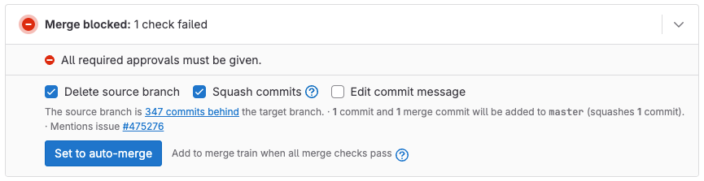
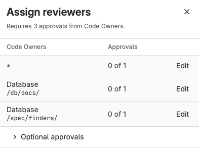
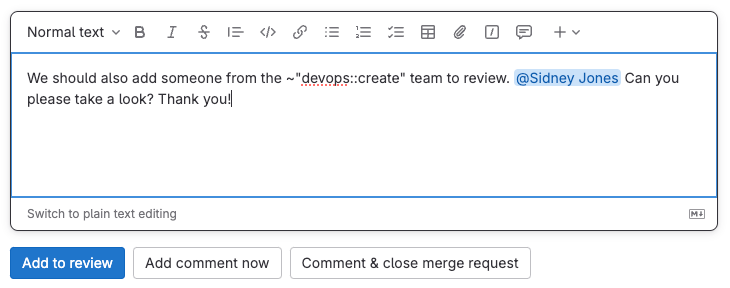
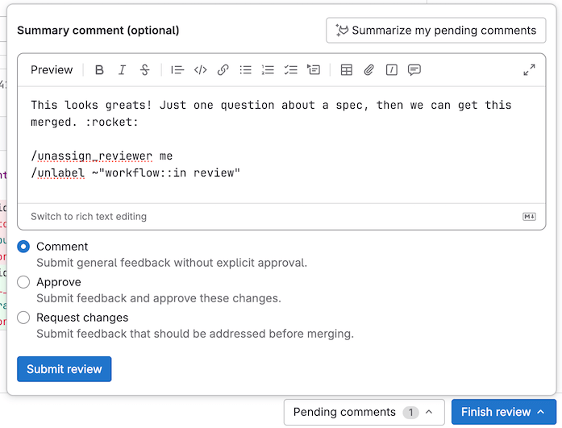
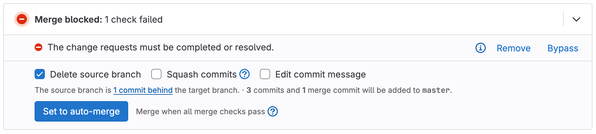
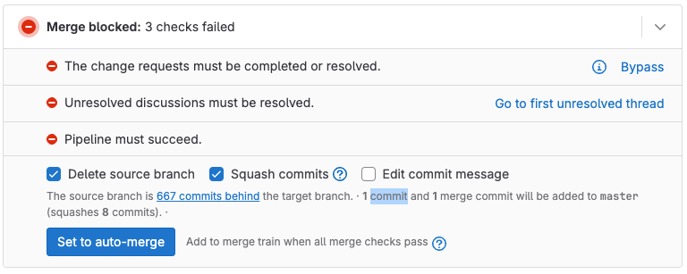
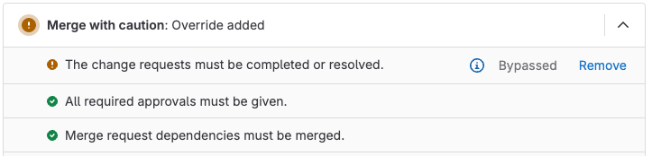

DETAILS:
**Tier:** Free, Premium, Ultimate
**Offering:** GitLab.com, GitLab Self-Managed, GitLab Dedicated

Merge requests are the primary method of making changes to files in a
GitLab project. [Create and submit](../creating_merge_requests.md) a merge request
to propose changes. Your team leaves [comments](../../../discussions/_index.md) on
your merge request, and makes [suggestions](suggestions.md) you can accept
from the user interface. When a teammate reviews your work, they can choose
to accept or reject it.

To review merge requests, you can use:

- The GitLab interface.
- Visual Studio Code, if you have configured the
  [GitLab Workflow extension for VS Code](../../../../editor_extensions/visual_studio_code/_index.md).
- Your terminal window, if you have configured the [GitLab CLI](../../../../editor_extensions/gitlab_cli/_index.md).

<i class="fa fa-youtube-play youtube" aria-hidden="true"></i>
For an overview, see [Merge request review](https://www.youtube.com/watch?v=2MayfXKpU08&list=PLFGfElNsQthYDx0A_FaNNfUm9NHsK6zED&index=183).
<!-- Video published on 2023-04-29 -->

## Finding merge requests to review

Merge requests that you need to review are in the **Review requested** category of the [merge request homepage](../../../../tutorials/merge_requests/homepage.md). To view all merge requests on the homepage, use the <kbd>Shift</kbd> + <kbd>m</kbd>
[keyboard shortcut](../../../shortcuts.md), or:

1. On the left sidebar, select the **Merge requests** icon.

or:

1. On the left sidebar, select **Search or go to**.
1. From the dropdown list, select **Merge requests**.

## View the review status of a merge request

To do this:

1. On the left sidebar, select **Search or go to** and find your project.
1. Select **Code > Merge requests** and find your merge request.
1. Select the title of the merge request to view it.
1. Scroll to the [merge request widget](../widgets.md) to see the mergeability and
   approval status for the merge request. For example, the lack of required approvals blocks this merge request:

   

To see the individual review status for each reviewer, check the right sidebar
of a merge request. Each **Reviewer** shows the status to the right of the user's name:

- **{dash-circle}** Awaiting review from this user.
- **{status_running}** The user's review is in progress.
- **{check-circle}** Approved by this user.
- **{comment-lines}** User has requested changes, and [blocked this merge request](#prevent-merge-when-you-request-changes).
  (If needed, you can [bypass this block](#prevent-merge-when-you-request-changes).)

## Request a review

> - Enhanced reviewer drawer [introduced](https://gitlab.com/groups/gitlab-org/-/epics/12878) in GitLab 17.5 [with a flag](../../../../administration/feature_flags.md) named `reviewer_assign_drawer`.
> - [Enabled](https://gitlab.com/gitlab-org/gitlab/-/issues/467205) on GitLab.com and GitLab Self-Managed in GitLab 17.5.
> - [Feature flag](https://gitlab.com/gitlab-org/gitlab/-/issues/467205) `reviewer_assign_drawer` removed in GitLab 17.8.

When you've finished preparing your changes, it's time to request a review. To assign a reviewer to your merge request,
either use the `/assign_reviewer @user`
[quick action](../../quick_actions.md#issues-merge-requests-and-epics) in any text field, or:

1. On the left sidebar, select **Search or go to** and find your project.
1. Select **Code > Merge requests** and find your merge request.
1. Select the title of the merge request to view it.
1. On the right sidebar, in the **Reviewers** section:
   - To find a specific reviewer by name, select **Edit**.
   - In GitLab Premium and Ultimate, to find a reviewer
     [who fulfills approval rules](#find-reviewers-who-fulfill-approval-rules), select **Assign** to
     open the reviewer drawer.

GitLab adds the merge request to the user's review requests.

### Find reviewers who fulfill approval rules

DETAILS:
**Tier:** Premium, Ultimate
**Offering:** GitLab.com, GitLab Self-Managed, GitLab Dedicated

GitLab Premium and Ultimate help you more quickly find the best reviewers for your merge request.
Use the **Assign reviewers** drawer to filter lists of reviewers. See the Code Owners for the files
changed in your merge request, and the users who satisfy your project's approval rules.

In this example, the merge request requires 3 Code Owner approvals, but has none so far:



1. To see optional approval rules or Code Owners, select **Optional approval rules** (**{chevron-lg-up}**) to show them.
1. Next to the reviewer type you need, select **Edit**:
   - **Code Owners** shows only the Code Owners for that file type.
   - **Approval rules** shows only users who fulfill that approval rule.
1. Select your desired reviewers. (GitLab Premium and Ultimate enable you to select multiple reviewers.)
1. Repeat for each required **Code Owner** and **Approval rule** item.
1. When you've selected your reviewers, on the top right, select **Close** (**{close}**) to hide the drawer.

### Re-request a review

After a reviewer completes their [merge request reviews](../../../discussions/_index.md),
the author of the merge request can request a new review from the reviewer.
To do this, either use the `/request_review @user` quick action in any text field on the merge request, or:

1. On the left sidebar, select **Search or go to** and find your project.
1. Select **Code > Merge requests** and find your merge request.
1. Select the title of the merge request to view it.
1. If you have collapsed the right sidebar in the merge request, select the
   **{chevron-double-lg-left}** **Expand Sidebar** to expand it.
1. In the **Reviewers** section, select the **Re-request a review** icon (**{redo}**)
   next to the reviewer's name.

GitLab creates a new [to-do item](../../../todos.md) for the reviewer, and sends
them a notification email.

## Start a review

If a user has asked you to review a merge request:

1. Either:
   - Press <kbd>Shift</kbd> + <kbd>r</kbd> to go to your **Review requests** page.
   - On the left sidebar, select **Merge requests** (**{merge-request}**) **> Review requests**.

1. Find your merge request, and select the title of the merge request to view it.
1. Read the merge request description and comments to learn about the merge request.
1. Select **Changes** to view the diff of the proposed changes. To learn more about
   the **Changes** page, see [Changes in merge requests](../changes.md).
1. [Suggest multi-line or single-line changes](suggestions.md) as needed. If you select **Start a review**
   instead of **Add comment now**, your review comments remain unpublished until
   your review is complete.

1. To add more comments after you've selected **Start a review**, add them to your review from:
   - The **Changes** tab, containing the diff view.
   - The **Overview** tab, and selecting **Add to review**:

   
1. Select [**Submit your review**](#submit-a-review) to publish all review comments
   added with either **Start a review** or **Add to review**. Until you
   [submit your review](#submit-a-review), these comments remain unpublished.

### Resolve or unresolve thread with a comment

Review comments can also resolve or unresolve [resolvable threads](../_index.md#resolve-a-thread).
To resolve or unresolve a thread when replying to a comment:

1. In the comment text area, write your comment.
1. Select or clear **Resolve thread**.
1. Select **Add comment now** or **Add to review**.

Pending comments display information about delayed actions. GitLab does not perform these actions until you publish the comment:

- **{check-circle-filled}** Thread is resolved.
- **{check-circle}** Thread stays unresolved.

## Submit a review

To submit your completed review, you can:

- Use the `/submit_review` [quick action](../../quick_actions.md) in the text of a non-review comment.
- Select **Finish review**, then select **Submit review** at the bottom of the dialog.
  In the dialog, you can supply a **Summary comment**, approve (or reject) the merge request, and
  include quick actions:

  

When you submit your review, GitLab:

- Publishes the comments in your review.
- Sends a single email to every notifiable user of the merge request, with your
  review comments attached. Replying to this email creates a new comment on the merge request.
- Perform any quick actions you added to your review comments.
- Optional. Shows whether you have also approved or requested changes:
  - **Comment**: Leave general feedback without explicit approval.
  - **Approve**: Leave feedback and approve the changes.
  - **Request changes**: Block the merge request from merging until the author
    addresses your feedback.

### Prevent merge when you request changes

DETAILS:
**Tier:** Premium, Ultimate
**Offering:** GitLab.com, GitLab Self-Managed, GitLab Dedicated

> - [Introduced](https://gitlab.com/gitlab-org/gitlab/-/issues/430728) in GitLab 16.11 [with a flag](../../../../administration/feature_flags.md) named `mr_reviewer_requests_changes`. Disabled by default.
> - Enabled by default [on GitLab.com](https://gitlab.com/gitlab-org/gitlab/-/issues/451211) and [GitLab Self-Managed](https://gitlab.com/gitlab-org/gitlab/-/merge_requests/158226) in GitLab 17.2.
> - [Feature flag removed](https://gitlab.com/gitlab-org/gitlab/-/issues/451211) in GitLab 17.3.

A reviewer [requesting changes](#submit-a-review) blocks a merge request from merging.
When this happens, the merge request reports area shows the message
**The change requests must be completed or resolved.** To unblock the merge request,
the reviewer who requested changes should [re-review and approve](#re-request-a-review) the merge request.

### Remove a change request

> - [Introduced](https://gitlab.com/gitlab-org/gitlab/-/issues/480412) in GitLab 17.8.

If you previously requested changes, you can remove your change request. You might need to do this
if both of the following are true:

- You can no longer approve the merge request.
- You want to cancel your change request, but don't want to submit a new review.

To remove your change request without submitting a new review:

1. On the left sidebar, select **Search or go to** and find your project.
1. Select **Code > Merge requests** and find your merge request.
1. Select the title of the merge request to view it.
1. On the merge request **Overview**, scroll to the merge request reports area.
1. Next to **The change requests must be completed or resolved**, select **Remove**:

   

### Bypass a request for changes

If the user who requested changes is unavailable to re-review or approve,
another user with permission to merge the merge request can override this check:

1. On the left sidebar, select **Search or go to** and find your project.
1. Select **Code > Merge requests** and find your merge request.
1. Select the title of the merge request to view it.
1. On the merge request **Overview**, scroll to the merge request reports area.
1. Next to **The change requests must be completed or resolved**, select **Bypass**:

   

1. The merge reports area shows `Merge with caution: Override added`. To see which check a user
   bypassed, select **Expand merge checks** (**{chevron-lg-down}**) and find the
   check that contains a warning (**{status_warning}**) icon. In this example, the
   author bypassed **The change requests must be completed or resolved**:

   

## Download merge request changes

### As a diff

To download the changes included in a merge request as a diff:

1. On the left sidebar, select **Search or go to** and find your project.
1. Select **Code > Merge requests**.
1. Select your merge request.
1. In the upper-right corner, select **Code > Plain diff**.

If you know the URL of the merge request, you can also download the diff from
the command line by appending `.diff` to the URL. This example downloads the diff
for merge request `000000`:

```plaintext
https://gitlab.com/gitlab-org/gitlab/-/merge_requests/000000.diff
```

To download and apply the diff in a one-line CLI command:

```shell
curl "https://gitlab.com/gitlab-org/gitlab/-/merge_requests/000000.diff" | git apply
```

### As a patch file

To download the changes included in a merge request as a patch file:

1. On the left sidebar, select **Search or go to** and find your project.
1. Select **Code > Merge requests**.
1. Select your merge request.
1. In the upper-right corner, select **Code > Patches**.

If you know the URL of the merge request, you can also download the patch from
the command line by appending `.patch` to the URL. This example downloads the patch
file for merge request `000000`:

```plaintext
https://gitlab.com/gitlab-org/gitlab/-/merge_requests/000000.patch
```

To download and apply the patch in a one-line CLI command using [`git am`](https://git-scm.com/docs/git-am):

```shell
curl "https://gitlab.com/gitlab-org/gitlab/-/merge_requests/000000.patch" | git am
```

## Associated features

Merge requests are related to these features:

- [Cherry-pick changes](../cherry_pick_changes.md):
  In the GitLab UI, select **Cherry-pick** in a merged merge request or a commit to cherry-pick it.
- [Fast-forward merge requests](../methods/_index.md#fast-forward-merge):
  For a linear Git history and a way to accept merge requests without creating merge commits
- [Find the merge request that introduced a change](../versions.md):
  When viewing the commit details page, GitLab links to the merge requests containing that commit.
- [Merge requests versions](../versions.md):
  Select and compare the different versions of merge request diffs
- [Resolve conflicts](../conflicts.md):
  GitLab can provide the option to resolve certain merge request conflicts in the GitLab UI.
- [Revert changes](../revert_changes.md):
  Revert changes from any commit from a merge request.
- [Keyboard shortcuts](../../../shortcuts.md#merge-requests):
  Access and change specific parts of a merge request with keyboard commands.

## Related topics

- [Merge methods](../methods/_index.md)
- [Draft Notes API](../../../../api/draft_notes.md)
