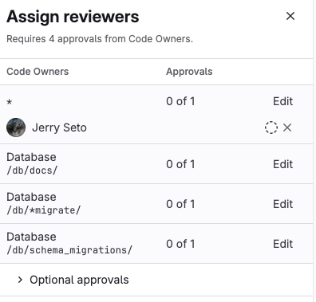
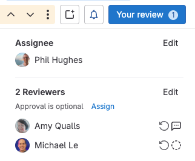
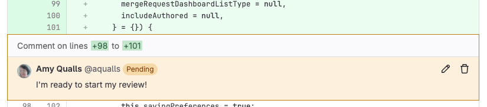
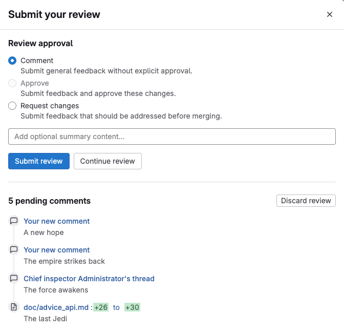



- Tier: Free, Premium, Ultimate
- Offering: GitLab.com, GitLab Self-Managed, GitLab Dedicated



The merge request review process ensures that subject matter experts review your proposed changes
before they are merged. Reviewers add review comments to merge requests, and [suggest changes](suggestions.md)
the author can apply directly from the GitLab UI.

Reviewers can use any of these tools to review a merge request:

- The GitLab interface.
- Visual Studio Code, with the
  [GitLab Workflow extension for VS Code](../../../../editor_extensions/visual_studio_code/_index.md).
- A terminal window, with the [GitLab CLI](../../../../editor_extensions/gitlab_cli/_index.md).

Approvals are one of several merge checks that ensure your merge request merges only when it's truly
ready. Depending on your project configuration, reviewers can also block a merge request
from merging by setting **Request changes**.

GitLab Premium and Ultimate provide an **Assign reviewers** drawer with more information to help you
find reviewers [who fulfill approval rules](#find-reviewers-who-fulfill-approval-rules):

By following the [defined review flow](#start-a-review), each reviewer decides whether to accept or reject a merge request.
The right sidebar shows the list of reviewers, and (if they follow the review flow) their review status:

-  Review not yet started.
-  Review is in progress.
-  Reviewed and approved.
-  Reviewed, requested changes, and
  [blocked this merge request](#prevent-merge-when-you-request-changes) until changes are made.
  This block [can be bypassed](#prevent-merge-when-you-request-changes).

<i class="fa fa-youtube-play youtube" aria-hidden="true"></i>
For an overview, see [Merge request review](https://www.youtube.com/watch?v=2MayfXKpU08&list=PLFGfElNsQthYDx0A_FaNNfUm9NHsK6zED&index=183).
<!-- Video published on 2023-04-29 -->

## Find merge requests to review

Your [merge request homepage](../homepage.md) shows your merge requests in progress, and merge requests
awaiting review from you. The merge requests you need to review are in the **Review requested** category.
To see all merge requests that need your attention, use one of these methods:

- Press the <kbd>Shift</kbd>+<kbd>m</kbd> [keyboard shortcut](../../../shortcuts.md).
- On the left sidebar, select **Merge requests** ().
- On the left sidebar, select **Search or go to** then, from the dropdown list, select **Merge requests I'm working on**.

## View the review status of a merge request

To do this:

1. On the left sidebar, select **Search or go to** and find your project.
1. Select **Code** > **Merge requests** and find your merge request.
1. Select the title of the merge request to view it.
1. Scroll to the [merge request widget](../widgets.md) to see the mergeability and
   approval status for the merge request. For example, the lack of required approvals blocks this merge request:

   

## Request a review



- **Assign reviewers** drawer [introduced](https://gitlab.com/groups/gitlab-org/-/epics/12878) in GitLab 17.5 [with a flag](../../../../administration/feature_flags/_index.md) named `reviewer_assign_drawer`.
- Drawer [enabled](https://gitlab.com/gitlab-org/gitlab/-/issues/467205) on GitLab.com and GitLab Self-Managed in GitLab 17.5.
- [Feature flag](https://gitlab.com/gitlab-org/gitlab/-/issues/467205) `reviewer_assign_drawer` removed in GitLab 17.8.



When you've finished preparing your changes, it's time to request a review. To assign a reviewer to
your merge request, either use the `/assign_reviewer @user`
[quick action](../../quick_actions.md#issues-merge-requests-and-epics) in any text field, or:

1. On the left sidebar, select **Search or go to** and find your project.
1. Select **Code** > **Merge requests** and find your merge request.
1. Select the title of the merge request to view it.
1. To find a reviewer by name: on the right sidebar, in the **Reviewers** section, select **Edit**.
1. To find a reviewer who fulfills an approval rule in GitLab Premium and Ultimate:
   1. On the right sidebar, in the **Reviewers** section, select **Assign** to open the **Assign reviewers** drawer.
   1. For each approval rule, select **Edit** to find a reviewer who fulfills that approval rule.

GitLab adds the merge request to the user's review requests.

### Find reviewers who fulfill approval rules



- Tier: Premium, Ultimate
- Offering: GitLab.com, GitLab Self-Managed, GitLab Dedicated



GitLab Premium and Ultimate help you more quickly find the best reviewers for your merge request.
Use the **Assign reviewers** drawer to filter lists of reviewers. See the Code Owners for the files
changed in your merge request, and the users who satisfy your project's approval rules.

In this example, the merge request requires 3 Code Owner approvals, but has none so far:

To assign eligible approvers in a merge request:

1. In the **Reviewers** section, select **Assign**.
1. To see optional approval rules or Code Owners, select **Optional approval rules** () to show them.
1. Next to the reviewer type you need, select **Edit**:
   - **Code Owners** shows only the Code Owners for that file type.
   - **Approval rules** shows only users who fulfill that approval rule.
1. Select your desired reviewer. (GitLab Premium and Ultimate enable you to select more than one reviewer.)
1. Repeat for each required **Code Owner** and **Approval rule** item.
1. When you've selected your reviewers, in the upper right, select **Close** ()
   to hide the **Assign reviewers** drawer.

### Re-request a review

After a reviewer completes their [merge request reviews](../../../discussions/_index.md),
the author of the merge request can request a new review from the reviewer.
To do this, either use the `/request_review @user` quick action in any text field on the merge request, or:

1. On the left sidebar, select **Search or go to** and find your project.
1. Select **Code** > **Merge requests** and find your merge request.
1. Select the title of the merge request to view it.
1. If you have collapsed the right sidebar in the merge request, select the
    **Expand Sidebar** to expand it.
1. In the **Reviewers** section, select the **Re-request a review** icon ()
   next to the reviewer's name.

GitLab creates a new [to-do item](../../../todos.md) for the reviewer, and sends
them a notification email.

## Start a review



- **Assign reviewers** drawer [introduced](https://gitlab.com/gitlab-org/gitlab/-/merge_requests/185795) in GitLab 17.11 [with a flag](../../../../administration/feature_flags/_index.md) named `improved_review_experience`. Disabled by default.
- **Assign reviewers** drawer [enabled by default](https://gitlab.com/gitlab-org/gitlab/-/issues/535461) in GitLab 18.1.



When reviewing a merge request, follow the review process instead of leaving individual
comments. When you select **Start a review**, the **Reviewers** section of the right sidebar updates
your status from **Awaiting review** () to
**Reviewer started review** ()

To start your review of a merge request:

1. Either:
   - Press <kbd>Shift</kbd>+<kbd>r</kbd> to go to your **Review requests** page.
   - On the left sidebar, select **Merge requests** () > **Review requests**.
<!-- When the feature flag paneled_view is removed, refer only to the button icon -->

1. Find your merge request, and select the title of the merge request to view it.
1. Read the merge request description and comments to learn about the merge request.
1. Select **Changes** to view the diff of the proposed changes. To learn more about
   the **Changes** page, see [Changes in merge requests](../changes.md).
1. [Suggest multi-line or single-line changes](suggestions.md) as needed. When ready to save your
   first review comment, select **Start a review** to:

   - Update your status in the right sidebar to **Reviewer started review** ().
   - Save your review comment, but leave it unpublished, like this:

     

   If you select **Add comment now** instead of **Start a review**, GitLab publishes your comment immediately.

1. Continue writing review comments on the **Changes** tab or the **Overview** tab.
   Selecting **Add to review** keeps them unpublished until you submit your review:

   

Next, submit your review.

### Resolve or reopen thread with a comment

Review comments can also resolve or reopen comment threads.
To resolve or reopen a thread when replying to a comment:

1. In the comment text area, write your comment.
1. Select or clear **Resolve thread** or **Reopen thread**.
1. Select **Add comment now** or **Add to review**.

Pending comments display information about delayed actions. GitLab does not perform these actions
until you publish the comment:

-  Resolves thread.
-  Thread stays open.

## Submit a review

When you submit a review, GitLab does the following:

- Publishes the comments in your review.
- Sends a single email to every notifiable user of the merge request, with your
  review comments attached. Replying to this email creates a new comment on the merge request.
- Performs any quick actions you added to your review comments.
- Shows the outcome of your review.

1. In the upper right, select **Your review** to show details about your review:

   

1. Review your pending comments. Edit them as needed.
1. Select the outcome of your review.

   - **Approve**: Leave feedback and approve the changes.
   - **Comment**: Leave general feedback without an explicit approval or change request.
   - **Request changes**: Block the merge request from merging until the author
     addresses your feedback.

1. Optional. Write a summary of your review. GitLab Premium and Ultimate users can select
   **Add summary** () to create a summary for you. Include any
   quick actions you want performed.

You can also use the `/submit_review` [quick action](../../quick_actions.md) in the text of a non-review comment.

### Discard your pending review

When you discard a review, your unpublished comments are deleted and you cannot restore them.
To do this:

1. In the upper right, select **Your review** to show details about your review:

   

1. Select **Discard review**.

### Prevent merge when you request changes



- Tier: Premium, Ultimate
- Offering: GitLab.com, GitLab Self-Managed, GitLab Dedicated





- [Introduced](https://gitlab.com/gitlab-org/gitlab/-/issues/430728) in GitLab 16.11 [with a flag](../../../../administration/feature_flags/_index.md) named `mr_reviewer_requests_changes`. Disabled by default.
- Enabled by default [on GitLab.com](https://gitlab.com/gitlab-org/gitlab/-/issues/451211) and [GitLab Self-Managed](https://gitlab.com/gitlab-org/gitlab/-/merge_requests/158226) in GitLab 17.2.
- [Feature flag removed](https://gitlab.com/gitlab-org/gitlab/-/issues/451211) in GitLab 17.3.



A reviewer [requesting changes](#submit-a-review) blocks a merge request from merging.
When this happens, the merge request reports area shows the message
**Change requests must be approved by the requesting user**. To unblock the merge request,
the reviewer who requested changes should [re-review and approve](#re-request-a-review) the merge request.

### Remove a change request



- [Introduced](https://gitlab.com/gitlab-org/gitlab/-/issues/480412) in GitLab 17.8.



If you previously requested changes, you can remove your change request. You might need to do this
if both of the following are true:

- You can no longer approve the merge request.
- You want to cancel your change request, but don't want to submit a new review.

To remove your change request without submitting a new review:

1. On the left sidebar, select **Search or go to** and find your project.
1. Select **Code** > **Merge requests** and find your merge request.
1. Select the title of the merge request to view it.
1. On the merge request **Overview**, scroll to the merge request reports area.
1. Next to **Change requests must be approved by the requesting user**, select **Remove**:

   

### Bypass a request for changes

If the user who requested changes is unavailable to re-review or approve,
another user with permission to merge the merge request can override this check:

1. On the left sidebar, select **Search or go to** and find your project.
1. Select **Code** > **Merge requests** and find your merge request.
1. Select the title of the merge request to view it.
1. On the merge request **Overview**, scroll to the merge request reports area.
1. Next to **Change requests must be approved by the requesting user**, select **Bypass**:

   

1. The merge reports area shows `Merge with caution: Override added`. To see which check a user
   bypassed, select **Expand merge checks** () and find the
   check that contains a warning () icon. In this example, the
   author bypassed **Change requests must be approved by the requesting user**:

   

## Download merge request changes

You can download the changes from a merge request as a diff or patch file.
For more information and examples, see
[Download merge request changes](../changes.md#download-merge-request-changes).

## Associated features

Merge requests are related to these features:

- [Cherry-pick changes](../cherry_pick_changes.md):
  In the GitLab UI, select **Cherry-pick** in a merged merge request or a commit to cherry-pick it.
- [Compare changes](../changes.md):
  View and download the diff of changes included in a merge request.
- [Fast-forward merge requests](../methods/_index.md#fast-forward-merge):
  For a linear Git history and a way to accept merge requests without creating merge commits
- [Find the merge request that introduced a change](../versions.md):
  When viewing the commit details page, GitLab links to the merge requests containing that commit.
- [Merge requests versions](../versions.md):
  Select and compare the different versions of merge request diffs
- [Resolve conflicts](../conflicts.md):
  GitLab can provide the option to resolve certain merge request conflicts in the GitLab UI.
- [Revert changes](../revert_changes.md):
  Revert changes from any commit from a merge request.
- [Keyboard shortcuts](../../../shortcuts.md#merge-requests):
  Access and change specific parts of a merge request with keyboard commands.
- [Value stream analytics](../../../group/value_stream_analytics/_index.md): Track key merge request steps (such as `reviewed` and `approved`) to identify where your team spends the most time in the software development lifecycle. This information helps uncover actionable insights to optimize merge request workflows for groups and projects, and improve developer productivity. Read more about [How we reduced MR review time with value stream analytics](https://about.gitlab.com/blog/2025/02/20/how-we-reduced-mr-review-time-with-value-stream-management/).

## Related topics

- [Compare changes in merge requests](../changes.md)
- [Compare revisions](../../repository/compare_revisions.md)
- [Merge methods](../methods/_index.md)
- [Draft Notes API](../../../../api/draft_notes.md)
