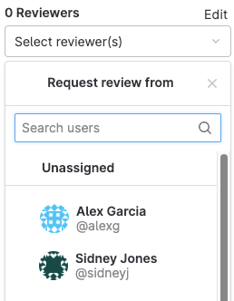
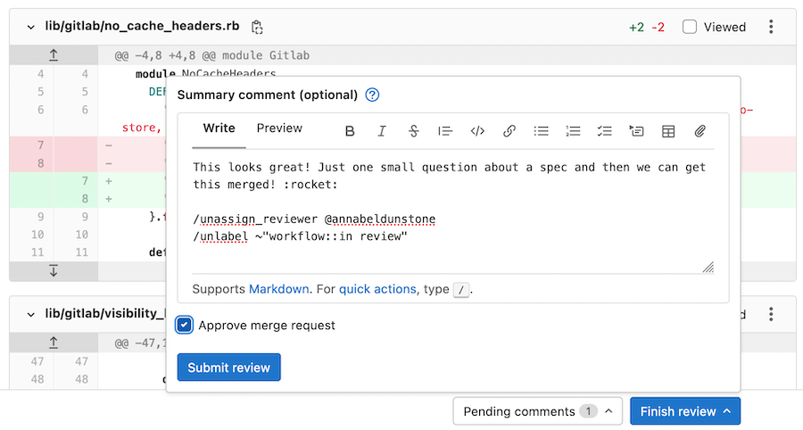
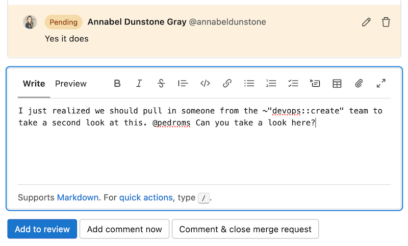
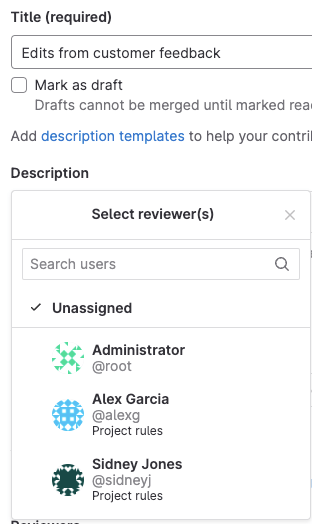
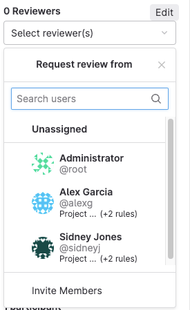

# Merge request reviews **(FREE)**

> - [Introduced](https://gitlab.com/gitlab-org/gitlab/-/issues/216054) in GitLab 13.5.
> - [Feature flag removed](https://gitlab.com/gitlab-org/gitlab/-/issues/245190) in GitLab 13.9.

[Merge requests](../index.md) are the primary method of making changes to files in a
GitLab project. [Create and submit a merge request](../creating_merge_requests.md)
to propose changes. Your team leaves [comments](../../../discussions/index.md) on
your merge request, and makes [code suggestions](suggestions.md) you can accept
from the user interface. When your work is reviewed, your team members can choose
to accept or reject it.

You can review merge requests from the GitLab interface. If you install the
[GitLab Workflow VS Code extension](../../repository/vscode.md), you can also
review merge requests in Visual Studio Code.

## Suggested reviewers **(ULTIMATE SAAS)**

> - [Introduced](https://gitlab.com/groups/gitlab-org/modelops/applied-ml/review-recommender/-/epics/3) in GitLab 15.4 as a [Beta](../../../../policy/alpha-beta-support.md#beta) feature [with a flag](../../../../administration/feature_flags.md) named `suggested_reviewers_control`. Disabled by default.
> - [Enabled on GitLab.com](https://gitlab.com/gitlab-org/gitlab/-/issues/368356) in GitLab 15.6.
> - Beta designation [removed from the UI](https://gitlab.com/gitlab-org/gitlab/-/merge_requests/113058) in GitLab 15.10.

GitLab can suggest reviewers. Using the changes in a merge request and a project's contribution graph, machine learning suggestions appear in the reviewer section of the right sidebar.



For more information, see [Data usage in Suggested Reviewers](data_usage.md).

### Enable suggested reviewers

Project Maintainers or Owners can enable suggested reviewers by visiting
the [project settings](../../settings/index.md).

Enabling suggested reviewers triggers GitLab to create an ML model for your
project that is used to generate reviewers. The larger your project, the longer
this process can take. Usually, the model is ready to generate suggestions
within a few hours.

No action is required after the feature is enabled. After the model is ready,
recommendations populate the **Reviewer** dropdown list in the right-hand sidebar
of a merge request with new commits.

## Review a merge request

> - [Introduced](https://gitlab.com/gitlab-org/gitlab/-/merge_requests/4213) in GitLab 11.4.
> - [Moved](https://gitlab.com/gitlab-org/gitlab/-/issues/28154) from GitLab Premium to GitLab Free in 13.1.

When you review a merge request, you can create comments that are visible only
to you. When you're ready, you can publish them together in a single action.
To start your review:

1. Go to the merge request you want to review, and select the **Changes** tab.
   For more information about navigating the diffs displayed in this tab, see
   [Changes in merge requests](../changes.md).
1. Select the **{comment}** **comment** icon in the gutter to expand the diff lines
   and display a comment box. In GitLab version 13.2 and later, you can
   [select multiple lines](#comment-on-multiple-lines).
1. In the text area, write your first comment, then select **Start a review** below your comment.
1. Continue adding comments to lines of code. After each comment, select **Add to review**.
   Comments made as part of a review are visible only to you until you submit your review.
1. Optional. You can use [quick actions](../../quick_actions.md) inside review comments.
   The comment shows the actions to perform after publication, but does not perform them
   until you submit your review.
1. When your review is complete, you can [submit the review](#submit-a-review). Your comments
   are now visible, and any [quick actions](../../quick_actions.md) included in
   your comments are performed.

[In GitLab 13.10 and later](https://gitlab.com/gitlab-org/gitlab/-/issues/292936),
if you [approve a merge request](../approvals/index.md#approve-a-merge-request) and
are shown in the reviewer list, a green check mark **{check-circle-filled}**
displays next to your name.

### Download merge request changes as a diff

To download the changes included in a merge request as a diff:

1. On the top bar, select **Main menu > Projects** and find your project.
1. On the left sidebar, select **Merge requests**.
1. Select your merge request.
1. In the upper-right corner, select **Code > Plain diff**.

If you know the URL of the merge request, you can also download the diff from
the command line by appending `.diff` to the URL. This example downloads the diff
for merge request `000000`:

```plaintext
https://gitlab.com/gitlab-org/gitlab/-/merge_requests/000000.diff
```

To download and apply the diff in a one-line CLI command:

```shell
curl "https://gitlab.com/gitlab-org/gitlab/-/merge_requests/000000.diff" | git apply
```

### Download merge request changes as a patch file

To download the changes included in a merge request as a patch file:

1. On the top bar, select **Main menu > Projects** and find your project.
1. On the left sidebar, select **Merge requests**.
1. Select your merge request.
1. In the upper-right corner, select **Code > Patches**.

If you know the URL of the merge request, you can also download the patch from
the command line by appending `.patch` to the URL. This example downloads the patch
file for merge request `000000`:

```plaintext
https://gitlab.com/gitlab-org/gitlab/-/merge_requests/000000.patch
```

To download and apply the patch in a one-line CLI command using [`git am`](https://git-scm.com/docs/git-am):

```shell
curl "https://gitlab.com/gitlab-org/gitlab/-/merge_requests/000000.patch" | git am
```

### Submit a review

You can submit your completed review in multiple ways:

- Use the `/submit_review` [quick action](../../quick_actions.md) in the text of a non-review comment.
- Select **Finish review**, then select **Submit review** at the bottom of the modal window.
  In the modal window, you can supply a **Summary comment**, approve the merge request, and
  include quick actions:

  

When you submit your review, GitLab:

- Publishes the comments in your review.
- Sends a single email to every notifiable user of the merge request, with your
  review comments attached. Replying to this email creates a new comment on the merge request.
- Perform any quick actions you added to your review comments.
- Optional. Approves the merge request.

### Resolve or unresolve thread with a comment

Review comments can also resolve or unresolve [resolvable threads](../../../discussions/index.md#resolve-a-thread).
To resolve or unresolve a thread when replying to a comment:

1. In the comment text area, write your comment.
1. Select or clear **Resolve thread**.
1. Select **Add comment now** or **Add to review**.

Pending comments display information about the action to be taken when the comment is published:

- **{check-circle-filled}** Thread is resolved.
- **{check-circle}** Thread stays unresolved.

### Add a new comment

> [Introduced](https://gitlab.com/gitlab-org/gitlab/-/issues/8225) in GitLab 13.10.

If you have a review in progress, you can also add a comment from the **Overview** tab by selecting
 **Add to review**:



### Approval Rule information for Reviewers **(PREMIUM)**

> - [Introduced](https://gitlab.com/gitlab-org/gitlab/-/issues/233736) in GitLab 13.8.
> - [Feature flag `reviewer_approval_rules` removed](https://gitlab.com/gitlab-org/gitlab/-/issues/293742) in GitLab 13.9.

When editing the **Reviewers** field in a new or existing merge request, GitLab
displays the name of the matching [approval rule](../approvals/rules.md)
below the name of each suggested reviewer. [Code Owners](../../codeowners/index.md) are displayed as `Codeowner` without group detail.

This example shows reviewers and approval rules when creating a new merge request:



This example shows reviewers and approval rules in a merge request sidebar:



### Request a new review

> [Introduced](https://gitlab.com/gitlab-org/gitlab/-/issues/293933) in GitLab 13.9.

After a reviewer completes their [merge request reviews](../../../discussions/index.md),
the author of the merge request can request a new review from the reviewer:

1. If the right sidebar in the merge request is collapsed, select the
   **{chevron-double-lg-left}** **Expand Sidebar** icon to expand it.
1. In the **Reviewers** section, select the **Re-request a review** icon (**{redo}**)
   next to the reviewer's name.

GitLab creates a new [to-do item](../../../todos.md) for the reviewer, and sends
them a notification email.

## Comment on multiple lines

> - [Introduced](https://gitlab.com/gitlab-org/ux-research/-/issues/870) in GitLab 13.2.
> - [Added](https://gitlab.com/gitlab-org/gitlab/-/merge_requests/49875) select-and-drag features in GitLab 13.8.
> - [Feature flag removed](https://gitlab.com/gitlab-org/gitlab/-/issues/299121) in GitLab 13.9.

When commenting on a diff, you can select which lines of code your comment refers
to by either:


- Dragging the **{comment}** **comment** icon in the gutter to highlight
  lines in the diff. GitLab expands the diff lines and displays a comment box.
- After starting a comment by selecting the **{comment}** **comment** icon in the
  gutter, select the first line number your comment refers to in the **Commenting on lines**
  select box. New comments default to single-line comments, unless you select
  a different starting line.

Multiline comments display the comment's line numbers above the body of the comment:


## Bulk edit merge requests at the project level

Users with at least the Developer role can manage merge requests.

When bulk-editing merge requests in a project, you can edit the following attributes:

- Status (open/closed)
- Assignee
- Milestone
- Labels
- Subscriptions

To update multiple project merge requests at the same time:

1. In a project, go to **Merge requests**.
1. Select **Bulk edit**. A sidebar on the right-hand side of your screen appears with
   editable fields.
1. Select the checkboxes next to each merge request you want to edit.
1. Select the appropriate fields and their values from the sidebar.
1. Select **Update all**.

## Bulk edit merge requests at the group level **(PREMIUM)**

> [Introduced](https://gitlab.com/gitlab-org/gitlab/-/issues/12719) in GitLab 12.2.

Users with at least the Developer role can manage merge requests.

When bulk editing merge requests in a group, you can edit the following attributes:

- Milestone
- Labels

To update multiple group merge requests at the same time:

1. In a group, go to **Merge requests**.
1. Select **Bulk edit**. A sidebar on the right-hand side of your screen appears with
   editable fields.
1. Select the checkboxes next to each merge request you want to edit.
1. Select the appropriate fields and their values from the sidebar.
1. Select **Update all**.

## Associated features

These features are associated with merge requests:

- [Cherry-pick changes](../cherry_pick_changes.md):
  Cherry-pick any commit in the UI by selecting the **Cherry-pick** button in a merged merge requests or a commit.
- [Fast-forward merge requests](../methods/index.md#fast-forward-merge):
  For a linear Git history and a way to accept merge requests without creating merge commits
- [Find the merge request that introduced a change](../versions.md):
  When viewing the commit details page, GitLab links to the merge requests containing that commit.
- [Merge requests versions](../versions.md):
  Select and compare the different versions of merge request diffs
- [Resolve conflicts](../conflicts.md):
  GitLab can provide the option to resolve certain merge request conflicts in the GitLab UI.
- [Revert changes](../revert_changes.md):
  Revert changes from any commit from a merge request.
- [Keyboard shortcuts](../../../shortcuts.md#merge-requests):
  Access and modify specific parts of a merge request with keyboard commands.

## Troubleshooting

Sometimes things don't go as expected in a merge request. Here are some
troubleshooting steps.

### Merge request cannot retrieve the pipeline status

This can occur if Sidekiq doesn't pick up the changes fast enough.

#### Sidekiq

Sidekiq didn't process the CI state change fast enough. Wait a few
seconds and the status should update automatically.

#### Bug

Merge request pipeline statuses can't be retrieved when the following occurs:

1. A merge request is created
1. The merge request is closed
1. Changes are made in the project
1. The merge request is reopened

To enable the pipeline status to be properly retrieved, close and reopen the
merge request again.

## Tips

Here are some tips to help you be more efficient with merge requests in
the command line.

### Copy the branch name for local checkout

> [Introduced](https://gitlab.com/gitlab-org/gitlab/-/issues/23767) in GitLab 13.4.

The merge request sidebar contains the branch reference for the source branch
used to contribute changes for this merge request.

To copy the branch reference into your clipboard, select the **Copy branch name** button
(**{copy-to-clipboard}**) in the right sidebar. Use it to check out the branch locally
from the command line by running `git checkout <branch-name>`.

### Checkout merge requests locally through the `head` ref

A merge request contains all the history from a repository, plus the additional
commits added to the branch associated with the merge request. Here's a few
ways to check out a merge request locally.

You can check out a merge request locally even if the source
project is a fork (even a private fork) of the target project.

This relies on the merge request `head` ref (`refs/merge-requests/:iid/head`)
that is available for each merge request. It allows checking out a merge
request by using its ID instead of its branch.

[Introduced](https://gitlab.com/gitlab-org/gitlab/-/issues/223156) in GitLab
13.4, 14 days after a merge request gets closed or merged, the merge request
`head` ref is deleted. This means that the merge request isn't available
for local checkout from the merge request `head` ref anymore. The merge request
can still be re-opened. If the merge request's branch
exists, you can still check out the branch, as it isn't affected.

#### Checkout locally by adding a Git alias

Add the following alias to your `~/.gitconfig`:

```plaintext
[alias]
    mr = !sh -c 'git fetch $1 merge-requests/$2/head:mr-$1-$2 && git checkout mr-$1-$2' -
```

Now you can check out a particular merge request from any repository and any
remote. For example, to check out the merge request with ID 5 as shown in GitLab
from the `origin` remote, do:

```shell
git mr origin 5
```

This fetches the merge request into a local `mr-origin-5` branch and check
it out.

#### Checkout locally by modifying `.git/config` for a given repository

Locate the section for your GitLab remote in the `.git/config` file. It looks
like this:

```plaintext
[remote "origin"]
  url = https://gitlab.com/gitlab-org/gitlab-foss.git
  fetch = +refs/heads/*:refs/remotes/origin/*
```

You can open the file with:

```shell
git config -e
```

Now add the following line to the above section:

```plaintext
fetch = +refs/merge-requests/*/head:refs/remotes/origin/merge-requests/*
```

In the end, it should look like this:

```plaintext
[remote "origin"]
  url = https://gitlab.com/gitlab-org/gitlab-foss.git
  fetch = +refs/heads/*:refs/remotes/origin/*
  fetch = +refs/merge-requests/*/head:refs/remotes/origin/merge-requests/*
```

Now you can fetch all the merge requests:

```shell
git fetch origin

...
From https://gitlab.com/gitlab-org/gitlab-foss.git
 * [new ref]         refs/merge-requests/1/head -> origin/merge-requests/1
 * [new ref]         refs/merge-requests/2/head -> origin/merge-requests/2
...
```

And to check out a particular merge request:

```shell
git checkout origin/merge-requests/1
```

All the above can be done with the [`git-mr`](https://gitlab.com/glensc/git-mr) script.

## Cached merge request count

> - [Introduced](https://gitlab.com/gitlab-org/gitlab/-/issues/299542) in GitLab 13.11.
> - [Feature flag removed](https://gitlab.com/gitlab-org/gitlab/-/issues/327319) in GitLab 14.0.

In a group, the sidebar displays the total count of open merge requests. This value is cached if it's greater than
than 1000. The cached value is rounded to thousands (or millions) and updated every 24 hours.

## Related topics

- [Merge methods](../methods/index.md)
- [Draft Notes API](../../../../api/draft_notes.md)
