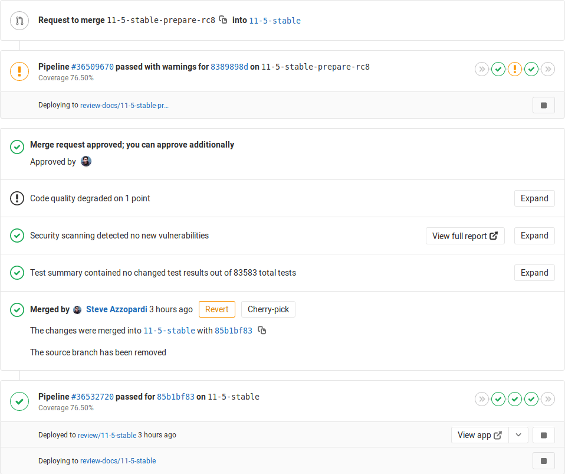

# Review and manage merge requests **(FREE)**

[Merge requests](../index.md) are the primary method of making changes to files in a
GitLab project. [Create and submit a merge request](../creating_merge_requests.md)
to propose changes. Your team makes [suggestions](suggestions.md) and leaves
[comments](../../../discussions/index.md). When your work is reviewed, your team
members can choose to accept or reject it.

## View merge requests

You can view merge requests for a specific project, or for all projects in a group:

- **Specific project**: Go to your project and select **Merge requests**.
- **All projects in a group**: Go to your group and select **Merge requests**.
  If your group contains subgroups, this view also displays merge requests from the subgroup projects.
  GitLab displays a count of open merge requests in the left sidebar, but
  [caches the value](#cached-merge-request-count) for groups with a large number of
  open merge requests.

GitLab displays open merge requests, with tabs to filter the list by open and closed status:


You can [search and filter](../../../search/index.md#filtering-issue-and-merge-request-lists),
the results, or select a merge request to begin a review.

## Bulk edit merge requests at the project level

Users with permission level of [Developer or higher](../../../permissions.md) can manage merge requests.

When bulk editing merge requests in a project, you can edit the following attributes:

- Status (open/closed)
- Assignee
- Milestone
- Labels
- Subscriptions

To update multiple project merge requests at the same time:

1. In a project, go to **Merge requests**.
1. Click **Edit merge requests**. A sidebar on the right-hand side of your screen appears with
   editable fields.
1. Select the checkboxes next to each merge request you want to edit.
1. Select the appropriate fields and their values from the sidebar.
1. Click **Update all**.

## Bulk edit merge requests at the group level

> [Introduced](https://gitlab.com/gitlab-org/gitlab/-/issues/12719) in [GitLab Premium](https://about.gitlab.com/pricing/) 12.2.

Users with permission level of [Developer or higher](../../../permissions.md) can manage merge requests.

When bulk editing merge requests in a group, you can edit the following attributes:

- Milestone
- Labels

To update multiple group merge requests at the same time:

1. In a group, go to **Merge requests**.
1. Click **Edit merge requests**. A sidebar on the right-hand side of your screen appears with
   editable fields.
1. Select the checkboxes next to each merge request you want to edit.
1. Select the appropriate fields and their values from the sidebar.
1. Click **Update all**.

## Review a merge request

> - [Introduced](https://gitlab.com/gitlab-org/gitlab/-/merge_requests/4213) in GitLab Premium 11.4.
> - [Moved](https://gitlab.com/gitlab-org/gitlab/-/issues/28154) to GitLab Free in 13.1.

When you review a merge request, you can create comments that are visible only
to you. When you're ready, you can publish them together in a single action.
To start your review:

1. Go to the merge request you want to review, and select the **Changes** tab.
   To learn more about navigating the diffs displayed in this tab, read
   [Changes tab in merge requests](../changes.md).
1. Select a line of code. In GitLab version 13.2 and later, you can [highlight a set of lines](#comment-on-multiple-lines).
1. Write your first comment, and select **Start a review** below your comment:
   
1. Continue adding comments to lines of code, and select the appropriate button after
   you write a comment:
   - **Add to review**: Keep this comment private and add to the current review.
     These review comments are marked **Pending** and are visible only to you.
   - **Add comment now**: Submits the specific comment as a regular comment instead of as part of the review.
1. (Optional) You can use [quick actions](../../quick_actions.md) inside review comments.
   The comment shows the actions to perform after publication, but does not perform them
   until you submit your review.
1. When your review is complete, you can [submit the review](#submit-a-review). Your comments
   are now visible, and any quick actions included your comments are performed.

### Submit a review

You can submit your completed review in multiple ways:

- Use the `/submit_review` [quick action](../../quick_actions.md) in the text of a non-review comment.
- When creating a review comment, select **Submit review**.
- Scroll to the bottom of the screen and select **Submit review**.

When you submit your review, GitLab:

- Publishes the comments in your review.
- Sends a single email to every notifiable user of the merge request, with your
  review comments attached. Replying to this email creates a new comment on the merge request.
- Perform any quick actions you added to your review comments.

### Resolving/Unresolving threads

Review comments can also resolve or unresolve [resolvable threads](../../../discussions/index.md#resolvable-comments-and-threads).
When replying to a comment, a checkbox is displayed to resolve or unresolve
the thread after publication.


If a particular pending comment resolves or unresolves the thread, this is shown on the pending
comment itself.


### Adding a new comment

> [Introduced](https://gitlab.com/gitlab-org/gitlab/-/issues/8225) in GitLab 13.10.

If you have a review in progress, you will be presented with the option to **Add to review**:


## Semi-linear history merge requests

A merge commit is created for every merge, but the branch is only merged if
a fast-forward merge is possible. This ensures that if the merge request build
succeeded, the target branch build also succeeds after the merge.

1. Go to your project and select **Settings > General**.
1. Expand **Merge requests**.
1. In the **Merge method** section, select **Merge commit with semi-linear history**.
1. Select **Save changes**.

## Perform inline code reviews

> [Introduced](https://gitlab.com/gitlab-org/gitlab-foss/-/issues/13950) in GitLab 11.5.

In a merge request, you can leave comments in any part of the file being changed.
In the merge request Diff UI, you can:

- **Comment on a single line**: Select the **{comment}** **comment** icon in the
  gutter to expand the diff lines and display a comment box.
- [**Comment on multiple lines**](#comment-on-multiple-lines).

### Comment on multiple lines

> - [Introduced](https://gitlab.com/gitlab-org/ux-research/-/issues/870) in GitLab 13.2.
> - [Added](https://gitlab.com/gitlab-org/gitlab/-/merge_requests/49875) click-and-drag features in GitLab 13.8.
> - [Feature flag removed](https://gitlab.com/gitlab-org/gitlab/-/issues/299121) in GitLab 13.9.

When commenting on a diff, you can select which lines of code your comment refers
to by either:


- Dragging the **{comment}** **comment** icon in the gutter to highlight
  lines in the diff. GitLab expands the diff lines and displays a comment box.
- After starting a comment by selecting the **{comment}** **comment** icon in the
  gutter, select the first line number your comment refers to in the **Commenting on lines**
  select box. New comments default to single-line comments, unless you select
  a different starting line.

Multiline comments display the comment's line numbers above the body of the comment:


## Pipeline status in merge requests widgets

If you've set up [GitLab CI/CD](../../../../ci/README.md) in your project,
you can see:

- Both pre-merge and post-merge pipelines and the environment information if any.
- Which deployments are in progress.

If an application is successfully deployed to an
[environment](../../../../ci/environments/index.md), the deployed environment and the link to the
Review App are both shown.

NOTE:
When the pipeline fails in a merge request but it can still be merged,
the **Merge** button is colored red.

### Post-merge pipeline status

When a merge request is merged, you can see the post-merge pipeline status of
the branch the merge request was merged into. For example, when a merge request
is merged into the [default branch](../../repository/branches/default.md) and then triggers a deployment to the staging
environment.

Ongoing deployments are shown, and the state (deploying or deployed)
for environments. If it's the first time the branch is deployed, the link
returns a `404` error until done. During the deployment, the stop button is
disabled. If the pipeline fails to deploy, the deployment information is hidden.



For more information, [read about pipelines](../../../../ci/pipelines/index.md).

### Merge when pipeline succeeds (MWPS)

Set a merge request that looks ready to merge to
[merge automatically when CI pipeline succeeds](../merge_when_pipeline_succeeds.md).

### Live preview with Review Apps

If you configured [Review Apps](https://about.gitlab.com/stages-devops-lifecycle/review-apps/) for your project,
you can preview the changes submitted to a feature branch through a merge request
on a per-branch basis. You don't need to checkout the branch, install, and preview locally.
All your changes are available to preview by anyone with the Review Apps link.

With GitLab [Route Maps](../../../../ci/review_apps/index.md#route-maps) set, the
merge request widget takes you directly to the pages changed, making it easier and
faster to preview proposed modifications.

[Read more about Review Apps](../../../../ci/review_apps/index.md).

## Associated features

These features are associated with merge requests:

- [Bulk editing merge requests](../../../project/bulk_editing.md):
  Update the attributes of multiple merge requests simultaneously.
- [Cherry-pick changes](../cherry_pick_changes.md):
  Cherry-pick any commit in the UI by selecting the **Cherry-pick** button in a merged merge requests or a commit.
- [Fast-forward merge requests](../fast_forward_merge.md):
  For a linear Git history and a way to accept merge requests without creating merge commits
- [Find the merge request that introduced a change](../versions.md):
  When viewing the commit details page, GitLab links to the merge request(s) containing that commit.
- [Merge requests versions](../versions.md):
  Select and compare the different versions of merge request diffs
- [Resolve conflicts](../resolve_conflicts.md):
  GitLab can provide the option to resolve certain merge request conflicts in the GitLab UI.
- [Revert changes](../revert_changes.md):
  Revert changes from any commit from a merge request.

## Troubleshooting

Sometimes things don't go as expected in a merge request. Here are some
troubleshooting steps.

### Merge request cannot retrieve the pipeline status

This can occur if Sidekiq doesn't pick up the changes fast enough.

#### Sidekiq

Sidekiq didn't process the CI state change fast enough. Please wait a few
seconds and the status should update automatically.

#### Bug

Merge request pipeline statuses can't be retrieved when the following occurs:

1. A merge request is created
1. The merge request is closed
1. Changes are made in the project
1. The merge request is reopened

To enable the pipeline status to be properly retrieved, close and reopen the
merge request again.

## Tips

Here are some tips to help you be more efficient with merge requests in
the command line.

### Copy the branch name for local checkout

> [Introduced](https://gitlab.com/gitlab-org/gitlab/-/issues/23767) in GitLab 13.4.

The merge request sidebar contains the branch reference for the source branch
used to contribute changes for this merge request.

To copy the branch reference into your clipboard, select the **Copy branch name** button
(**{copy-to-clipboard}**) in the right sidebar. Use it to checkout the branch locally
from the command line by running `git checkout <branch-name>`.

### Checkout merge requests locally through the `head` ref

A merge request contains all the history from a repository, plus the additional
commits added to the branch associated with the merge request. Here's a few
ways to check out a merge request locally.

You can check out a merge request locally even if the source
project is a fork (even a private fork) of the target project.

This relies on the merge request `head` ref (`refs/merge-requests/:iid/head`)
that is available for each merge request. It allows checking out a merge
request by using its ID instead of its branch.

[Introduced](https://gitlab.com/gitlab-org/gitlab/-/issues/223156) in GitLab
13.4, 14 days after a merge request gets closed or merged, the merge request
`head` ref is deleted. This means that the merge request isn't available
for local checkout from the merge request `head` ref anymore. The merge request
can still be re-opened. If the merge request's branch
exists, you can still check out the branch, as it isn't affected.

#### Checkout locally by adding a Git alias

Add the following alias to your `~/.gitconfig`:

```plaintext
[alias]
    mr = !sh -c 'git fetch $1 merge-requests/$2/head:mr-$1-$2 && git checkout mr-$1-$2' -
```

Now you can check out a particular merge request from any repository and any
remote. For example, to check out the merge request with ID 5 as shown in GitLab
from the `origin` remote, do:

```shell
git mr origin 5
```

This fetches the merge request into a local `mr-origin-5` branch and check
it out.

#### Checkout locally by modifying `.git/config` for a given repository

Locate the section for your GitLab remote in the `.git/config` file. It looks
like this:

```plaintext
[remote "origin"]
  url = https://gitlab.com/gitlab-org/gitlab-foss.git
  fetch = +refs/heads/*:refs/remotes/origin/*
```

You can open the file with:

```shell
git config -e
```

Now add the following line to the above section:

```plaintext
fetch = +refs/merge-requests/*/head:refs/remotes/origin/merge-requests/*
```

In the end, it should look like this:

```plaintext
[remote "origin"]
  url = https://gitlab.com/gitlab-org/gitlab-foss.git
  fetch = +refs/heads/*:refs/remotes/origin/*
  fetch = +refs/merge-requests/*/head:refs/remotes/origin/merge-requests/*
```

Now you can fetch all the merge requests:

```shell
git fetch origin

...
From https://gitlab.com/gitlab-org/gitlab-foss.git
 * [new ref]         refs/merge-requests/1/head -> origin/merge-requests/1
 * [new ref]         refs/merge-requests/2/head -> origin/merge-requests/2
...
```

And to check out a particular merge request:

```shell
git checkout origin/merge-requests/1
```

All the above can be done with the [`git-mr`](https://gitlab.com/glensc/git-mr) script.

## Cached merge request count

> - [Introduced](https://gitlab.com/gitlab-org/gitlab/-/issues/299542) in GitLab 13.11.
> - It's [deployed behind a feature flag](../../../feature_flags.md), enabled by default.
> - It's enabled on GitLab.com.
> - It's recommended for production use.
> - For GitLab self-managed instances, GitLab administrators can opt to [disable it](#enable-or-disable-cached-merge-request-count).

WARNING:
This feature might not be available to you. Refer to the previous **version history** note for details.

In a group, the sidebar displays the total count of open merge requests. This value is cached if it's greater than
than 1000. The cached value is rounded to thousands (or millions) and updated every 24 hours.

### Enable or disable cached merge request count **(FREE SELF)**

Cached merge request count in the left sidebar is under development but ready for production use. It is
deployed behind a feature flag that is **enabled by default**.
[GitLab administrators with access to the GitLab Rails console](../../../../administration/feature_flags.md)
can disable it.

To disable it:

```ruby
Feature.disable(:cached_sidebar_merge_requests_count)
```

To enable it:

```ruby
Feature.enable(:cached_sidebar_merge_requests_count)
```
