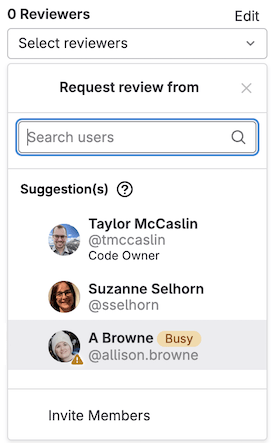

# Merge request reviews

DETAILS:
**Tier:** Free, Premium, Ultimate
**Offering:** GitLab.com, Self-managed, GitLab Dedicated

Merge requests are the primary method of making changes to files in a
GitLab project. [Create and submit](../creating_merge_requests.md) a merge request
to propose changes. Your team leaves [comments](../../../discussions/index.md) on
your merge request, and makes [Code Suggestions](suggestions.md) you can accept
from the user interface. When a teammate reviews your work, they can choose
to accept or reject it.

To review merge requests, you can use:

- The GitLab interface.
- Visual Studio Code, if you have configured the
  [GitLab Workflow VS Code extension](../../../../editor_extensions/visual_studio_code/index.md).
- Your terminal window, if you have configured the [GitLab CLI](../../../../editor_extensions/gitlab_cli/index.md).

<i class="fa fa-youtube-play youtube" aria-hidden="true"></i>
For an overview, see [Merge request review](https://www.youtube.com/watch?v=2MayfXKpU08&list=PLFGfElNsQthYDx0A_FaNNfUm9NHsK6zED&index=183).
<!-- Video published on 2023-04-29 -->

## Request a review

To assign a reviewer to a merge request, in a text area in
the merge request, use the `/assign_reviewer @user`
[quick action](../../quick_actions.md#issues-merge-requests-and-epics), or:

1. On the left sidebar, select **Search or go to** and find your project.
1. Select **Code > Merge requests** and find your merge request.
1. Select the title of the merge request to view it.
1. On the right sidebar, in the **Reviewers** section, select **Edit**.
1. Search for the user you want to assign, and select the user.

GitLab adds the merge request to the user's review requests.

### From multiple users

DETAILS:
**Tier:** Premium, Ultimate
**Offering:** GitLab.com, Self-managed, GitLab Dedicated

To assign multiple reviewers to a merge request, in a text area in
the merge request, use the `/assign_reviewer @user1 @user2`
[quick action](../../quick_actions.md#issues-merge-requests-and-epics), or:

1. On the left sidebar, select **Search or go to** and find your project.
1. Select **Code > Merge requests** and find your merge request.
1. Select the title of the merge request to view it.
1. On the right sidebar, in the **Reviewers** section, select **Edit**.
1. From the dropdown list, select all the users you want
   to assign to the merge request.

To remove a reviewer, clear the user from the same dropdown list.

### Re-request a review

After a reviewer completes their [merge request reviews](../../../discussions/index.md),
the author of the merge request can request a new review from the reviewer:

1. On the left sidebar, select **Search or go to** and find your project.
1. Select **Code > Merge requests** and find your merge request.
1. Select the title of the merge request to view it.
1. If you have collapsed the right sidebar in the merge request, select the
   **{chevron-double-lg-left}** **Expand Sidebar** to expand it.
1. In the **Reviewers** section, select the **Re-request a review** icon (**{redo}**)
   next to the reviewer's name.

GitLab creates a new [to-do item](../../../todos.md) for the reviewer, and sends
them a notification email.

## Start a review

If a user has asked you to review a merge request:

1. Either:
   - Press <kbd>Shift</kbd> + <kbd>r</kbd> to go to your **Review requests** page.
   - On the left sidebar, select **Merge requests** (**{merge-request}**) **> Review requests**.

1. Find your merge request, and select the title of the merge request to view it.
1. Read the merge request description and comments to learn about the merge request.
1. Select **Changes** to view the diff of the proposed changes. To learn more about
   the **Changes** page, see [Changes in merge requests](../changes.md).
1. [Suggest multi-line or single-line changes](suggestions.md) as needed. If you select **Start a review**
   instead of **Add comment now**, your review comments remain unpublished until
   your review is complete.

1. To add more comments after you've selected **Start a review**, add them to your review from:
   - The **Changes** tab, containing the diff view.
   - The **Overview** tab, and selecting **Add to review**:

   
1. Select [**Submit your review**](#submit-a-review) to publish all review comments
   added with either **Start a review** or **Add to review**. Until you
   [submit your review](#submit-a-review), these comments remain unpublished.

### Resolve or unresolve thread with a comment

Review comments can also resolve or unresolve [resolvable threads](../index.md#resolve-a-thread).
To resolve or unresolve a thread when replying to a comment:

1. In the comment text area, write your comment.
1. Select or clear **Resolve thread**.
1. Select **Add comment now** or **Add to review**.

Pending comments display information about the actions that are delayed until comment is published:

- **{check-circle-filled}** Thread is resolved.
- **{check-circle}** Thread stays unresolved.

## Submit a review

To submit your completed review, you can:

- Use the `/submit_review` [quick action](../../quick_actions.md) in the text of a non-review comment.
- Select **Finish review**, then select **Submit review** at the bottom of the dialog.
  In the dialog, you can supply a **Summary comment**, approve (or reject) the merge request, and
  include quick actions:

  

When you submit your review, GitLab:

- Publishes the comments in your review.
- Sends a single email to every notifiable user of the merge request, with your
  review comments attached. Replying to this email creates a new comment on the merge request.
- Perform any quick actions you added to your review comments.
- Optional. Shows whether you have also approved or requested changes:
  - **Comment**: Leave general feedback without explicit approval.
  - **Approve**: Leave feedback and approve the changes.
  - **Request changes**: Block the merge request from merging until the author
    addresses your feedback.

### Prevent merge when you request changes

DETAILS:
**Tier:** Premium, Ultimate
**Offering:** GitLab.com, Self-managed, GitLab Dedicated

> - [Introduced](https://gitlab.com/gitlab-org/gitlab/-/issues/430728) in GitLab 16.11 [with a flag](../../../../administration/feature_flags.md) named `mr_reviewer_requests_changes`. Disabled by default.
> - Enabled by default [on GitLab.com](https://gitlab.com/gitlab-org/gitlab/-/issues/451211) and [self-managed](https://gitlab.com/gitlab-org/gitlab/-/merge_requests/158226) in GitLab 17.2.

A reviewer [requesting changes](#submit-a-review) blocks a merge request from merging.
When this happens, the merge request reports area shows the message
**The change requests must be completed or resolved.** To unblock the merge request,
the reviewer who requested changes should [re-review and approve](#re-request-a-review) the merge request.

If the user who requested changes is unable to re-review or provide an approval,
another user with permission to merge the merge request can override this check in the
merge request reports area by selecting **Bypass**:

1. On the left sidebar, select **Search or go to** and find your project.
1. Select **Code > Merge requests** and find your merge request.
1. Select the title of the merge request to view it.
1. On the merge request **Overview**, scroll to the merge request reports area.
1. Next to **The change requests must be completed or resolved**, select **Bypass**:

   

### See how reviewers map to approval rules

DETAILS:
**Tier:** Premium, Ultimate
**Offering:** GitLab.com, Self-managed, GitLab Dedicated

When you create a merge request, you want to request reviews from
subject matter experts for the changes you're making. To decrease the number of
review cycles for your merge request, consider requesting reviews from users
listed in the project's approval rules.

When you edit the **Reviewers** field in a new or existing merge request, GitLab shows you
the matching [approval rule](../approvals/rules.md) below the name of each reviewer.
[Code Owners](../../codeowners/index.md) display as `Codeowner` without any group detail.

::Tabs

:::TabTitle Create or edit a merge request

1. When you create a new merge request, or edit an existing one, select **Reviewers**.
1. Begin entering the name of your desired reviewer. Users who are Code Owners, or match an approval rule, show more information below the username:

   

:::TabTitle Reviewing a merge request

1. On the left sidebar, select **Search or go to** and find your project.
1. Select **Code > Merge requests**.
1. Select your merge request.
1. On the right sidebar, next to **Reviewers**, select **Edit**.
1. Begin entering the name of your desired reviewer. Users who are Code Owners,
   or who match an approval rule, show more information below the username:

   

::EndTabs

## Download merge request changes

### As a diff

To download the changes included in a merge request as a diff:

1. On the left sidebar, select **Search or go to** and find your project.
1. Select **Code > Merge requests**.
1. Select your merge request.
1. In the upper-right corner, select **Code > Plain diff**.

If you know the URL of the merge request, you can also download the diff from
the command line by appending `.diff` to the URL. This example downloads the diff
for merge request `000000`:

```plaintext
https://gitlab.com/gitlab-org/gitlab/-/merge_requests/000000.diff
```

To download and apply the diff in a one-line CLI command:

```shell
curl "https://gitlab.com/gitlab-org/gitlab/-/merge_requests/000000.diff" | git apply
```

### As a patch file

To download the changes included in a merge request as a patch file:

1. On the left sidebar, select **Search or go to** and find your project.
1. Select **Code > Merge requests**.
1. Select your merge request.
1. In the upper-right corner, select **Code > Patches**.

If you know the URL of the merge request, you can also download the patch from
the command line by appending `.patch` to the URL. This example downloads the patch
file for merge request `000000`:

```plaintext
https://gitlab.com/gitlab-org/gitlab/-/merge_requests/000000.patch
```

To download and apply the patch in a one-line CLI command using [`git am`](https://git-scm.com/docs/git-am):

```shell
curl "https://gitlab.com/gitlab-org/gitlab/-/merge_requests/000000.patch" | git am
```

## GitLab Duo Suggested Reviewers

DETAILS:
**Tier:** Ultimate
**Offering:** GitLab.com

> - [Introduced](https://gitlab.com/groups/gitlab-org/modelops/applied-ml/review-recommender/-/epics/3) in GitLab 15.4 as a [beta](../../../../policy/experiment-beta-support.md#beta) feature [with a flag](../../../../administration/feature_flags.md) named `suggested_reviewers_control`. Disabled by default.
> - [Enabled on GitLab.com](https://gitlab.com/gitlab-org/gitlab/-/issues/368356) in GitLab 15.6.
> - Beta designation [removed from the UI](https://gitlab.com/gitlab-org/gitlab/-/merge_requests/113058) in GitLab 15.10.
> - Feature flag [removed](https://gitlab.com/gitlab-org/gitlab/-/merge_requests/134728) in GitLab 16.6.

GitLab uses machine learning to suggest reviewers for your merge request.

<i class="fa fa-youtube-play youtube" aria-hidden="true"></i>
For an overview, see [GitLab Duo Suggested Reviewers](https://www.youtube.com/embed/ivwZQgh4Rxw).
<!-- Video published on 2023-11-03 -->

To suggest reviewers, GitLab uses:

- The changes in the merge request
- The project's contribution graph

GitLab Duo Suggested Reviewers also integrates with Code Owners, profile status,
and merge request rules. It helps you make a more informed decision when choosing
reviewers who can meet your review criteria.



For more information, see [Data usage in GitLab Duo Suggested Reviewers](data_usage.md).

### Enable Suggested Reviewers

Enabling Suggested Reviewers triggers GitLab to create the machine learning model your
project uses to generate reviewers. The larger your project, the longer
this process can take. Usually, the model is ready to generate suggestions
after a few hours.

Prerequisites:

- You have the Owner or Maintainer role in the project.

To do this:

1. On the left sidebar, select **Search or go to** and find your project.
1. Select **Settings > Merge requests**.
1. Scroll to **Suggested reviewers**, and select **Enable suggested reviewers**.
1. Select **Save changes**.

After you enable the feature, no action is needed. After the model is ready,
recommendations populate the **Reviewer** dropdown list in the right-hand sidebar
of a merge request with new commits.

## Associated features

Merge requests are related to these features:

- [Cherry-pick changes](../cherry_pick_changes.md):
  In the GitLab UI, select **Cherry-pick** in a merged merge request or a commit to cherry-pick it.
- [Fast-forward merge requests](../methods/index.md#fast-forward-merge):
  For a linear Git history and a way to accept merge requests without creating merge commits
- [Find the merge request that introduced a change](../versions.md):
  When viewing the commit details page, GitLab links to the merge requests containing that commit.
- [Merge requests versions](../versions.md):
  Select and compare the different versions of merge request diffs
- [Resolve conflicts](../conflicts.md):
  GitLab can provide the option to resolve certain merge request conflicts in the GitLab UI.
- [Revert changes](../revert_changes.md):
  Revert changes from any commit from a merge request.
- [Keyboard shortcuts](../../../shortcuts.md#merge-requests):
  Access and change specific parts of a merge request with keyboard commands.

## Related topics

- [Merge methods](../methods/index.md)
- [Draft Notes API](../../../../api/draft_notes.md)
