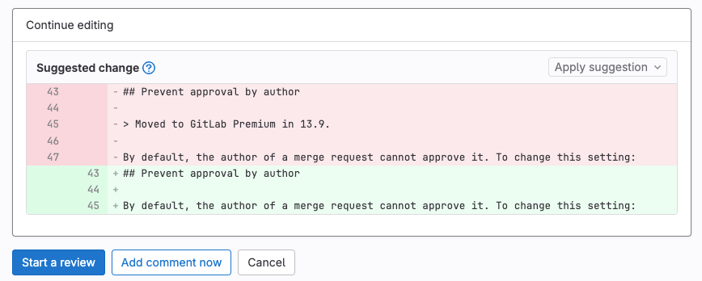
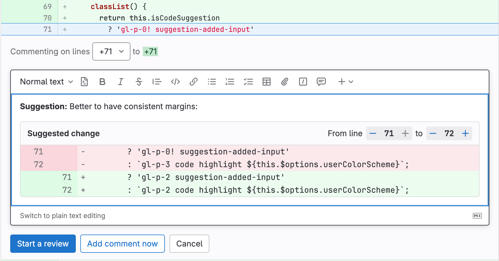
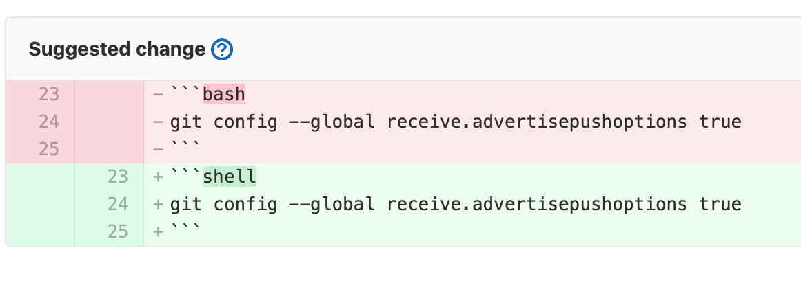

# Suggest changes

DETAILS:
**Tier:** Free, Premium, Ultimate
**Offering:** GitLab.com, Self-managed, GitLab Dedicated

Reviewers can suggest code changes with a Markdown syntax in merge request diff threads.
The merge request author (or other users with the appropriate role) can apply any or
all of the suggestions from the GitLab UI. Applying suggestions adds a commit to the
merge request, authored by the user who suggested the changes.

## Create suggestions

1. On the left sidebar, select **Search or go to** and find your project.
1. Select **Code > Merge requests** and find your merge request.
1. On the secondary menu, select **Changes**.
1. Find the lines of code you want to change.
   - To select a single line, hover over the line number and
     select **Add a comment to this line** (**{comment}**).
   - To select multiple lines:
     1. Hover over the line number, and select **Add a comment to this line** (**{comment}**):
        
     1. Select and drag your selection until all desired lines are included. To
        learn more, see [Multi-line suggestions](#multi-line-suggestions).
1. In the comment toolbar, select **Insert suggestion** (**{doc-code}**). GitLab
   inserts a pre-populated code block into your comment, like this:

   ````markdown
   ```suggestion:-0+0
   The content of the line you selected is shown here.
   ```
   ````

1. Edit the pre-populated code block to add your suggestion.
1. Select whether you want your comment to appear immediately:

   - **Start a review** or **Add to review** creates your comment in a pending state
     as part of a [review](index.md).
   - **Add comment now** adds your comment immediately.

### Multi-line suggestions

When you review a merge request diff, you can propose changes to multiple lines (up to 200)
in a single suggestion, by either:

- Selecting and dragging, as described in [Create suggestions](#create-suggestions).
  GitLab creates a suggestion block for you.
- Selecting a single line, then manually editing the range offsets in the suggestion block.

The range offsets in the first line of the suggestion describe line numbers relative
to the line you selected. The offsets specify the lines your suggestion intends to replace.
For example, this suggestion covers 2 lines above and 2 lines below the
commented line:

````markdown
```suggestion:-2+2
## Prevent approval by author

By default, the author of a merge request cannot approve it. To change this setting:
```
````

When applied, the suggestion replaces from 2 lines above to 2 lines below the commented line:



Suggestions for multiple lines are limited to 100 lines _above_ and 100
lines _below_ the commented diff line. This allows for up to 200 changed lines per
suggestion.

Multiline comments display the comment's line numbers above the body of the comment:


#### Using the rich text editor

> - [Introduced](https://gitlab.com/gitlab-org/gitlab/-/issues/388449) in GitLab 16.1 [with a flag](../../../../administration/feature_flags.md) named `content_editor_on_issues`. Disabled by default.
> - [Enabled on GitLab.com and self-managed](https://gitlab.com/gitlab-org/gitlab/-/issues/375172) in GitLab 16.2.
> - Feature flag `content_editor_on_issues` removed in GitLab 16.5.

When you insert suggestions, you can use the WYSIWYG
[rich text editor](../../../rich_text_editor.md) to move
up and down the source file's line numbers in the UI.

To add or subtract changed lines, next to **From line**, select **+** or **-**.



## Apply suggestions

Prerequisites:

- You must be the author of the merge request, or have at least the Developer role in the project.

To apply suggested changes directly from the merge request:

1. On the left sidebar, select **Search or go to** and find your project.
1. Select **Code > Merge requests** and find your merge request.
1. Find the comment containing the suggestion you want to apply.
   - To apply suggestions individually, select **Apply suggestion**.
   - To apply multiple suggestions in a single commit, select **Add suggestion to batch**.
1. Optional. Provide a custom commit message to describe your change. If you don't provide a custom message, the default commit message is used.
1. Select **Apply**.

After a suggestion is applied:

- The suggestion is marked as **Applied**.
- The comment thread is resolved.
- GitLab creates a new commit with the changes.
- If the user has the Developer role, GitLab pushes
  the suggested change directly into the codebase in the merge request's branch.

## Nest code blocks in suggestions

To add a suggestion that includes a
[fenced code block](../../../markdown.md#code-spans-and-blocks), wrap your suggestion
in four backticks instead of three:

`````markdown
````suggestion:-0+2
```shell
git config --global receive.advertisepushoptions true
```
````
`````



## Configure the commit message for applied suggestions

GitLab uses a default commit message when applying suggestions. This message
supports placeholders, and can be changed. For example, the default message
`Apply %{suggestions_count} suggestion(s) to %{files_count} file(s)` renders
like this if you apply three suggestions to two different files:

```plaintext
Apply 3 suggestion(s) to 2 file(s)
```

Merge requests created from forks use the template defined in the target project.
To meet your project's needs, customize these messages and include other
placeholder variables.

Prerequisites:

- You must have the Maintainer role.

To do this:

1. On the left sidebar, select **Search or go to** and find your project.
1. Select **Settings > Merge requests**.
1. Scroll to **Merge suggestions**, and alter the text to meet your needs.
   See [Supported variables](#supported-variables) for a list of placeholders
   you can use in this message.

### Supported variables

The template for commit messages for applied suggestions supports these variables:

| Variable               | Description | Output example |
|------------------------|-------------|----------------|
| `%{branch_name}`       | The name of the branch to which suggestions were applied. | `my-feature-branch` |
| `%{files_count}`       | The number of files to which suggestions were applied.| `2` |
| `%{file_paths}`        | The paths of the file to which suggestions were applied. Paths are separated by commas.| `docs/index.md, docs/about.md` |
| `%{project_path}`      | The project path. | `my-group/my-project` |
| `%{project_name}`      | The human-readable name of the project. | `My Project` |
| `%{suggestions_count}` | The number of suggestions applied.| `3` |
| `%{username}`          | The username of the user applying suggestions. | `user_1` |
| `%{user_full_name}`    | The full name of the user applying suggestions. | `User 1` |
| `%{co_authored_by}`    | Names and emails of suggestion authors in a `Co-authored-by` Git commit trailer format. | `Co-authored-by: Zane Doe <zdoe@example.com>` <br> `Co-authored-by: Blake Smith <bsmith@example.com>` |

For example, to customize the commit message to output
`Addresses user_1's review`, set the custom text to
`Addresses %{username}'s review`.

## Batch suggestions

> - [Introduced](https://gitlab.com/gitlab-org/gitlab/-/issues/326168) custom commit messages for batch suggestions in GitLab 14.4.

Prerequisites:

- You must have a role in the project that allows you to commit to the source branch.

To reduce the number of commits added to your branch, apply multiple
suggestions in a single commit.

1. On the left sidebar, select **Search or go to** and find your project.
1. Select **Code > Merge requests** and find your merge request.
1. For each suggestion you want to apply, select **Add suggestion to batch**.
1. Optional. To remove a suggestion, select **Remove from batch**.
1. After you add your desired suggestions, select **Apply suggestions**.

   WARNING:
   If you apply a batch of suggestions containing changes from multiple authors,
   you are credited as the resulting commit's author. If your project is configured
   to [prevent approvals from users who add commits](../approvals/settings.md#prevent-approvals-by-users-who-add-commits), you are no longer an eligible
   approver for this merge request.

1. Optional. Provide a custom commit message for [batch suggestions](#batch-suggestions)
   (GitLab 14.4 and later) to describe your change. If you don't specify one,
   the default commit message is used.

## Related topics

- [Suggestions API](../../../../api/suggestions.md)
