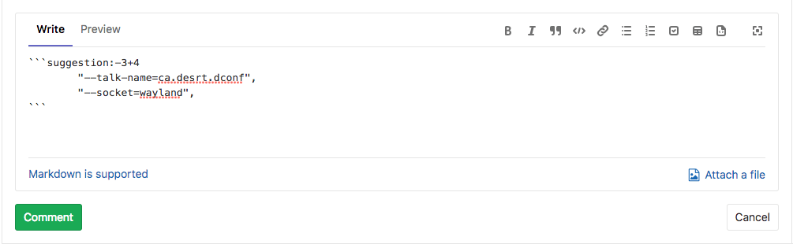
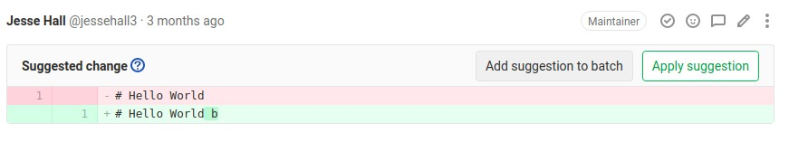
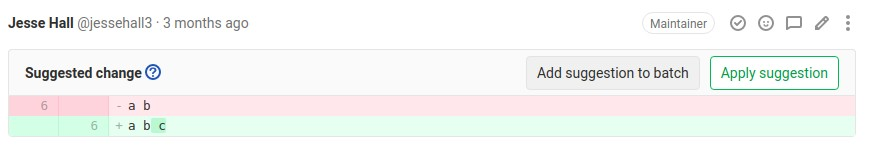
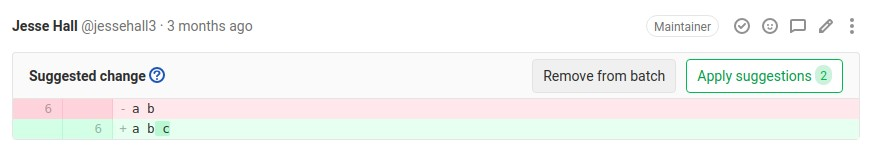

# Suggest changes **(FREE)**

> - [Introduced](https://gitlab.com/gitlab-org/gitlab-foss/-/issues/18008) in GitLab 11.6.
> - Custom commit messages for suggestions was [introduced](https://gitlab.com/gitlab-org/gitlab/-/issues/25381) in GitLab 13.9 behind a [feature flag](../../../feature_flags.md), disabled by default.
> - [Feature flag removed](https://gitlab.com/gitlab-org/gitlab/-/issues/297404) in GitLab 13.10.

As a reviewer, you're able to suggest code changes with a Markdown syntax in merge request
diff threads. Then, the merge request author (or other users with appropriate
[permission](../../../permissions.md)) is able to apply these suggestions with a click,
which generates a commit in the merge request authored by the user that suggested the changes.

1. Choose a line of code to be changed, add a new comment, then select
   the **Insert suggestion** icon in the toolbar:

   

1. In the comment, add your suggestion to the pre-populated code block:

   

1. Select either **Start a review** or **Add to review** to add your comment to a
   [review](index.md), or **Add comment now** to add the comment to the thread immediately.

   The suggestion in the comment can be applied by the merge request author
   directly from the merge request:

   

1. [Introduced](https://gitlab.com/gitlab-org/gitlab/-/issues/25381) in GitLab 13.9,
   you can opt to add a custom commit message to describe your change. If you don't
   specify it, the default commit message is used. It is not supported for [batch suggestions](#batch-suggestions).

   

After the author applies a suggestion, it's marked with the **Applied** label,
the thread is automatically resolved, and GitLab creates a new commit
and pushes the suggested change directly into the codebase in the merge request's
branch. [Developer permission](../../../permissions.md) is required to do so.

## Multi-line suggestions

> - [Introduced](https://gitlab.com/gitlab-org/gitlab-foss/-/issues/53310) in GitLab 11.10.

Reviewers can also suggest changes to multiple lines with a single suggestion
within merge request diff threads by adjusting the range offsets. The
offsets are relative to the position of the diff thread, and specify the
range to be replaced by the suggestion when it is applied.

In the previous example, the suggestion covers three lines above and four lines
below the commented line. When applied, it would replace from 3 lines _above_
to 4 lines _below_ the commented line, with the suggested change.

NOTE:
Suggestions for multiple lines are limited to 100 lines _above_ and 100
lines _below_ the commented diff line. This allows for up to 200 changed lines per
suggestion.

## Code block nested in suggestions

If you need to make a suggestion that involves a
[fenced code block](../../../markdown.md#code-spans-and-blocks), wrap your suggestion in four backticks
instead of the usual three.

## Configure the commit message for applied suggestions

> - [Introduced](https://gitlab.com/gitlab-org/gitlab/-/issues/13086) in GitLab 12.7.

GitLab uses a default commit message
when applying suggestions: `Apply %{suggestions_count} suggestion(s) to %{files_count} file(s)`

For example, consider that a user applied 3 suggestions to 2 different files, the
default commit message is: **Apply 3 suggestion(s) to 2 file(s)**

These commit messages can be customized to follow any guidelines you might have.
To do so, expand the **Merge requests** tab within your project's **General**
settings and change the **Merge suggestions** text:

You can also use following variables besides static text:

| Variable               | Description | Output example |
|------------------------|-------------|----------------|
| `%{branch_name}`       | The name of the branch the suggestion(s) was(were) applied to. | `my-feature-branch` |
| `%{files_count}`       | The number of file(s) to which suggestion(s) was(were) applied.| **2** |
| `%{file_paths}`        | The path(s) of the file(s) suggestion(s) was(were) applied to. Paths are separated by commas.| `docs/index.md, docs/about.md` |
| `%{project_path}`      | The project path. | `my-group/my-project` |
| `%{project_name}`      | The human-readable name of the project. | **My Project** |
| `%{suggestions_count}` | The number of suggestions applied.| **3** |
| `%{username}`          | The username of the user applying suggestion(s). | `user_1` |
| `%{user_full_name}`    | The full name of the user applying suggestion(s). | **User 1** |

For example, to customize the commit message to output
**Addresses user_1's review**, set the custom text to
`Addresses %{username}'s review`.

NOTE:
Custom commit messages for each applied suggestion is
introduced by [#25381](https://gitlab.com/gitlab-org/gitlab/-/issues/25381).

## Batch suggestions

> - [Introduced](https://gitlab.com/gitlab-org/gitlab/-/issues/25486) in GitLab 13.1 as an [alpha feature](https://about.gitlab.com/handbook/product/gitlab-the-product/#alpha) behind a feature flag, disabled by default.
> - [Enabled by default](https://gitlab.com/gitlab-org/gitlab/-/issues/227799) in GitLab 13.2.
> - [Feature flag removed](https://gitlab.com/gitlab-org/gitlab/-/issues/320755) in GitLab 13.11.

You can apply multiple suggestions at once to reduce the number of commits added
to your branch to address your reviewers' requests.

1. To start a batch of suggestions to apply with a single commit, select **Add suggestion to batch**:

   

1. Add as many additional suggestions to the batch as you wish:

   

1. To remove suggestions, select **Remove from batch**:

   

1. Having added all the suggestions to your liking, when ready, select **Apply suggestions**:

   

WARNING:
Suggestions applied from multiple authors creates a commit authored by the user applying the suggestions.

## Related links

- [Suggestions API](../../../../api/suggestions.md)
