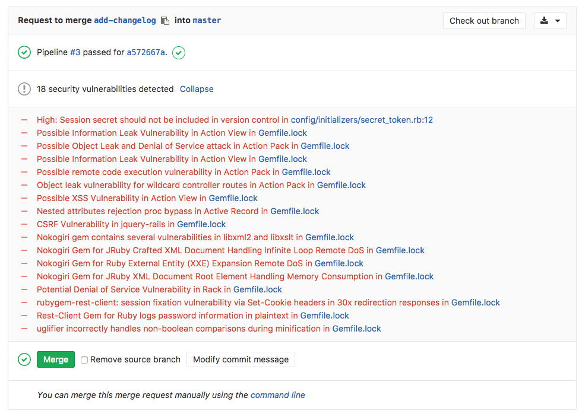
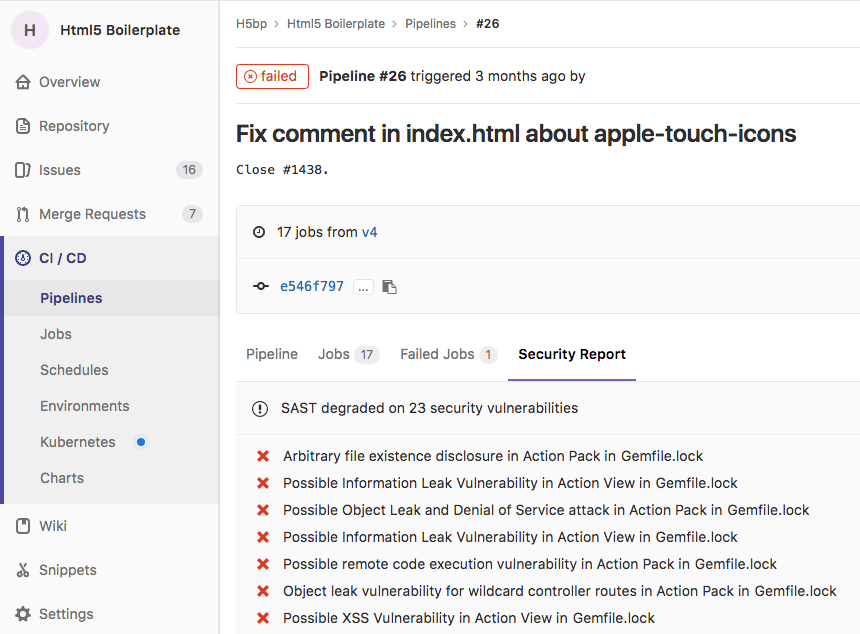

# Static Application Security Testing (SAST)

> [Introduced][ee-3775] in [GitLab Ultimate][ee] 10.3.

## Overview

If you are using [GitLab CI/CD][ci], you can analyze your source code for known
vulnerabilities using Static Application Security Testing (SAST), either by
including the CI job in your [existing `.gitlab-ci.yml` file][cc-docs] or
by implicitly using [Auto SAST](../../../topics/autodevops/index.md#auto-sast)
that is provided by [Auto DevOps](../../../topics/autodevops/index.md).

Going a step further, GitLab can show the vulnerability list right in the merge
request widget area.

## Use cases

- Your application is using an external (open source) library, locked to a
  specific version (e.g., via `Gemfile.lock`) and the version is known to be
  vulnerable.
- Your code has a potentially dangerous attribute in a class, or unsafe code
  that can lead to unintended code execution.

## Supported languages and frameworks

The following languages and frameworks are supported.

| Language / framework | Scan tool                                          |
|----------------------|----------------------------------------------------|
| C/C++                | [Flawfinder](https://www.dwheeler.com/flawfinder/) |
| Python               | [bandit](https://github.com/openstack/bandit)      |
| Ruby on Rails        | [brakeman](https://brakemanscanner.org)            |
| Java                 | [find-sec-bugs](https://find-sec-bugs.github.io/)  |

## How it works

First of all, you need to define a job named `sast` in your `.gitlab-ci.yml`
file. [Check how the `sast` job should look like][cc-docs].

In order for the report to show in the merge request, there are two
prerequisites:

- the specified job **must** be named `sast`
- the resulting report **must** be named `gl-sast-report.json` and uploaded as
  an artifact

The `sast` job will perform an analysis on the running web application, the
resulting JSON file will be uploaded as an artifact, and GitLab will then check
this file and show the information inside the merge request.

## Security report under pipelines

> [Introduced][ee-3776] in [GitLab Ultimate][ee] 10.6.

Visit any pipeline page which has a `sast` job and you will be able to see
the security report tab with the listed vulnerabilities (if any).

[ee-3775]: https://gitlab.com/gitlab-org/gitlab-ee/issues/3775
[ee-3776]: https://gitlab.com/gitlab-org/gitlab-ee/issues/3776
[ee]: https://about.gitlab.com/pricing
[ci]: ../../../ci/README.md
[cc-docs]: ../../../ci/examples/sast.md
