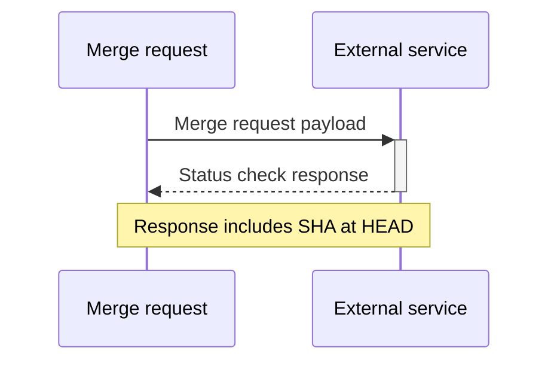

DETAILS:
**Tier:** Ultimate
**Offering:** GitLab.com, GitLab Self-Managed, GitLab Dedicated

> - `pending` status [introduced](https://gitlab.com/gitlab-org/gitlab/-/issues/413723) in GitLab 16.5
> - Timeout interval of two minutes for `pending` status checks [introduced](https://gitlab.com/gitlab-org/gitlab/-/issues/388725) in GitLab 16.6.

Status checks are API calls to external systems that request the status of an external requirement.

You can create a status check that sends merge request data to third-party tools.
When users create, change, or close merge requests, GitLab sends a notification. The users or automated workflows
can then update the status of merge requests from outside of GitLab.

With this integration, you can integrate with third-party workflow tools, like
ServiceNow, or the custom tool of your choice. The third-party tool
responds with an associated status. This status is then displayed as a non-blocking
widget within the merge request, which surfaces this status to the merge request author or reviewers
at the merge request level itself.

You can configure merge request status checks for each individual project. These are not shared between projects.

Status checks fail if they stay in the pending state for more than two minutes.

For more information about use cases, feature discovery, and development timelines,
see [epic 3869](https://gitlab.com/groups/gitlab-org/-/epics/3869).

## Block merges of merge requests unless all status checks have passed

> - [Introduced](https://gitlab.com/gitlab-org/gitlab/-/issues/369859) in GitLab 15.5 [with a flag](../../../administration/feature_flags.md) named `only_allow_merge_if_all_status_checks_passed`. Disabled by default.
> - [Enabled on GitLab.com](https://gitlab.com/gitlab-org/gitlab/-/issues/372340) in GitLab 15.8.
> - Enabled on GitLab Self-Managed and feature flag [removed](https://gitlab.com/gitlab-org/gitlab/-/merge_requests/111492) in GitLab 15.9.

By default, merge requests in projects can be merged even if external status checks fail. To block the merging of merge requests when external checks fail:

1. On the left sidebar, select **Search or go to** and find your project.
1. Select **Settings > Merge requests**.
1. Select the **Status checks must succeed** checkbox.
1. Select **Save changes**.

## Lifecycle

External status checks have an **asynchronous** workflow. Merge requests emit a merge request webhook payload to an external service whenever:

- A merge request is updated, closed, reopened, approved, unapproved, or merged.
- Code is pushed to the source branch of the merge request.



When the payload is received, the external service can then run any required processes before posting its response back to the merge request [using the REST API](../../../api/status_checks.md#set-status-of-an-external-status-check).

Merge requests return a `409 Conflict` error to any responses that do not refer to the current `HEAD` of the source branch. As a result, it's safe for the external service to process and respond to out-of-date commits.

External status checks have the following states:

- `pending` - The default state. No response has been received by the merge request from the external service.
- `passed` - A response from the external service has been received and approved by it.
- `failed` - A response from the external service has been received and denied by it.

If something changes outside of GitLab, you can [set the status of an external status check](../../../api/status_checks.md#set-status-of-an-external-status-check)
using the API. You don't need to wait for a merge request webhook payload to be sent first.

## View status check services

To view a list of status check services added to a project from the merge request settings:

1. On the left sidebar, select **Search or go to** and find your project.
1. Select **Settings > Merge requests**.
1. Scroll down to **Status checks**. This list shows the service name, API URL, targeted branch,
   and HMAC authentication status.


You can also view a list of status check services from the [Branch rules](../repository/branches/branch_rules.md#add-a-status-check-service) settings.

## Add or update a status check service

### Add a status check service

Within the **Status checks** sub-section, select the **Add status check** button.
The **Add status check** form is then shown.


Filling in the form and selecting the **Add status check** button creates a new status check.

### Update a status check service

Within the **Status checks** sub-section, select **Edit** (**{pencil}**)
next to the status check you want to edit.
The **Update status check** form is then shown.


NOTE:
You cannot see or modify the value of the HMAC shared secret. To change the shared secret, delete and recreate the external status check with a new value for the shared secret.

Changing the values in the form and selecting the **Update status check** button updates the status check.

### Form values

For common form errors see the [troubleshooting](#troubleshooting) section below.

#### Service name

This name can be any alphanumerical value and **must** be set. The name **must** be unique for
the project.
The name **has** to be unique for the project.

#### API to check

This field requires a URL and **must** use either the HTTP or HTTPS protocols.
We **recommend** using HTTPS to protect your merge request data in transit.
The URL **must** be set and **must** be unique for the project.

#### Target branch

If you want to restrict the status check to a single branch,
you can use this field to set this limit.


The branches list is populated from the projects [protected branches](../repository/branches/protected.md).

You can scroll through the list of branches or use the search box
when there are a lot of branches and the branch you are looking
for doesn't appear immediately. The search box requires
**three** alphanumeric characters to be entered for the search to begin.

If you want the status check to be applied to **all** merge requests,
you can select the **All branches** option.

#### HMAC shared secret

HMAC authentication prevents tampering with requests
and ensures they come from a legitimate source.

## Delete a status check service

Within the **Status checks** sub-section, select **Remove** (**{remove}**)
next to the status check you want to delete.
The **Remove status check?** modal is then shown.


To complete the deletion of the status check you must select the
**Remove status check** button. This **permanently** deletes
the status check and it **is not** recoverable.

## Status checks widget

> - UI [updated](https://gitlab.com/gitlab-org/gitlab/-/merge_requests/91504) in GitLab 15.2.
> - Ability to retry failed external status checks [added](https://gitlab.com/gitlab-org/gitlab/-/issues/383200) in GitLab 15.8.
> - Widget [updated](https://gitlab.com/gitlab-org/gitlab/-/merge_requests/111763) to poll for updates when there are pending status checks in GitLab 15.11.

The status checks widget displays in merge requests and displays the following statuses:

- **pending** (**{status-neutral}**), while GitLab waits for a response from an external status check.
- **success** (**{status-success}**) or **failed** (**{status-failed}**), when GitLab receives a response from an external status check.

When there are pending status checks, the widget polls for updates every few seconds until it receives a **success** or **failed** response.

To retry a failed status check:

1. On the left sidebar, select **Search or go to** and find your project.
1. Select **Code > Merge requests** and find your merge request.
1. Scroll to the merge request reports section, and expand the dropdown list to show the list of external status checks.
1. Select **Retry** (**{retry}**) on the failed external status check row. The status check is put back into a pending state.

An organization might have a policy that does not allow merging merge requests if
external status checks do not pass. However, the details in the widget are for informational
purposes only.

NOTE:
GitLab cannot guarantee that the external status checks are properly processed by
the related external service.

## Troubleshooting

### Duplicate value errors

```plaintext
Name is already taken
---
External API is already in use by another status check
```

On a per project basis, status checks can only use a name or API URL once.
These errors mean that either the status checks name or API URL have already
been used in this projects status checks.

You must either choose a different
value on the current status check or update the value on the existing status check.

### Invalid URL error

```plaintext
Please provide a valid URL
```

The API to check field requires the URL provided to use either the HTTP or HTTPs protocols.
You must update the value of the field to meet this requirement.

### Branch list error during retrieval or search

```plaintext
Unable to fetch branches list, please close the form and try again
```

An unexpected response was received from the branches retrieval API.
As suggested, you should close the form and reopen again or refresh the page. This error should be temporary, although
if it persists, check the [GitLab status page](https://status.gitlab.com/) to see if there is a wider outage.

### Failed to load status checks

```plaintext
Failed to load status checks
```

An unexpected response was received from the external status checks API.
You should:

- Refresh the page in case this error is temporary.
- Check the [GitLab status page](https://status.gitlab.com/) if the problem persists,
  to see if there is a wider outage.

## Related topics

- [External status checks API](../../../api/status_checks.md)
