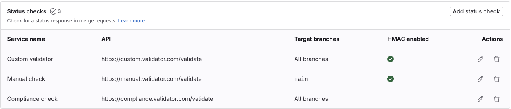
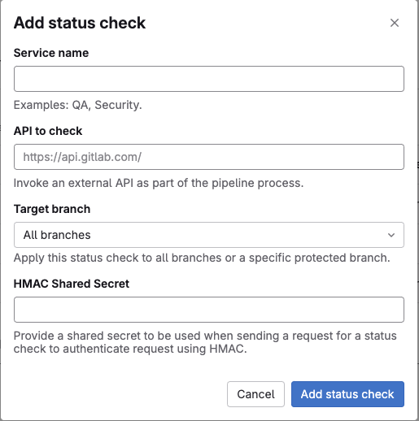
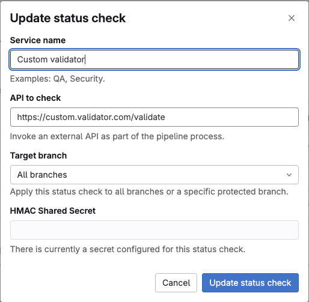
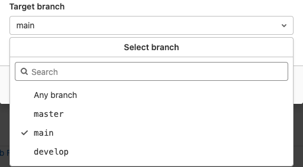
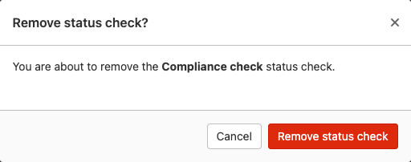
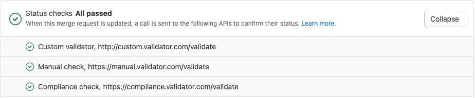
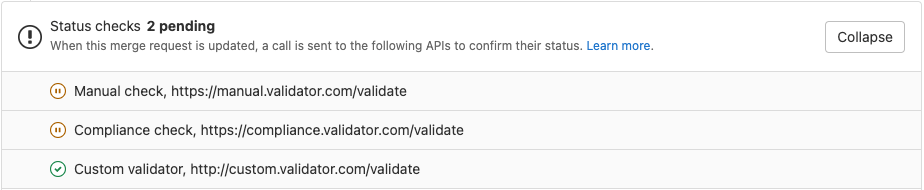

# External Status Checks **(ULTIMATE)**

> - [Introduced](https://gitlab.com/groups/gitlab-org/-/epics/3869) in GitLab 14.0, disabled behind the `:ff_external_status_checks` feature flag.
> - [Feature flag removed](https://gitlab.com/gitlab-org/gitlab/-/issues/320783) in GitLab 14.1.

WARNING:
This feature might not be available to you. Check the **version history** note above for details.

You can create a status check that sends merge request data to third-party tools.
When users create, change, or close merge requests, GitLab sends a notification. The users or automated workflows
can then update the status of merge requests from outside of GitLab.

With this integration, you can integrate with third-party workflow tools, like
ServiceNow, or the custom tool of your choice. The third-party tool
respond with an associated status. This status is then displayed as a non-blocking
widget within the merge request to surface this status to the merge request author or reviewers
at the merge request level itself.

The lack of a status check response does not block the merging of a merge request.

You can configure merge request status checks for each individual project. These are not shared between projects.

To learn more about use cases, feature discovery, and development timelines,
see the [external status checks epic](https://gitlab.com/groups/gitlab-org/-/epics/3869).

## View the status checks on a project

Within each project's settings, you can see a list of status checks added to the project:

1. In your project, go to **Settings > General**.
1. Expand the **Merge requests** section.
1. Scroll down to the **Status checks** sub-section.



This list shows the service name, API URL, and targeted branch.
It also provides actions to allow you to create, edit, or remove status checks.

## Add or update a status check

### Add a status check

Within the **Status checks** sub-section, select the **Add status check** button.
The **Add status check** form is then shown.



Filling in the form and selecting the **Add status check** button creates a new status check.

### Update a status check

Within the **Status checks** sub-section, select the **Edit** button
next to the status check you want to edit.
The **Update status check** form is then shown.



Changing the values in the form and selecting the **Update status check** button updates the status check.

### Form values

For common form errors see the [troubleshooting](#troubleshooting) section below.

#### Service name

This name can be any alphanumerical value and **must** be set. The name **must** be unique for
the project.
The name **has** to be unique for the project.

#### API to check

This field requires a URL and **must** use either the HTTP or HTTPs protocols.
We **recommend** using HTTPs to protect your merge request data in transit.
The URL **must** be set and **must** be unique for the project.

#### Target branch

If you want to restrict the status check to a single branch,
you can use this field to set this limit.



The branches list is populated from the projects [protected branches](../protected_branches.md).

You can scroll through the list of branches or use the search box
when there are a lot of branches and the branch you are looking
for doesn't appear immediately. The search box requires
**three** alphanumeric characters to be entered for the search to begin.

If you want the status check to be applied to **all** merge requests,
you can select the **Any branch** option.

## Delete a status check

Within the **Status checks** sub-section, select the **Remove...** button
next to the status check you want to delete.
The **Remove status check?** modal is then shown.



To complete the deletion of the status check you must select the
**Remove status check** button. This **permanently** deletes
the status check and it **will not** be recoverable.

## Status checks widget

> - [Introduced](https://gitlab.com/gitlab-org/gitlab/-/issues/327634) in GitLab 14.1.

The status checks widget displays in merge requests and shows the status of external
status checks:



An organization might have a policy that does not allow merging merge requests if
external status checks do not pass. However, the details in the widget are for informational
purposes only. GitLab does not prevent merging of merge requests that fail status checks.

While GitLab waits for a response from the external status check, the widget shows
the status checks as `pending`:



After GitLab [receives a response](../../../api/status_checks.md#set-approval-status-of-an-external-status-check)
from the external status check, the widget updates accordingly.

NOTE:
GitLab cannot guarantee that the external status checks are properly processed by
the related external service.

## Troubleshooting

### Duplicate value errors

```plaintext
Name is already taken
---
External API is already in use by another status check
```

On a per project basis, status checks can only use a name or API URL once.
These errors mean that either the status checks name or API URL have already
been used in this projects status checks.

You must either choose a different
value on the current status check or update the value on the existing status check.

### Invalid URL error

```plaintext
Please provide a valid URL
```

The API to check field requires the URL provided to use either the HTTP or HTTPs protocols.
You must update the value of the field to meet this requirement.

### Branch list error during retrieval or search

```plaintext
Unable to fetch branches list, please close the form and try again
```

An unexpected response was received from the branches retrieval API.
As suggested, you should close the form and reopen again or refresh the page. This error should be temporary, although
if it persists please check the [GitLab status page](https://status.gitlab.com/) to see if there is a wider outage.

### Failed to load status checks

```plaintext
Failed to load status checks
```

An unexpected response was received from the external status checks API.
You should:

- Refresh the page in case this error is temporary.
- Check the [GitLab status page](https://status.gitlab.com/) if the problem persists,
  to see if there is a wider outage.

## Related links

- [External status checks API](../../../api/status_checks.md)
