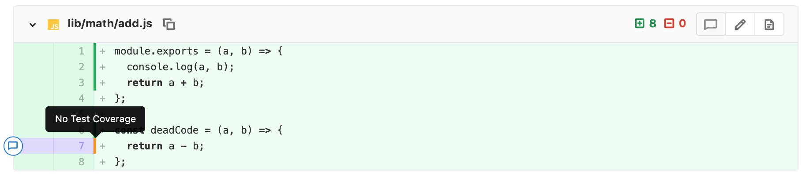

# Test coverage visualization **(FREE)**

> - [Introduced](https://gitlab.com/gitlab-org/gitlab/-/issues/3708) in GitLab 12.9.
> - [Feature flag removed](https://gitlab.com/gitlab-org/gitlab/-/issues/249811) in GitLab 13.5.

With the help of [GitLab CI/CD](../../../ci/index.md), you can collect the test
coverage information of your favorite testing or coverage-analysis tool, and visualize
this information inside the file diff view of your merge requests (MRs). This will allow you
to see which lines are covered by tests, and which lines still require coverage, before the
MR is merged.



## How test coverage visualization works

Collecting the coverage information is done via GitLab CI/CD's
[artifacts reports feature](../../../ci/yaml/index.md#artifactsreports).
You can specify one or more coverage reports to collect, including wildcard paths.
GitLab then takes the coverage information in all the files and combines it
together.

For the coverage analysis to work, you have to provide a properly formatted
[Cobertura XML](https://cobertura.github.io/cobertura/) report to
[`artifacts:reports:cobertura`](../../../ci/yaml/index.md#artifactsreportscobertura).
This format was originally developed for Java, but most coverage analysis frameworks
for other languages have plugins to add support for it, like:

- [simplecov-cobertura](https://rubygems.org/gems/simplecov-cobertura) (Ruby)
- [gocover-cobertura](https://github.com/boumenot/gocover-cobertura) (Golang)

Other coverage analysis frameworks support the format out of the box, for example:

- [Istanbul](https://istanbul.js.org/docs/advanced/alternative-reporters/#cobertura) (JavaScript)
- [Coverage.py](https://coverage.readthedocs.io/en/coverage-5.0.4/cmd.html#xml-reporting) (Python)

Once configured, if you create a merge request that triggers a pipeline which collects
coverage reports, the coverage is shown in the diff view. This includes reports
from any job in any stage in the pipeline. The coverage displays for each line:

- `covered` (green): lines which have been checked at least once by tests
- `no test coverage` (orange): lines which are loaded but never executed
- no coverage information: lines which are non-instrumented or not loaded

Hovering over the coverage bar provides further information, such as the number
of times the line was checked by tests.

NOTE:
A limit of 100 `<source>` nodes for Cobertura format XML files applies. If your Cobertura report exceeds
100 nodes, there can be mismatches or no matches in the merge request diff view.

### Artifact expiration

By default, the [pipeline artifact](../../../ci/pipelines/pipeline_artifacts.md#storage) used
to draw the visualization on the merge request expires **one week** after creation.

### Automatic class path correction

> - [Introduced](https://gitlab.com/gitlab-org/gitlab/-/issues/217664) in GitLab 13.8.
> - [Feature flag removed](https://gitlab.com/gitlab-org/gitlab/-/issues/284822) in GitLab 13.9.

The coverage report properly matches changed files only if the `filename` of a `class` element
contains the full path relative to the project root. However, in some coverage analysis frameworks,
the generated Cobertura XML has the `filename` path relative to the class package directory instead.

To make an intelligent guess on the project root relative `class` path, the Cobertura XML parser
attempts to build the full path by:

- Extracting a portion of the `source` paths from the `sources` element and combining them with the
  class `filename` path.
- Checking if the candidate path exists in the project.
- Using the first candidate that matches as the class full path.

#### Path correction example

As an example, a project with:

- A full path of `test-org/test-project`.
- The following files relative to the project root:

  ```shell
  Auth/User.cs
  Lib/Utils/User.cs
  src/main/java
  ```

In the:

- Cobertura XML, the `filename` attribute in the `class` element assumes the value is a relative
  path to the project's root:

  ```xml
  <class name="packet.name" filename="src/main/java" line-rate="0.0" branch-rate="0.0" complexity="5">
  ```

- `sources` from Cobertura XML, the following paths in the format
  `<CI_BUILDS_DIR>/<PROJECT_FULL_PATH>/...`:

  ```xml
  <sources>
    <source>/builds/test-org/test-project/Auth</source>
    <source>/builds/test-org/test-project/Lib/Utils</source>
  </sources>
  ```

The parser:

- Extracts `Auth` and `Lib/Utils` from the `sources` and uses these to determine the `class` path
  relative to the project root.
- Combines these extracted `sources` and the class filename. For example, if there is a `class`
  element with the `filename` value of `User.cs`, the parser takes the first candidate path that
  matches, which is `Auth/User.cs`.
- For each `class` element, attempts to look for a match for each extracted `source` path up to
  100 iterations. If it reaches this limit without finding a matching path in the file tree, the
  class is not included in the final coverage report.

NOTE:
Automatic class path correction only works on `source` paths in the format `<CI_BUILDS_DIR>/<PROJECT_FULL_PATH>/...`.
The `source` is ignored if the path does not follow this pattern. The parser assumes that the
`filename` of a `class` element contains the full path relative to the project root.

## Example test coverage configurations

### JavaScript example

The following [`gitlab-ci.yml`](../../../ci/yaml/index.md) example uses [Mocha](https://mochajs.org/)
JavaScript testing and [nyc](https://github.com/istanbuljs/nyc) coverage-tooling to
generate the coverage artifact:

```yaml
test:
  script:
    - npm install
    - npx nyc --reporter cobertura mocha
  artifacts:
    reports:
      cobertura: coverage/cobertura-coverage.xml
```

### Java and Kotlin examples

#### Maven example

The following [`gitlab-ci.yml`](../../../ci/yaml/index.md) example for Java or Kotlin uses [Maven](https://maven.apache.org/)
to build the project and [JaCoCo](https://www.eclemma.org/jacoco/) coverage-tooling to
generate the coverage artifact.
You can check the [Docker image configuration and scripts](https://gitlab.com/haynes/jacoco2cobertura) if you want to build your own image.

GitLab expects the artifact in the Cobertura format, so you have to execute a few
scripts before uploading it. The `test-jdk11` job tests the code and generates an
XML artifact. The `coverage-jdk-11` job converts the artifact into a Cobertura report:

```yaml
test-jdk11:
  stage: test
  image: maven:3.6.3-jdk-11
  script:
    - mvn $MAVEN_CLI_OPTS clean org.jacoco:jacoco-maven-plugin:prepare-agent test jacoco:report
  artifacts:
    paths:
      - target/site/jacoco/jacoco.xml

coverage-jdk11:
  # Must be in a stage later than test-jdk11's stage.
  # The `visualize` stage does not exist by default.
  # Please define it first, or choose an existing stage like `deploy`.
  stage: visualize
  image: registry.gitlab.com/haynes/jacoco2cobertura:1.0.7
  script:
    # convert report from jacoco to cobertura, using relative project path
    - python /opt/cover2cover.py target/site/jacoco/jacoco.xml $CI_PROJECT_DIR/src/main/java/ > target/site/cobertura.xml
  needs: ["test-jdk11"]
  dependencies:
    - test-jdk11
  artifacts:
    reports:
      cobertura: target/site/cobertura.xml
```

#### Gradle example

The following [`gitlab-ci.yml`](../../../ci/yaml/index.md) example for Java or Kotlin uses [Gradle](https://gradle.org/)
to build the project and [JaCoCo](https://www.eclemma.org/jacoco/) coverage-tooling to
generate the coverage artifact.
You can check the [Docker image configuration and scripts](https://gitlab.com/haynes/jacoco2cobertura) if you want to build your own image.

GitLab expects the artifact in the Cobertura format, so you have to execute a few
scripts before uploading it. The `test-jdk11` job tests the code and generates an
XML artifact. The `coverage-jdk-11` job converts the artifact into a Cobertura report:

```yaml
test-jdk11:
  stage: test
  image: gradle:6.6.1-jdk11
  script:
    - 'gradle test jacocoTestReport' # jacoco must be configured to create an xml report
  artifacts:
    paths:
      - build/jacoco/jacoco.xml

coverage-jdk11:
  # Must be in a stage later than test-jdk11's stage.
  # The `visualize` stage does not exist by default.
  # Please define it first, or chose an existing stage like `deploy`.
  stage: visualize
  image: registry.gitlab.com/haynes/jacoco2cobertura:1.0.7
  script:
    # convert report from jacoco to cobertura, using relative project path
    - python /opt/cover2cover.py build/jacoco/jacoco.xml $CI_PROJECT_DIR/src/main/java/ > build/cobertura.xml
  needs: ["test-jdk11"]
  dependencies:
    - test-jdk11
  artifacts:
    reports:
      cobertura: build/cobertura.xml
```

### Python example

The following [`gitlab-ci.yml`](../../../ci/yaml/index.md) example for Python uses [pytest-cov](https://pytest-cov.readthedocs.io/) to collect test coverage data and [coverage.py](https://coverage.readthedocs.io/) to convert the report to use full relative paths.
The information isn't displayed without the conversion.

This example assumes that the code for your package is in `src/` and your tests are in `tests.py`:

```yaml
run tests:
  stage: test
  image: python:3
  script:
    - pip install pytest pytest-cov
    - pytest --cov=src/ tests.py
    - coverage xml
  artifacts:
    reports:
      cobertura: coverage.xml
```

### C/C++ example

The following [`gitlab-ci.yml`](../../../ci/yaml/index.md) example for C/C++ with
`gcc` or `g++` as the compiler uses [`gcovr`](https://gcovr.com/en/stable/) to generate the coverage
output file in Cobertura XML format.

This example assumes:

- That the `Makefile` is created by `cmake` in the `build` directory,
  within another job in a previous stage.
  (If you use `automake` to generate the `Makefile`,
  then you need to call `make check` instead of `make test`.)
- `cmake` (or `automake`) has set the compiler option `--coverage`.

```yaml
run tests:
  stage: test
  script:
    - cd build
    - make test
    - gcovr --xml-pretty --exclude-unreachable-branches --print-summary -o coverage.xml --root ${CI_PROJECT_DIR}
  coverage: /^\s*lines:\s*\d+.\d+\%/
  artifacts:
    name: ${CI_JOB_NAME}-${CI_COMMIT_REF_NAME}-${CI_COMMIT_SHA}
    expire_in: 2 days
    reports:
      cobertura: build/coverage.xml
```
