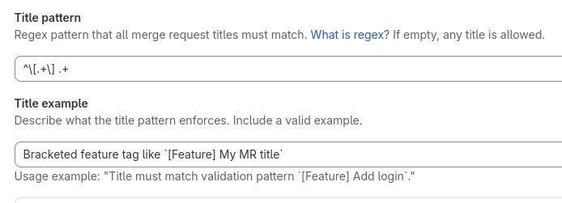
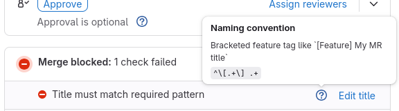



- Tier: Premium, Ultimate
- Offering: GitLab.com, GitLab Self-Managed, GitLab Dedicated





- [Introduced](https://gitlab.com/gitlab-org/gitlab/-/issues/25689) in GitLab 17.11 [with a flag](../../../administration/feature_flags/_index.md) named `merge_request_title_regex`. Disabled by default.



> [!flag]
> The availability of this feature is controlled by a feature flag.
> For more information, see the history.
> This feature is available for testing, but not ready for production use.

You can enforce a naming convention on merge request titles by
matching them against a [RE2](https://github.com/google/re2/wiki/Syntax) regular expression
pattern. When you configure a title pattern for a project, merge requests with titles that do
not match the pattern are blocked from merging.

Use title validation to:

- Require Jira or issue tracker ticket references in titles.
- Enforce [conventional commit](https://www.conventionalcommits.org/) formatting.
- Standardize title prefixes for release management or governance workflows.

## Configure merge request title validation

Configure a regex pattern that all merge request titles in the project must
match before they can be merged.

Prerequisites:

- The Maintainer or Owner role for the project.

To configure title validation:

1. In the top bar, select **Search or go to** and find your project.
1. Select **Settings > Merge requests**.
1. In the **Title pattern** text box, enter a regex pattern.
1. In the **Title example** text box, enter a description of the expected format.
   Include a valid example so merge request authors know what to use.
1. Select **Save changes**.



When you set a **Title pattern**, the **Title example** is also required.
The **Title example** is visible to users when their merge request title does not match the
pattern.

To remove title validation, clear both the **Title pattern** and **Title example** text boxes,
then select **Save changes**.

To configure title validation with the API, you can also
[use the projects API](../../../api/projects.md).

## Regex syntax

Title validation uses [RE2 syntax](https://github.com/google/re2/wiki/Syntax),
not PCRE. RE2 does not support backreferences or lookahead/lookbehind assertions.

The pattern and description fields each have a maximum length of 255 characters.

### Example patterns

The following are regex pattern examples:

- Jira ticket reference (example valid title: `PROJ-123 Fix login bug`):

  ```plaintext
  ^[A-Z]+-\d+ .+
  ```

- Conventional commits (example valid title: `feat(auth): add SSO support`):

  ```plaintext
  ^(feat|fix|docs|chore|refactor|test|style)(\(.+\))?: .+
  ```

- Custom prefix (example valid title: `BUGFIX: resolve timeout error`):

  ```plaintext
  ^(FEATURE|BUGFIX|HOTFIX): .+
  ```

- Bracketed category (example valid title: `[Feature] Add dark mode`):

  ```plaintext
  ^\[.+\] .+
  ```

## Validation enforcement

When a title validation pattern is configured:

- Merge requests with titles that do not match the pattern cannot be merged.
- The title check appears as a merge check alongside other checks like
  approvals, pipeline status, and thread resolution.
- If [auto-merge](auto_merge.md) is enabled, the merge request waits for
  the title to match the pattern before merging.
- Validation applies to the current title at merge time. Authors can update
  the title at any point before merging.



## Troubleshooting

### Merge request cannot be merged due to title validation

If a merge request is blocked by title validation:

1. Check the merge checks section of the merge request for the title
   validation failure.
1. Update the merge request title to match the pattern configured in
   **Settings** > **Merge requests** > **Title pattern**.
1. Use the **Title example** shown in the error message as a reference
   for the expected format.

### Draft merge requests

Title validation applies to the full title string, including any `Draft:`
prefix. If your regex pattern does not account for the `Draft:` prefix,
draft merge requests might fail validation. Consider using a pattern like
`^(Draft: )?YOUR_PATTERN` to allow both draft and non-draft titles.

### Regex pattern does not match as expected

Title validation uses [RE2 syntax](https://github.com/google/re2/wiki/Syntax),
which differs from PCRE syntax used by many online regex testers. To verify
your pattern:

- Use an RE2-compatible regex tester.
- Check that you are not using unsupported features like backreferences
  or lookahead assertions.
- Verify that special characters are escaped correctly.

## Related topics

- [Auto-merge](auto_merge.md)
- [Projects API - `merge_request_title_regex`](../../../api/projects.md)
- [Merge status API](../../../api/merge_requests.md#merge-status)
